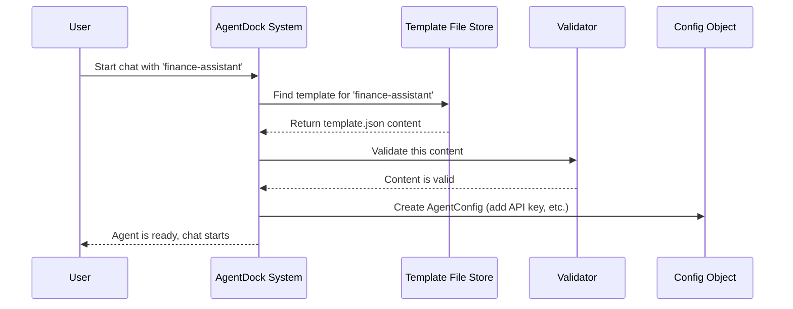

# Chapter 1: Agent Configuration (`AgentConfig`)

Welcome to the AgentDock tutorial! We're excited to help you get started building powerful AI agents. This first chapter introduces one of the most fundamental concepts: the **Agent Configuration**, often referred to as `AgentConfig`.

## What's the Big Idea?

Imagine you want to build a helpful AI assistant specifically designed to answer questions about finance. How do you tell the AI *how* to behave? How do you give it the right tools, like the ability to look up current stock prices? And how do you give it a name and personality, maybe making it sound knowledgeable but cautious about giving financial advice?

This is where `AgentConfig` comes in. It's like a **blueprint** or a **recipe** for creating a specific AI agent. It gathers all the essential instructions in one place, defining:

*   **Who** the agent is (its name and ID).
*   **How** it should act and talk (its personality).
*   **What** it can do (the tools and capabilities it has).
*   **Initial setup** details (like starting messages in a chat).

Think of it like a character sheet for a game character. The sheet tells you the character's name, their personality traits (like "brave" or "cautious"), their skills (like "lockpicking" or "spellcasting"), and maybe their starting equipment. An `AgentConfig` does the same for an AI agent.

## Anatomy of an AgentConfig

An `AgentConfig` is typically defined in a simple text file (using JSON format, which we'll see soon). Let's break down the key ingredients of this recipe:

1.  **Identification (`agentId`, `name`, `description`)**: Basic info to know which agent is which.
    *   `agentId`: A unique, internal code name (e.g., `finance-assistant`).
    *   `name`: A friendly, display name (e.g., "Finance Assistant").
    *   `description`: A short explanation of what the agent does.

2.  **Personality (`personality`)**: This is crucial! It's a set of instructions telling the underlying AI language model how to behave. It could be a simple sentence or a detailed list of traits and rules.
    *   Example: "You are a helpful Finance Assistant. You provide information about stocks but always remind the user this is not financial advice."

3.  **Nodes (`nodes`)**: These are the specific **capabilities** or **tools** the agent can use. If our Finance Assistant needs to look up stock prices, we list the "stock price lookup" node here. We'll learn more about these in the [Tools](02_tools_.md) and [Nodes (`BaseNode`, `AgentNode`)](03_nodes___basenode____agentnode___.md) chapters.
    *   Example: `["stock_price", "crypto_price"]` means the agent can use these two tools.

4.  **Node Configurations (`nodeConfigurations`)**: Some nodes might need specific settings. For example, which AI model should the agent use for its "brain"? This section holds those settings. We'll touch upon the AI model part in the [CoreLLM (LLM Abstraction)](04_corellm__llm_abstraction__.md) chapter.
    *   Example: Setting the specific AI model version for the language processing node.

5.  **Chat Settings (`chatSettings`)**: Controls how the chat interface works with this agent.
    *   `initialMessages`: What the agent says when you first open a chat with it.
    *   `historyPolicy`: How much of the past conversation the agent should remember.
    *   `chatPrompts`: Suggested questions the user might ask, displayed in the chat interface.

## Example: Defining Our Finance Assistant

Let's look at a simplified `AgentConfig` for our "Finance Assistant". This would typically be in a file like `agents/finance-assistant/template.json`:

```json
{
  "version": "1.0",
  "agentId": "finance-assistant",
  "name": "Finance Assistant",
  "description": "Provides stock and crypto info.",
  "personality": [
    "You are a knowledgeable finance assistant.",
    "You specialize in stocks and crypto using real-time data.",
    "Always provide disclaimers: not financial advice."
  ],
  "nodes": [
    "llm.anthropic", // The AI model node
    "stock_price",   // Tool to get stock prices
    "crypto_price"   // Tool to get crypto prices
  ],
  "nodeConfigurations": {
    "llm.anthropic": { // Settings for the AI model
      "model": "claude-3-5-sonnet-20240620", // Which specific AI model to use
      "temperature": 0.7 // Controls creativity (lower = more focused)
    }
    // Settings for stock_price or crypto_price could go here if needed
  },
  "chatSettings": {
    "initialMessages": [
      "Hello! I'm your Finance Assistant. Ask me about stocks or crypto!"
    ],
    "chatPrompts": [
      "What's Bitcoin's price?",
      "Show me Apple's stock price"
    ]
  }
}
```

**Explanation:**

*   This JSON file defines our `finance-assistant`.
*   `personality` gives it instructions on how to behave (knowledgeable, focused on finance, includes disclaimer). Notice it can be an array of strings, which are combined.
*   `nodes` tells us it uses an AI model (`llm.anthropic`) and two tools (`stock_price`, `crypto_price`).
*   `nodeConfigurations` sets specific options for the `llm.anthropic` node.
*   `chatSettings` defines its greeting (`initialMessages`) and suggests some starting questions (`chatPrompts`).

By creating this simple file, we've defined the entire behavior and capabilities of our Finance Assistant!

## How AgentDock Uses This Configuration

So you've written your `template.json` file. What happens next? When you want to interact with an agent (like the Finance Assistant), AgentDock needs to load and understand its configuration.

**High-Level Steps:**

1.  **Request:** You ask AgentDock to start a chat with the "Finance Assistant".
2.  **Find Template:** AgentDock looks for the `template.json` file corresponding to `finance-assistant`.
3.  **Load & Validate:** It reads the JSON file. It then checks if the configuration is valid (does it have all the required parts? Is the format correct?).
4.  **Inject Secrets:** It might securely add necessary information, like API keys required by some nodes (e.g., the key needed to use the `llm.anthropic` AI model). This is *not* stored directly in the template file for security.
5.  **Ready:** AgentDock now has a complete, validated `AgentConfig` object in memory, ready to use for managing the agent's conversation and actions.

Here's a simplified diagram of that process:



## Under the Hood: Loading and Validation Code

Let's peek at some (simplified) code to see how this loading happens.

**Loading the Configuration:**

The core function responsible for this is `loadAgentConfig` found in `agentdock-core/src/config/agent-config.ts`.

```typescript
// File: agentdock-core/src/config/agent-config.ts

import { AgentConfig, AgentConfigSchema } from '../types/agent-config';
import { createError, ErrorCode } from '../errors';
// ... other imports

/**
 * Load and validate an agent configuration
 */
export async function loadAgentConfig(
  template: any, // The raw content from template.json
  apiKey?: string // The API key to be added securely
): Promise<AgentConfig> {
  try {
    // 1. Basic Checks
    if (!apiKey) {
      throw createError(/* ... */); // Error if API key is missing
    }
    if (!template) {
      throw createError(/* ... */); // Error if template is missing
    }

    // 2. Prepare the config object
    const config = {
      ...template, // Copy properties from the template
      // Ensure nodes is a mutable array
      nodes: [...template.nodes], 
      // Add the API key to the correct node configuration
      nodeConfigurations: {
        ...template.nodeConfigurations,
        // Simplified: Assume we know the LLM node needs the key
        ['llm.anthropic']: { 
          ...template.nodeConfigurations?.['llm.anthropic'],
          apiKey // Add the key here
        }
      },
      // ... potentially prepare other fields like chatSettings ...
    };

    // 3. Validate the final config object using a schema
    return AgentConfigSchema.parse(config); // Throws error if invalid

  } catch (error) {
    // Handle errors gracefully
    throw createError(/* ... */);
  }
}
```

**Explanation:**

1.  It first checks if the necessary inputs (`template` content and `apiKey`) are present.
2.  It creates a new `config` object, copying data from the `template` and securely adding the `apiKey` to the right place within `nodeConfigurations`.
3.  Crucially, it uses `AgentConfigSchema.parse(config)` to validate the entire structure. If anything is missing or has the wrong format, this step will fail, preventing an invalid agent from being used.

**Validation Schema (`AgentConfigSchema`):**

How does `AgentConfigSchema.parse` work? AgentDock uses a library called Zod to define the expected structure and data types for the `AgentConfig`. This definition is in `agentdock-core/src/types/agent-config.ts`.

```typescript
// File: agentdock-core/src/types/agent-config.ts

import { z } from 'zod'; // Zod library for schema validation
// ... other imports like PersonalitySchema ...

/**
 * Zod schema for validating agent configurations
 */
export const AgentConfigSchema = z.object({
  version: z.string(), // Must be a string
  agentId: z.string(), // Must be a string
  name: z.string(),
  description: z.string(),
  personality: PersonalitySchema, // Uses a specific schema for personality
  nodes: z.array(z.string()), // Must be an array of strings
  nodeConfigurations: z.record(z.any()), // An object with any kind of values
  chatSettings: z.object({ // Must be an object with these fields:
    initialMessages: z.array(z.string()).optional(), // Optional array of strings
    // ... other chat settings fields ...
  }),
  // ... other optional fields like orchestration, maxConcurrency ...
});

// The actual AgentConfig type used in TypeScript code
export type AgentConfig = z.infer<typeof AgentConfigSchema>; 
```

**Explanation:**

*   This schema precisely defines what a valid `AgentConfig` must look like.
*   `z.object({...})` defines an object structure.
*   `z.string()`, `z.array(z.string())`, `z.record(z.any())`, `z.optional()` specify the types and requirements for each field.
*   When `AgentConfigSchema.parse(config)` is called, Zod checks if the `config` object matches this structure. If not, it raises an error. This ensures that all agents loaded into AgentDock meet the expected format.

**Bundling Templates:**

You might notice multiple `template.json` files, one for each agent. For efficiency, especially in web applications, AgentDock uses a build script (`scripts/bundle-templates.ts`) to gather all these JSON files into a single TypeScript file (`src/generated/templates.ts`). This makes it faster and easier to access any agent's template when needed, without reading individual files every time.

```typescript
// Simplified idea from scripts/bundle-templates.ts

import fs from 'fs';
import path from 'path';

async function bundleTemplates() {
  const templatesDir = path.join(process.cwd(), 'agents');
  const outputFile = path.join(process.cwd(), 'src/generated/templates.ts');
  const templates = {}; // Object to hold all templates

  // 1. Find all agent folders (like 'finance-assistant')
  const agentDirs = await fs.readdir(templatesDir);

  // 2. Read each agent's template.json
  for (const agentId of agentDirs) {
    const templatePath = path.join(templatesDir, agentId, 'template.json');
    const templateContent = await fs.readFile(templatePath, 'utf-8');
    templates[agentId] = JSON.parse(templateContent); // Store it
  }

  // 3. Write a TypeScript file exporting all templates
  const fileContent = `
    // Generated file
    export const templates = ${JSON.stringify(templates, null, 2)} as const;
    // ... helper functions to get templates ...
  `;
  await fs.writeFile(outputFile, fileContent);
  console.log('Templates bundled!');
}

bundleTemplates();
```

This script essentially creates a ready-to-use collection of all agent blueprints.

## Conclusion

You've just learned about `AgentConfig`, the fundamental blueprint for defining AI agents in AgentDock!

*   It acts like a **recipe** or **character sheet**.
*   It specifies the agent's **identity**, **personality**, **tools (nodes)**, and **settings**.
*   It's typically defined in a `template.json` file for each agent.
*   AgentDock loads, validates, and prepares this configuration using schemas (`AgentConfigSchema`) to ensure everything is correct before the agent starts working.

Understanding `AgentConfig` is the first step to creating your own custom agents. You now know how to define *what* an agent is and *what* it should be able to do.

In the next chapter, we'll dive deeper into one of the most exciting parts mentioned here: the **Tools** that give your agents their special abilities.

Next: [Chapter 2: Tools](02_tools_.md)

---

Generated by [AI Codebase Knowledge Builder](https://github.com/The-Pocket/Tutorial-Codebase-Knowledge)