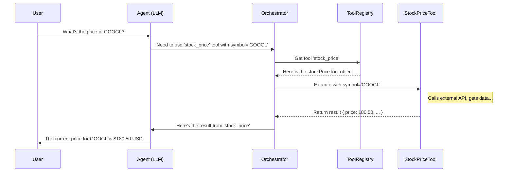

# Chapter 2: Tools

In [Chapter 1: Agent Configuration (`AgentConfig`)](01_agent_configuration___agentconfig___.md), we learned how the `AgentConfig` acts as a blueprint for our AI agents. We saw that the `nodes` list in the configuration defines the capabilities an agent has. Now, let's zoom in on a very important type of capability: **Tools**.

## Why Do Agents Need Tools?

Imagine you ask a friend to find the current price of Apple stock. Your friend doesn't magically know the price; they'll likely use a tool – maybe a finance app on their phone or a website on their computer.

AI agents in AgentDock work similarly. While the core AI (the Large Language Model or LLM) is great at understanding language, generating text, and reasoning, it doesn't inherently know real-time information like stock prices, today's weather, or the latest news headlines. It also can't perform complex, specialized calculations or directly interact with external services on its own.

That's where **Tools** come in! They give the agent specialized abilities, just like giving a human a calculator, a map, or access to a search engine.

## What Exactly Are Tools in AgentDock?

In AgentDock, **Tools** are specialized types of [Nodes (`BaseNode`, `AgentNode`)](03_nodes___basenode____agentnode___.md) designed to perform specific, well-defined actions. Think of them as the dedicated equipment an agent can use.

Here are some common examples you'll find in AgentDock:

*   `stock_price`: Looks up the current price of a stock.
*   `weather`: Fetches the weather forecast for a specific location.
*   `search`: Performs a web search to find recent information.
*   `deep_research`: Conducts more in-depth research on a topic, potentially analyzing multiple sources.
*   `crypto_price`: Gets the current price of a cryptocurrency.

These tools often work by:

1.  **Interacting with external APIs:** Like asking a weather service (e.g., Open-Meteo) or a stock data provider (e.g., AlphaVantage) for information.
2.  **Performing complex calculations:** Maybe a tool does some specialized financial modeling.
3.  **Accessing specific data sources:** A tool might connect to a particular database.

When you define an agent using `AgentConfig`, you specify which tools it's *allowed* to use in the `nodes` list. Our Finance Assistant from Chapter 1, for example, was given access to `stock_price` and `crypto_price`.

```json
// Simplified excerpt from finance-assistant/template.json
{
  // ... other config ...
  "nodes": [
    "llm.anthropic", // The agent's "brain" (an LLM Node)
    "stock_price",   // Tool allowed: Stock Price Lookup
    "crypto_price"   // Tool allowed: Crypto Price Lookup
  ]
  // ... other config ...
}
```

This means the Finance Assistant *can* use these tools, but it won't use them randomly. It needs a reason.

## How Does an Agent Decide to Use a Tool?

This is where the magic of the underlying AI model comes in! Here's the typical flow when you chat with an agent:

1.  **User Request:** You ask the agent a question, like "What's the stock price for Google?"
2.  **Agent Analyzes:** The agent's "brain" (the [CoreLLM (LLM Abstraction)](04_corellm__llm_abstraction__.md)) analyzes your request. It understands you're asking for a specific piece of real-time data.
3.  **Tool Identification:** The LLM checks the list of tools it's allowed to use (from the `AgentConfig`). It sees `stock_price` is available and recognizes it's the right tool for the job.
4.  **Tool Call Request:** The LLM decides to use the tool. It tells the AgentDock system: "I need to use the `stock_price` tool with the parameter `symbol: 'GOOGL'`."
5.  **System Executes Tool:** AgentDock receives this request. It finds the actual `stock_price` tool code and runs it, passing 'GOOGL' as the input. The tool connects to the stock data API and gets the price.
6.  **Tool Result:** The `stock_price` tool finishes its job and returns the result (e.g., `{ price: 180.50, currency: 'USD', symbol: 'GOOGL', ... }`).
7.  **Result to Agent:** AgentDock gives this result back to the LLM.
8.  **Agent Responds:** The LLM now has the information it needed. It formulates a user-friendly answer, like "The current stock price for GOOGL is $180.50 USD." and sends it back to you.

Crucially, the agent only uses tools *when necessary* based on the conversation and the tools available to it.

## Anatomy of a Tool

Let's peek at what a tool definition looks like internally. Tools in AgentDock are built following specific patterns. Here’s a highly simplified view inspired by the `stock_price` tool (`src/nodes/stock-price/index.ts`):

```typescript
// Simplified conceptual structure of a tool
import { z } from 'zod'; // Library for defining expected inputs

// Define the expected input parameters for the tool
const stockPriceSchema = z.object({
  symbol: z.string().describe('Stock symbol (e.g., AAPL, MSFT)'),
  // Other parameters could go here (like API key, optional)
});

// Define the tool itself
export const stockPriceTool = {
  // 1. Name: How the agent refers to the tool
  name: 'stock_price',

  // 2. Description: Helps the agent understand what the tool does
  description: 'Get the current stock price for a given symbol',

  // 3. Parameters: Defines what inputs the tool needs
  parameters: stockPriceSchema,

  // 4. Execute Function: The actual code that runs the tool
  async execute(params: { symbol: string }, options: any) {
    // Simplified logic:
    console.log(`Tool executing: Getting price for ${params.symbol}`);
    // ... code to call the AlphaVantage API using params.symbol ...
    const priceData = { price: 180.50, /* ... other data ... */ }; // Dummy data

    // ... code to format the result nicely (e.g., using a UI component) ...
    const formattedResult = `Stock Price for ${params.symbol}: $${priceData.price}`;

    console.log('Tool finished execution.');
    return formattedResult; // Return the result
  }
};
```

**Explanation:**

1.  **`name`**: A unique identifier (like `stock_price`). This is the name used in the `AgentConfig`'s `nodes` list and how the LLM requests the tool.
2.  **`description`**: A clear explanation for the LLM, helping it decide *when* to use this tool.
3.  **`parameters`**: Defines the inputs the tool expects. Here, it needs a `symbol` which must be a string. Zod (`z`) helps validate the inputs.
4.  **`execute`**: This is the heart of the tool. It's an asynchronous function (`async`) that takes the parameters provided by the LLM (like `{ symbol: 'GOOGL' }`) and performs the action (like calling an external API). It then returns the result. Often, this result is formatted for display, potentially using special UI components.

## How AgentDock Manages Tools: The Tool Registry

You might wonder: how does AgentDock know about all these different tools like `stock_price`, `weather`, etc.? And how does it give the *right* tools to the *right* agent?

This is managed by the **Tool Registry**.

Think of the Tool Registry as a central toolbox or catalog where all available tools are kept and organized.

1.  **Registration:** When AgentDock starts up (or more accurately, when tools are first needed, thanks to lazy initialization in `src/lib/tools.ts`), tools defined in the codebase (like those in `src/nodes/stock-price`, `src/nodes/weather`, etc.) are "registered". This means they are added to the Tool Registry's internal list. The file `src/nodes/registry.ts` gathers many of these custom tools together.

    ```typescript
    // Simplified concept from src/nodes/registry.ts
    import { stockPriceTool } from './stock-price';
    import { weatherTool } from './weather';
    import { searchTool } from './search';
    // ... import other tools ...

    // A collection holding all known custom tools
    export const allTools = {
      'stock_price': stockPriceTool,
      'weather': weatherTool,
      'search': searchTool,
      // ... other tools mapped by their name ...
    };
    ```

2.  **Provisioning:** When an agent needs to run (e.g., when you start a chat), AgentDock looks at the `nodes` list in the agent's `AgentConfig`. It then asks the Tool Registry: "Please give me the tools named 'stock_price' and 'crypto_price' for this agent."

    ```typescript
    // Conceptual usage of the Tool Registry
    import { getToolRegistry } from 'agentdock-core';

    const agentConfigNodes = ['llm.anthropic', 'stock_price', 'crypto_price'];
    const registry = getToolRegistry(); // Get the central registry

    // Ask the registry for the specific tools the agent needs
    const agentTools = registry.getToolsForAgent(agentConfigNodes);
    // agentTools would now contain the actual 'stock_price' and 'crypto_price' tool objects
    // (It ignores 'llm.anthropic' because that's not a typical tool)
    ```
    The `getToolRegistry` function (`agentdock-core/src/nodes/tool-registry.ts`) ensures there's a single, shared registry instance. The `getToolsForAgent` method filters the master list to provide only the tools requested in the agent's configuration.

3.  **Execution:** When the LLM decides to use a tool, the system (specifically the [Orchestration (`OrchestrationManager`)](05_orchestration___orchestrationmanager___.md)) uses the tool object provided by the registry to call its `execute` method with the required parameters.

Here's a diagram showing the flow when an agent uses a tool:



This registry system makes AgentDock flexible. You can easily add new tools by defining them and registering them, making them available for your agents to use.

## Conclusion

Tools are essential components in AgentDock, acting as specialized extensions for your AI agents.

*   They allow agents to perform actions beyond basic language processing, like **accessing real-time data**, **calling external services**, or **performing complex calculations**.
*   Tools are defined with a **name**, **description**, expected **parameters**, and an **`execute` function**.
*   Agents (specifically the LLM) **decide when to use** a tool based on the user's request and the tool's description.
*   The **Tool Registry** manages all available tools, and AgentDock provides the specific tools listed in an agent's `AgentConfig` when needed.

By equipping your agents with the right tools, you can significantly enhance their capabilities and build powerful, specialized AI assistants.

Now that we understand `AgentConfig` and `Tools`, let's dive deeper into the general concept they both relate to: **Nodes**. Tools are just one type of Node an agent can use.

Next: [Chapter 3: Nodes (`BaseNode`, `AgentNode`)](03_nodes___basenode____agentnode___.md)

---

Generated by [AI Codebase Knowledge Builder](https://github.com/The-Pocket/Tutorial-Codebase-Knowledge)