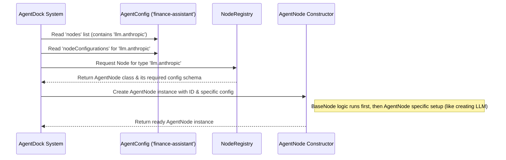

# Chapter 3: Nodes (`BaseNode`, `AgentNode`)

In [Chapter 2: Tools](02_tools_.md), we learned how agents use specialized "Tools" like `stock_price` or `weather` to perform specific tasks. But what exactly *are* these tools internally? And what about the agent's "brain" itself – the part that understands language and decides *when* to use a tool?

This chapter introduces the fundamental concept that underlies both tools and the agent's core logic: **Nodes**.

## What's the Big Idea? Nodes as Workers

Imagine a factory assembly line. You have different stations, each with a specialized worker performing a specific task: one worker attaches a wheel, another paints the body, another inspects the quality.

In AgentDock, **Nodes** are like these specialized workers. They are the fundamental building blocks or capabilities that make up an agent. Every distinct function or capability within the system is represented as a Node.

There are different *types* of workers (Nodes):

1.  **The General Employee Handbook (`BaseNode`):** Before any worker starts, they get an employee handbook defining common rules, how they get paid, their employee ID, etc. `BaseNode` is like this handbook. It's the **template** or **base blueprint** for *all* nodes (all workers) in AgentDock. It defines the common structure and properties every node must have, like a unique ID and configuration settings.
2.  **The Assembly Line Manager (`AgentNode`):** On the assembly line, there's usually a manager overseeing the process, deciding what needs to be done next, talking to other workers (tools), and reporting the final result. The `AgentNode` is like this manager. It's a very specific, crucial type of Node that handles the **core conversation logic**. It uses the powerful AI language model ([CoreLLM (LLM Abstraction)](04_corellm__llm_abstraction__.md)) to understand the user, generate responses, and decide *when* to delegate tasks to other specialized workers (the Tools we learned about in Chapter 2).

So, the "Tools" from the previous chapter are just one kind of specialized worker (Node). The agent's main "thinking" part is another specialized worker (the `AgentNode`). Both inherit their basic structure from the `BaseNode` template.

## `BaseNode`: The Blueprint for All Nodes

`BaseNode` is the foundation. Think of it as the abstract concept of a "worker" in our factory. It doesn't *do* a specific job itself, but it defines what *all* workers must have:

*   **An ID (`id`):** Like an employee ID badge, every node instance gets a unique identifier.
*   **Configuration (`config`):** Instructions or settings specific to *this* worker's job (e.g., which specific model the `AgentNode` should use, or which API key a `stock_price` tool needs).
*   **Metadata:** Information *about* the worker type (e.g., its name like "Stock Price Tool", what inputs it needs, what outputs it produces).

You don't usually interact with `BaseNode` directly. Instead, you use specific types of nodes (like `AgentNode` or `stock_price`) that are *built using* the `BaseNode` blueprint.

Here's a simplified peek at the structure defined in `agentdock-core/src/nodes/base-node.ts`:

```typescript
// Simplified structure from agentdock-core/src/nodes/base-node.ts

// The "Employee Handbook" blueprint
export abstract class BaseNode<TConfig = unknown> {
  // Every worker gets a unique ID
  readonly id: string;

  // Every worker has specific job instructions
  protected config: TConfig;

  // Information about the type of worker
  readonly metadata: NodeMetadata; // Contains label, description, etc.

  // The constructor: How a new worker instance is created
  constructor(id: string, config: TConfig) {
    this.id = id;
    this.config = config;
    // ... sets up metadata based on abstract methods below ...
  }

  // Abstract methods (MUST be implemented by specific worker types)
  // Like sections in the handbook that need details filled in
  protected abstract getLabel(): string; // What's the worker's job title?
  protected abstract getDescription(): string; // What does this worker do?
  // ... other abstract methods for inputs, outputs, etc. ...

  // The actual work function (also must be defined by specific workers)
  abstract execute(input: unknown): Promise<unknown>;
}
```

**Explanation:**

*   `abstract class BaseNode`: This means `BaseNode` is a template, not a concrete worker.
*   `id`, `config`, `metadata`: These are the common properties all nodes will have.
*   `constructor`: The standard way to create any node instance.
*   `abstract` methods (`getLabel`, `getDescription`, `execute`): These are placeholders. Any *specific* node type (like `AgentNode` or `stock_price`) must provide its own implementation for these, defining its specific job title, description, and how it actually does its work (`execute`).

## `AgentNode`: The Conversational Manager

Now, let's look at the most important specialized worker: the `AgentNode`. This node is responsible for the agent's conversational abilities. It's the "manager" on the assembly line.

The `AgentNode` *is* a `BaseNode`, meaning it follows the same basic blueprint (it has an ID, config, metadata). But it has a very specific job:

1.  **Communicate:** It interacts with the underlying AI Language Model ([CoreLLM (LLM Abstraction)](04_corellm__llm_abstraction__.md)) to understand user input and generate text responses.
2.  **Coordinate:** It looks at the list of available Tools (other nodes defined in the [Agent Configuration (`AgentConfig`)](01_agent_configuration___agentconfig___.md)) and decides if and when to use them based on the conversation.
3.  **Manage State:** It keeps track of the conversation flow.

When you look at an `AgentConfig` like the one for our Finance Assistant:

```json
// Simplified excerpt from finance-assistant/template.json
{
  // ...
  "nodes": [
    "llm.anthropic", // <--- This name points to an AgentNode type
    "stock_price",   // <--- This name points to a Tool Node type
    "crypto_price"   // <--- This name points to a Tool Node type
  ],
  "nodeConfigurations": {
    "llm.anthropic": { // <--- Configuration FOR the AgentNode
      "model": "claude-3-5-sonnet-20240620",
      "apiKey": "..." // (Added securely, not stored here)
    }
    // Config for stock_price could go here too
  },
  "personality": [ /* ... instructions for the AgentNode ... */ ]
  // ...
}
```

*   The name `"llm.anthropic"` tells AgentDock: "I need an `AgentNode` worker configured to use the Anthropic LLM provider."
*   The `nodeConfigurations["llm.anthropic"]` section provides the specific settings (`config`) for *that* `AgentNode` instance (which model to use, the API key).
*   The `personality` section provides instructions that the `AgentNode` will use when talking to the LLM.
*   The other names (`"stock_price"`, `"crypto_price"`) tell AgentDock: "I also need these Tool workers available." The `AgentNode` is then *aware* of these tools and can decide to use them.

Here's a simplified look at the `AgentNode` class from `agentdock-core/src/nodes/agent-node.ts`:

```typescript
// Simplified structure from agentdock-core/src/nodes/agent-node.ts
import { BaseNode } from './base-node'; // It uses the blueprint!
import { CoreLLM } from '../llm'; // It needs an LLM to think
import { AgentConfig } from '../types/agent-config'; // It uses AgentConfig

// Configuration specific to AgentNode (API keys, full AgentConfig)
export interface AgentNodeConfig {
  apiKey: string;
  agentConfig?: AgentConfig; // The blueprint for the whole agent
  // ... other options like provider, fallback settings ...
}

// The AgentNode "worker" class, extending the BaseNode blueprint
export class AgentNode extends BaseNode<AgentNodeConfig> {
  readonly type = 'core.agent'; // Specific type identifier
  private llm: CoreLLM; // Holds the reference to the LLM "brain"

  constructor(id: string, config: AgentNodeConfig) {
    // Call the BaseNode constructor first (standard procedure)
    super(id, config);
    console.log('AgentNode Constructor - Test Log: 1744977381'); // For debugging

    // AgentNode specific setup: Create the LLM instance
    if (!config.apiKey) throw new Error('API key needed!');
    if (!config.agentConfig) throw new Error('AgentConfig needed!');
    this.llm = this.createLLMInstance(/* ... using config ... */);
    // ... setup fallback LLM if configured ...
  }

  // --- Implementation of BaseNode abstract methods ---
  protected getLabel(): string { return this.config.agentConfig?.name || 'Agent'; }
  protected getDescription(): string { return /* ... gets from agentConfig ... */; }
  // ... other required methods ...

  // The CORE method for AgentNode (different from simple 'execute')
  async handleMessage(options: AgentNodeHandleMessageOptions): Promise</*...stream result...*/ > {
    // 1. Figure out which tools are available (using AgentConfig & Orchestration)
    // 2. Prepare the system prompt (using personality from AgentConfig)
    // 3. Call the LLM (this.llm) with messages, tools, prompt
    // 4. Return the result stream
    // (This is complex, covered more in Orchestration chapter)
  }

  // The standard 'execute' is less relevant here; handleMessage is key
  async execute(input: unknown): Promise<unknown> {
     throw new Error('Use handleMessage for AgentNode');
  }

  private createLLMInstance(/* ... */): CoreLLM { /* ... */ } // Helper
}
```

**Explanation:**

*   `export class AgentNode extends BaseNode<AgentNodeConfig>`: This clearly shows `AgentNode` is a specific *type* of `BaseNode`. It inherits the basic structure but adds its own logic.
*   `AgentNodeConfig`: Defines the specific configuration needed *just* for an `AgentNode`, including the crucial `agentConfig` which contains personality, tools list etc.
*   `constructor`: It takes its specific `config` and uses it to set up the necessary components, most importantly the `CoreLLM` instance.
*   `handleMessage`: This is the primary method where the `AgentNode` does its work – managing the conversation, deciding on tool use, and interacting with the LLM. We'll see more about how this orchestration works in the [Orchestration (`OrchestrationManager`)](05_orchestration___orchestrationmanager___.md) chapter.

## How Nodes are Created and Used

So, you define node *names* (like `"llm.anthropic"` or `"stock_price"`) in your `AgentConfig`. How does AgentDock turn these names into actual working Node instances?

1.  **Configuration Loading:** AgentDock loads the `AgentConfig` for the agent you want to use (as seen in [Chapter 1](01_agent_configuration___agentconfig___.md)).
2.  **Node Registry:** AgentDock has an internal catalog called the `NodeRegistry` (`agentdock-core/src/nodes/node-registry.ts`). This registry knows which *code* corresponds to which node *name*. For example, it knows that the name `"llm.anthropic"` should be handled by the `AgentNode` class, and `"stock_price"` should be handled by the `StockPriceNode` class (which is also a `BaseNode`).
3.  **Instantiation:** For each node listed in the `AgentConfig.nodes`, AgentDock asks the `NodeRegistry` to create an instance of the corresponding Node class. It passes the specific configuration from `AgentConfig.nodeConfigurations` to the node's constructor.
4.  **Ready:** Now AgentDock has actual Node objects (an `AgentNode` instance, a `StockPriceNode` instance, etc.) ready to work together. The `AgentNode` will manage the flow, potentially calling the `execute` method of the Tool nodes when needed.

Here's a simplified diagram of creating the `AgentNode`:



This process ensures that the agent is assembled correctly with all the necessary "workers" (Nodes) based on its blueprint (`AgentConfig`).

## Conclusion

Nodes are the core building blocks in AgentDock, like specialized workers on an assembly line.

*   **`BaseNode`** is the fundamental **template** or blueprint for all nodes, defining common properties like `id` and `config`.
*   **`AgentNode`** is a specific, vital type of node that extends `BaseNode`. It acts as the **conversational manager**, using the LLM, handling chat logic, and deciding when to use Tools (which are other types of nodes).
*   Tools (like `stock_price`) are also specific types of nodes extending `BaseNode`, designed for specialized tasks.
*   The `AgentConfig` lists the *names* of nodes an agent needs, and the `NodeRegistry` knows how to build the actual Node instances from those names.

Understanding Nodes helps you see how different capabilities (talking, using tools) are organized and interact within AgentDock. The `AgentNode` is the central piece orchestrating these capabilities. Its "brain" relies heavily on the underlying AI model.

In the next chapter, we'll explore the abstraction that represents this AI "brain": the [CoreLLM (LLM Abstraction)](04_corellm__llm_abstraction__.md).

Next: [Chapter 4: CoreLLM (LLM Abstraction)](04_corellm__llm_abstraction__.md)

---

Generated by [AI Codebase Knowledge Builder](https://github.com/The-Pocket/Tutorial-Codebase-Knowledge)