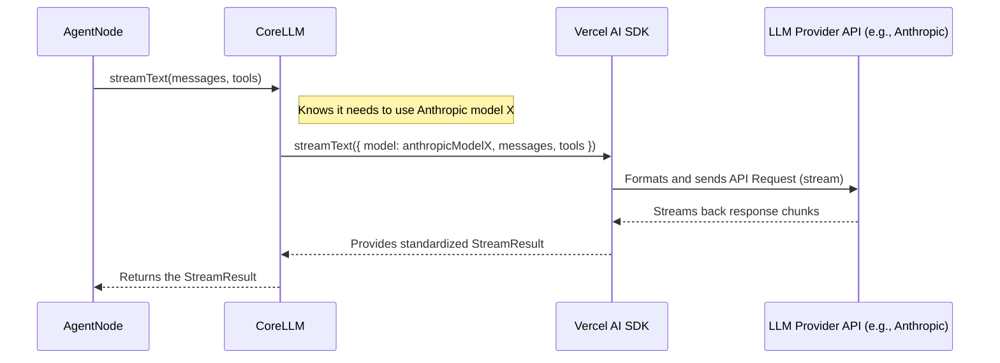

# Chapter 4: CoreLLM (LLM Abstraction)

In [Chapter 3: Nodes (`BaseNode`, `AgentNode`)](03_nodes___basenode____agentnode___.md), we learned that the `AgentNode` is the "manager" of our AI agent, handling conversations and deciding when to use Tools. But how does this manager actually *talk* to the powerful AI brain, the Large Language Model (LLM)? That's where `CoreLLM` comes in!

## The Problem: So Many Remotes!

Imagine you have several different TVs at home: a Sony, an LG, and a Samsung. Each TV comes with its own specific remote control. If you want to turn on the Sony, you need the Sony remote. To change the channel on the LG, you need the LG remote. It's a bit confusing, right?

Different Large Language Models (LLMs) like OpenAI's GPT-4, Anthropic's Claude, and Google's Gemini are like those different TVs. Each one has its own way of being controlled – its own specific Application Programming Interface (API), its own way of handling requests, and its own format for responses.

If our `AgentNode` had to learn the specific "remote control" for every single LLM, its code would become very complex and hard to manage. What if we wanted to switch our "Finance Assistant" from using Claude to using Gemini? We'd have to rewrite parts of the `AgentNode`!

## The Solution: A Universal Remote (`CoreLLM`)

Wouldn't it be great if you had *one* universal remote that could control all your TVs? You press the "power" button, and it knows how to turn on whichever TV you're pointing it at.

**`CoreLLM` is AgentDock's universal remote control for LLMs.**

It acts as a **translator** or **adapter**. The `AgentNode` doesn't need to know the specific details of talking to Claude or GPT or Gemini. It just talks to `CoreLLM` using a single, simple set of commands, like:

*   "Generate some text based on this conversation."
*   "Start streaming a response based on this conversation."
*   "Generate some text, and here are the tools you can use."

`CoreLLM` then takes these simple commands and translates them into the specific instructions needed by the actual LLM provider (like Anthropic or Google) that the agent is configured to use (remember the `nodeConfigurations` in [Chapter 1: Agent Configuration (`AgentConfig`)](01_agent_configuration___agentconfig___.md)?).

```json
// From finance-assistant/template.json in Chapter 1
"nodeConfigurations": {
  "llm.anthropic": { // Config for the AgentNode using CoreLLM
    "model": "claude-3-5-sonnet-20240620", // Tells CoreLLM *which* model
    "apiKey": "..." // Tells CoreLLM the key for Anthropic
  }
}
```

Based on this configuration, `CoreLLM` knows it needs to talk to Anthropic using the specified model and API key.

## How the `AgentNode` Uses `CoreLLM`

The `AgentNode` holds an instance of `CoreLLM`. When it needs the LLM's help (e.g., to respond to a user message or decide if a tool is needed), it calls methods on its `CoreLLM` instance.

Let's look at a simplified example of how the `AgentNode` might ask `CoreLLM` to stream a response:

```typescript
// Simplified example inside AgentNode's logic

// 'this.llm' is the CoreLLM instance for this AgentNode
const llm = this.llm; 

// 1. Prepare the conversation history for the LLM
const messages: CoreMessage[] = [
  { role: 'system', content: 'You are a helpful assistant.' },
  { role: 'user', content: 'Hi! Can you tell me a joke?' }
];

// 2. Ask CoreLLM to start streaming a response
const streamResult = await llm.streamText({ 
  messages: messages,
  // Maybe provide tools if needed
});

// 3. The AgentNode can now work with the streamResult 
//    (e.g., send the streaming text back to the user interface)
//    It doesn't need to know if this came from Claude, GPT, or Gemini!
```

**Explanation:**

1.  The `AgentNode` prepares the input for the LLM – usually the conversation history (`messages`).
2.  It calls the `streamText` method on its `CoreLLM` instance (`llm`). This is the "universal command".
3.  `CoreLLM` takes care of talking to the *actual* configured LLM (like Claude) behind the scenes. It returns a `streamResult` object that the `AgentNode` can use in a standard way, regardless of the underlying provider.

`CoreLLM` provides other simple methods like:

*   `generateText()`: For when you need the full response at once, not streamed.
*   `generateObject()`: For asking the LLM to output structured data (like JSON) matching a specific format.

## Key Benefits of `CoreLLM`

*   **Simplicity:** The `AgentNode` code stays clean and doesn't need provider-specific logic.
*   **Flexibility:** You can easily switch the underlying LLM for an agent just by changing its `AgentConfig` (e.g., changing `"llm.anthropic"` to `"llm.openai"` and updating the configuration). No code changes needed in the `AgentNode`!
*   **Consistency:** It handles text generation, streaming, and tool usage calls in a uniform way across all supported LLMs.
*   **Centralized Logic:** It handles the common complexities of interacting with LLMs, like formatting API requests, managing API keys, and basic error handling.

## What Happens Under the Hood?

How does this "universal remote" actually work? `CoreLLM` relies heavily on a fantastic library called the **Vercel AI SDK**. This SDK provides tools to interact with many different LLM providers in a standardized way.

Here’s a step-by-step look at what happens when the `AgentNode` calls `CoreLLM.streamText()`:

1.  **Request Received:** `CoreLLM` gets the request from `AgentNode`, including the messages and maybe a list of available tools.
2.  **Identify Provider:** `CoreLLM` knows which LLM provider (e.g., Anthropic) and model (e.g., `claude-3-5-sonnet-20240620`) to use based on the configuration it received when it was created (originally from the `AgentConfig`).
3.  **Call AI SDK:** `CoreLLM` uses the Vercel AI SDK's functions. It essentially says to the SDK: "Please stream text using *this specific Anthropic model*, with *these messages* and *these tools*."
4.  **SDK Handles API Call:** The Vercel AI SDK takes care of formatting the request correctly for the Anthropic API and makes the actual network call.
5.  **Provider Streams Response:** The LLM provider (Anthropic) starts sending back the response in small pieces (streaming).
6.  **SDK Processes Stream:** The Vercel AI SDK receives these pieces and makes them available in a standardized stream format.
7.  **Result Returned:** `CoreLLM` gets this standardized stream result from the SDK and passes it back to the `AgentNode`.

Here's a simplified diagram of that flow:



## A Peek at the Code

Let's look at the main `CoreLLM` class definition (`agentdock-core/src/llm/core-llm.ts`). We'll keep it simple!

```typescript
// Simplified from agentdock-core/src/llm/core-llm.ts
import { 
  LanguageModel, // Represents the specific LLM model (e.g., Claude)
  CoreMessage, 
  streamText,    // Function from Vercel AI SDK
  generateText,  // Function from Vercel AI SDK
  // ... other imports from 'ai' SDK ...
} from 'ai'; 
import { LLMConfig } from './types'; // Our config type

export class CoreLLM {
  private model: LanguageModel; // The actual model object from the AI SDK
  private config: LLMConfig;    // Stores provider, apiKey, model name etc.

  constructor({ model, config }: { model: LanguageModel; config: LLMConfig }) {
    this.model = model;
    this.config = config;
    // Ready to act as a universal remote for 'this.model'!
  }

  // --- Universal Commands ---

  async streamText(options: { messages: CoreMessage[], /*...*/ }) {
    // Uses the AI SDK's streamText function, passing the specific model
    const streamResult = await streamText({
      model: this.model, // Tells SDK which actual model to use
      messages: options.messages,
      // ... pass other options like tools, temperature ...
    });
    return streamResult; // Return the standardized result
  }

  async generateText(options: { messages: CoreMessage[], /*...*/ }) {
    // Uses the AI SDK's generateText function
    const result = await generateText({
      model: this.model, // Tells SDK which actual model to use
      messages: options.messages,
      // ... pass other options ...
    });
    return result; // Return the standardized result
  }
  
  // ... other methods like generateObject, streamObject ...
}
```

**Explanation:**

*   The `CoreLLM` class takes the specific `LanguageModel` object (created by the AI SDK for a provider like Anthropic or OpenAI) and the `LLMConfig` in its `constructor`.
*   Methods like `streamText` and `generateText` are simple wrappers around the corresponding functions from the Vercel AI SDK (`ai` library).
*   Crucially, they pass `this.model` to the SDK functions, telling the SDK *which specific LLM* to talk to for this particular `CoreLLM` instance.

**How is the right `LanguageModel` created?**

There's a helper function `createLLM` (`agentdock-core/src/llm/create-llm.ts`) that reads the `LLMConfig` and uses other helpers (`agentdock-core/src/llm/model-utils.ts`) to ask the Vercel AI SDK to create the correct `LanguageModel` object (e.g., an Anthropic one or an OpenAI one).

```typescript
// Simplified from agentdock-core/src/llm/create-llm.ts
import { CoreLLM } from './core-llm';
import { LLMConfig } from './types';
import { 
  createAnthropicModel, // Helper to get Anthropic model object
  createOpenAIModel,    // Helper to get OpenAI model object
  // ... other model creation helpers ...
} from './model-utils'; 

export function createLLM(config: LLMConfig): CoreLLM {
  let model; // This will hold the LanguageModel object

  // Check the provider name from the config
  switch (config.provider) {
    case 'anthropic':
      model = createAnthropicModel(config); // Get Anthropic model
      break;
    case 'openai':
      model = createOpenAIModel(config); // Get OpenAI model
      break;
    // ... cases for gemini, deepseek, groq ...
    default:
      throw new Error(`Unsupported provider: ${config.provider}`);
  }

  // Create the CoreLLM instance, giving it the specific model object
  return new CoreLLM({ model, config }); 
}
```

**Explanation:**

*   `createLLM` acts like a factory. Based on the `provider` field in the `config`, it calls the appropriate function (like `createAnthropicModel`) to get the specific `LanguageModel` object from the Vercel AI SDK.
*   It then creates and returns a `CoreLLM` instance equipped with that specific model, ready to be used by an `AgentNode`.

## Conclusion

You've now learned about `CoreLLM`, AgentDock's essential abstraction for interacting with Large Language Models!

*   It acts like a **universal remote control**, hiding the differences between LLM providers like Anthropic, OpenAI, and Google.
*   It provides a **simple, consistent interface** (`streamText`, `generateText`, etc.) for the `AgentNode` to use.
*   It makes it **easy to switch LLMs** by just changing the [Agent Configuration (`AgentConfig`)](01_agent_configuration___agentconfig___.md).
*   Under the hood, it leverages the **Vercel AI SDK** to communicate with the actual LLM APIs.

`CoreLLM` simplifies development significantly, allowing the rest of AgentDock (especially the `AgentNode`) to focus on conversation logic and tool usage without worrying about the specific details of each LLM provider.

Now that we understand how the agent configures itself (`AgentConfig`), uses tools (`Tools`), organizes its capabilities (`Nodes`), and talks to its AI brain (`CoreLLM`), how is the entire conversation flow managed? How does the system decide when to call the LLM versus when to execute a tool? That's where orchestration comes in.

Next: [Chapter 5: Orchestration (`OrchestrationManager`)](05_orchestration___orchestrationmanager___.md)

---

Generated by [AI Codebase Knowledge Builder](https://github.com/The-Pocket/Tutorial-Codebase-Knowledge)