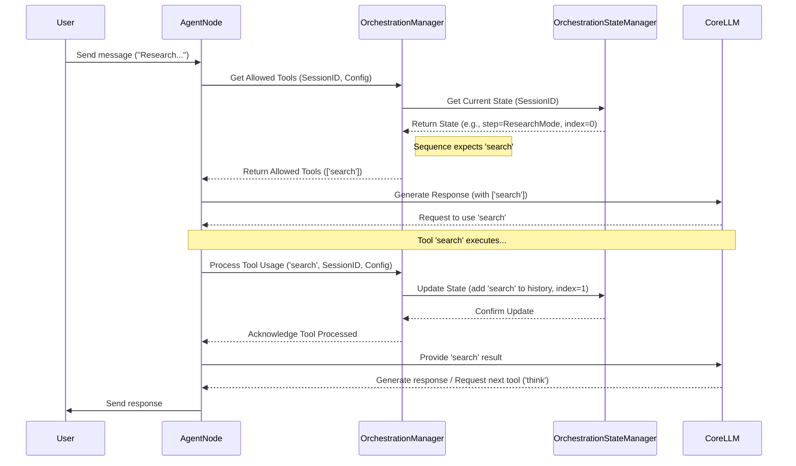

# Chapter 5: Orchestration (`OrchestrationManager`)

In [Chapter 4: CoreLLM (LLM Abstraction)](04_corellm__llm_abstraction__.md), we saw how `CoreLLM` acts like a universal remote, letting our `AgentNode` talk to different AI brains (LLMs) easily. The `AgentNode` can ask the `CoreLLM` to generate text, and it can also give the `CoreLLM` a list of [Tools](02_tools_.md) it might want to use.

But this raises a question: How does the agent decide *when* to just talk versus *when* to use a specific tool? And can we guide this process to make the agent behave in a more structured way?

## The Problem: Predictable Steps

Imagine you want an agent to help you research a topic. A good process might be:

1.  **Search:** First, use a search tool to gather basic information.
2.  **Think:** Then, use its AI brain (LLM) to structure and analyze that information.
3.  **Reflect:** Finally, use the LLM again to summarize the key findings and potential biases.

If we just let the agent decide freely, it might jump straight to reflecting without searching, or it might search multiple times randomly. How can we ensure it follows these specific steps in the right order?

## The Solution: The Conductor (`OrchestrationManager`)

This is where the **`OrchestrationManager`** comes in. Think of it as the **conductor of an orchestra**. The agent's capabilities (talking via `CoreLLM`, using various `Tools`) are like the different instruments. The `OrchestrationManager` doesn't play any instruments itself, but it holds the musical score (the rules) and guides the musicians (the agent's capabilities) on *when* and *how* to play.

It helps create more structured, predictable, and controllable agent behavior by:

*   Defining different **stages** or **steps** in a conversation.
*   Specifying **which tools** are allowed at each step.
*   Sometimes enforcing a **strict sequence** of tools that *must* be used.

These rules are defined in a special section called `orchestration` within the agent's blueprint, the [Agent Configuration (`AgentConfig`)](01_agent_configuration___agentconfig___.md).

## Key Concepts of Orchestration

Let's break down the "musical score" – the `OrchestrationConfig` – that the `OrchestrationManager` reads. This configuration is typically part of the agent's `template.json` file.

### 1. `OrchestrationConfig`: The Rulebook

This is the main JSON object within `template.json` that defines the rules. Here's a simplified example from the "Cognitive Reasoner" agent, which is designed for complex thinking tasks:

```json
// Simplified from agents/cognitive-reasoner/template.json
{
  // ... other AgentConfig properties ...
  "orchestration": {
    "description": "Guides the agent to select a mode (sequence) based on the query.",
    "steps": [ 
      // ... Step definitions go here ... 
    ]
  }
  // ... other AgentConfig properties ...
}
```

### 2. Steps (`steps`): Conversation Stages

Inside the `orchestration` block, you define a list of `steps`. Each step represents a distinct phase or mode of the conversation.

*   **`name`**: A unique identifier for the step (e.g., "ResearchMode", "ProblemSolvingMode").
*   **`description`**: Explains what happens in this step.
*   **`isDefault`**: If `true`, this step is used when no other step's conditions are met. Think of it as the starting or fallback stage.

```json
// Simplified step definition
{
  "name": "ResearchMode",
  "description": "Agent focuses on searching and analyzing.",
  // ... other properties like conditions, sequence ...
},
{
  "name": "DefaultMode",
  "description": "General mode, no specific restrictions.",
  "isDefault": true 
}
```

### 3. Sequences (`sequence`): Mandatory Tool Order

Some steps might require the agent to use a specific set of tools in a precise order. This is defined using the `sequence` property within a step.

```json
// Simplified step with a sequence
{
  "name": "ResearchMode",
  "description": "Research using Search -> Think -> Reflect.",
  "sequence": [ 
    "search",   // Must use 'search' first
    "think",    // Then must use 'think'
    "reflect"   // Finally must use 'reflect'
  ],
  // ... other properties ...
}
```

If a step has a `sequence`, the `OrchestrationManager` will only allow the agent to use the *next* required tool in that list.

### 4. Conditions (`conditions`): Switching Steps

How does the agent move from one step to another? `conditions` define the rules for activating a specific step.

*   **`type`**: The kind of condition. Common types:
    *   `tool_used`: Becomes true if a specific tool (`value`) was recently used.
    *   `sequence_match`: Becomes true if the sequence of recently used tools matches the `sequence` defined in *this* step (useful for triggering a step *after* a sequence completes).
*   **`value`**: The value to check against (e.g., the tool name for `tool_used`).

```json
// Simplified step with a condition
{
  "name": "AnalysisMode",
  "description": "Activates after the 'search' tool has been used.",
  "conditions": [
    { "type": "tool_used", "value": "search" } 
  ]
  // ... other properties ...
}
```

The `OrchestrationManager` checks these conditions to determine which step is currently active.

### 5. Tool Availability (`availableTools`): Allowed/Denied Tools

Within a step, even if there isn't a strict `sequence`, you can still control which tools the agent is allowed or forbidden to use.

*   **`allowed`**: A list of tool names. Only these tools can be used in this step.
*   **`denied`**: A list of tool names. These tools *cannot* be used in this step.

```json
// Simplified step with tool availability rules
{
  "name": "CreativeMode",
  "description": "Focus on brainstorming, no searching allowed.",
  "availableTools": {
    "allowed": ["think", "brainstorm"], // Only these are okay
    "denied": ["search"]                // Explicitly forbid search
  }
}
```

If a step has *both* `sequence` and `availableTools`, the `sequence` takes priority – only the next tool in the sequence is allowed. `availableTools` is more commonly used in steps *without* a sequence.

### 6. `OrchestrationManager`: The Enforcer

The `OrchestrationManager` is the actual system component (a class in the code) that puts all these rules into action during a conversation.

*   It **reads** the `OrchestrationConfig` for the specific agent.
*   It **keeps track** of the current state for each user session (which step is active? what tools were used recently? how far into a sequence are we?). This state is managed by an internal helper called `OrchestrationStateManager`.
*   It **evaluates** the `conditions` to determine the current `activeStep`.
*   It **filters** the list of all possible tools based on the active step's `sequence` or `availableTools`.
*   It **updates** the state when a tool is used (e.g., adds the tool to history, advances the sequence index).

## How Orchestration Works in Practice

Let's follow the flow when a user sends a message to an agent using orchestration:

1.  **User Message:** You send a message, e.g., "Research the impact of AI on jobs."
2.  **AgentNode Receives:** The agent's main [Nodes (`BaseNode`, `AgentNode`)](03_nodes___basenode____agentnode___.md) receives the message.
3.  **Check Orchestration:** Before calling the [CoreLLM (LLM Abstraction)](04_corellm__llm_abstraction__.md), the `AgentNode` asks the `OrchestrationManager`: "For this user session, given the `OrchestrationConfig`, what's the current state and which tools are allowed *right now*?"
4.  **Manager Evaluates:** The `OrchestrationManager` retrieves the session's state (using `OrchestrationStateManager`). Let's say the state indicates the "ResearchMode" step is active, and the `sequence` requires "search" next. The manager determines that only the "search" tool is currently allowed.
5.  **Filtered Tools:** The `OrchestrationManager` tells the `AgentNode`: "Only allow the 'search' tool."
6.  **LLM Call:** The `AgentNode` calls `CoreLLM.streamText()`, providing the user message, conversation history, and *only the allowed tools* (in this case, just "search").
7.  **LLM Decides:** The LLM analyzes the request ("Research...") and sees that the "search" tool is available and appropriate. It decides to use it.
8.  **Tool Execution:** The system executes the "search" tool.
9.  **Tool Result & State Update:** The "search" tool returns its results. The `AgentNode` (often via a helper service like `LLMOrchestrationService`) informs the `OrchestrationManager`: "The 'search' tool was just used for this session."
10. **Manager Updates State:** The `OrchestrationManager` updates the session state: adds "search" to the `recentlyUsedTools` history and advances the `sequenceIndex` for "ResearchMode" (now expecting "think").
11. **LLM Continues:** The `AgentNode` gives the search results back to the `CoreLLM`.
12. **Next Interaction:** Now, if the LLM needs to use another tool, the `AgentNode` will again ask the `OrchestrationManager`. This time, the manager will see the state expects "think" next in the sequence and will only allow the "think" tool.
13. **Final Response:** The process continues until the sequence is complete or the LLM generates a final text response to the user.

## Under the Hood: A Quick Look

Let's see how the `OrchestrationManager` coordinates this.

**High-Level Flow Diagram:**



**Key Code Components:**

*   **`OrchestrationManager` (`agentdock-core/src/orchestration/index.ts`):** The main class coordinating the logic.

    ```typescript
    // Simplified from agentdock-core/src/orchestration/index.ts
    import { OrchestrationStateManager, createOrchestrationStateManager } from './state';
    import { StepSequencer, createStepSequencer } from './sequencer';
    // ... other imports

    export class OrchestrationManager {
      private stateManager: OrchestrationStateManager;
      private sequencer: StepSequencer;

      constructor(options: OrchestrationManagerOptions = {}) {
        // Gets or creates the state manager (handles storage)
        this.stateManager = createOrchestrationStateManager(options); 
        // Gets or creates the sequencer (handles sequence logic)
        this.sequencer = createStepSequencer(this.stateManager);
      }

      // Determines the current step based on conditions and state
      async getActiveStep(config, messages, sessionId): Promise<OrchestrationStep | undefined> {
        const state = await this.stateManager.getOrCreateState(sessionId);
        // ... logic to check conditions against state.recentlyUsedTools ...
        // ... finds matching step or default step ...
        // ... updates state.activeStep if changed ...
        return activeStep;
      }

      // Determines allowed tools based on the active step's rules
      async getAllowedTools(config, messages, sessionId, allToolIds): Promise<string[]> {
        const activeStep = await this.getActiveStep(config, messages, sessionId);
        if (!activeStep) return allToolIds; // No rules, allow all

        // If sequence, ask the sequencer for the next tool
        if (activeStep.sequence?.length) {
          return this.sequencer.filterToolsBySequence(activeStep, sessionId, allToolIds);
        }
        
        // Otherwise, apply allowed/denied rules
        // ... logic using activeStep.availableTools ...
        return filteredTools;
      }

      // Updates state after a tool is used
      async processToolUsage(config, messages, sessionId, toolName): Promise<void> {
        const activeStep = await this.getActiveStep(config, messages, sessionId);
        if (!activeStep) return;
        
        // Tell the sequencer (which updates state via stateManager)
        await this.sequencer.processTool(activeStep, sessionId, toolName); 
        
        // Re-check if the step should change now that the tool was used
        await this.getActiveStep(config, messages, sessionId); 
      }

      // Gets the current state (used for conditions, etc.)
      async getState(sessionId: SessionId): Promise<AIOrchestrationState | null> {
        return await this.stateManager.toAIOrchestrationState(sessionId);
      }
      
      // Updates arbitrary parts of the state
      async updateState(sessionId, partialState) {
          return await this.stateManager.updateState(sessionId, partialState);
      }
    }
    ```

    **Explanation:**
    *   The `OrchestrationManager` uses helper classes: `OrchestrationStateManager` (to load/save the current status like `activeStep`, `recentlyUsedTools`, `sequenceIndex`) and `StepSequencer` (to handle the specific logic of enforcing `sequence` rules).
    *   `getActiveStep` finds the right step based on rules and history.
    *   `getAllowedTools` filters tools based on the active step's sequence or allow/deny lists.
    *   `processToolUsage` records that a tool was used and advances any active sequence.

*   **`OrchestrationStateManager` (`agentdock-core/src/orchestration/state.ts`):** Handles saving and loading the orchestration state for each session. It uses the [Session Management (`SessionManager`)](07_session_management___sessionmanager___.md) and [Storage (`StorageProvider`, `StorageFactory`)](08_storage___storageprovider____storagefactory___.md) components discussed later to persist this state.

    ```typescript
    // Simplified concept from agentdock-core/src/orchestration/state.ts
    import { SessionManager } from '../session';
    // ...

    export class OrchestrationStateManager {
      private sessionManager: SessionManager<OrchestrationState>; // Uses SessionManager!

      constructor(/* ... options including storage ... */) {
        // ... initializes sessionManager with storage ...
      }

      // Gets state (or creates if missing) using SessionManager
      async getOrCreateState(sessionId): Promise<OrchestrationState | null> {
        const result = await this.sessionManager.getSession(sessionId);
        if (result.success && result.data) return result.data;
        // ... handle creation if needed ...
        return newState;
      }

      // Updates state using SessionManager
      async updateState(sessionId, updates): Promise<OrchestrationState | null> {
        const updateFn = (currentState) => ({ ...currentState, ...updates });
        const result = await this.sessionManager.updateSession(sessionId, updateFn);
        return result.data;
      }
      
      // Adds tool to history (within updateState usually)
      async addUsedTool(sessionId, toolName) { /* ... */ }

      // Converts internal state to AI-facing state
      async toAIOrchestrationState(sessionId): Promise<AIOrchestrationState | null> { /* ... */ }
    }
    ```

*   **`StepSequencer` (`agentdock-core/src/orchestration/sequencer.ts`):** Focuses specifically on managing the `sequence` logic within a step.

    ```typescript
    // Simplified concept from agentdock-core/src/orchestration/sequencer.ts
    import { OrchestrationStateManager } from './state';
    // ...

    export class StepSequencer {
      private stateManager: OrchestrationStateManager;

      // Filters tools: returns ONLY the next expected tool if in a sequence
      async filterToolsBySequence(step, sessionId, allToolIds): Promise<string[]> {
        const state = await this.stateManager.getState(sessionId);
        const currentIndex = state?.sequenceIndex ?? 0;
        const expectedTool = step.sequence?.[currentIndex];
        
        if (expectedTool && allToolIds.includes(expectedTool)) {
          return [expectedTool]; // Only allow the expected tool
        }
        return allToolIds; // Sequence done or tool unavailable? Allow all/none.
      }

      // Processes tool use: advances sequence index if the tool matches
      async processTool(step, sessionId, usedTool): Promise<boolean> {
         await this.stateManager.addUsedTool(sessionId, usedTool); // Always track history
         
         const state = await this.stateManager.getState(sessionId);
         const currentIndex = state?.sequenceIndex ?? 0;
         const expectedTool = step.sequence?.[currentIndex];

         if (step.sequence && expectedTool === usedTool) {
           // Advance the index in the state
           await this.stateManager.updateState(sessionId, { sequenceIndex: currentIndex + 1 });
           return true;
         }
         return false; // Tool didn't match sequence
      }
    }
    ```

By separating concerns (`Manager` for overall coordination, `StateManager` for persistence, `Sequencer` for sequence logic), the system remains organized and easier to manage.

## Conclusion

You've learned about the `OrchestrationManager`, AgentDock's "conductor" for controlling agent behavior!

*   It allows you to define **structured workflows** using `steps`, `conditions`, `sequences`, and `availableTools` within the agent's `OrchestrationConfig`.
*   It acts as a **gatekeeper**, determining which tools the agent is allowed to use at any given moment based on the current state and rules.
*   It helps create **more predictable and reliable agents**, especially for tasks requiring specific multi-step processes.
*   It relies on `OrchestrationStateManager` to remember the state for each conversation and `StepSequencer` to handle mandatory tool orders.

Understanding orchestration unlocks the ability to build sophisticated agents that follow specific protocols or workflows.

Now that we've covered the core components of an agent (Config, Tools, Nodes, LLM, Orchestration), how does an external user actually interact with an agent? The next chapter explains how AgentDock exposes agents through a web API.

Next: [Chapter 6: API Route (`/api/chat/[agentId]/route.ts`)](06_api_route____api_chat__agentid__route_ts___.md)

---

Generated by [AI Codebase Knowledge Builder](https://github.com/The-Pocket/Tutorial-Codebase-Knowledge)