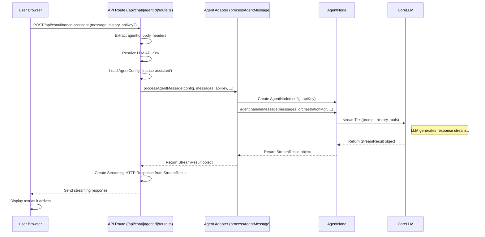

# Chapter 6: API Route (`/api/chat/[agentId]/route.ts`)

In the [Chapter 5: Orchestration (`OrchestrationManager`)](05_orchestration___orchestrationmanager___.md), we saw how the `OrchestrationManager` acts like a conductor, guiding the agent through specific steps and controlling tool usage. But how does your message from the chat window even reach the agent and its conductor in the first place? And how does the agent's response get back to your screen?

Let's explore the main "front door" for all chat interactions: the API Route.

## The Big Idea: The Chat Server's Front Door

Imagine you're sending a letter to a specific department (an agent) in a large company (AgentDock). You don't just throw the letter over the fence! You put it in an envelope, address it to the right department (`agentId`), and drop it off at the company's mailroom (the API Route).

The mailroom (`/api/chat/[agentId]/route.ts`) is the central point on the AgentDock web server that receives all incoming chat messages from the user interface. Its job is to:

1.  **Receive the Message:** Accept the incoming "letter" (the user's message and chat history).
2.  **Identify the Recipient:** Figure out which agent (`agentId`) the message is for.
3.  **Check Credentials:** Find the necessary keys (like API keys) to allow the agent to work.
4.  **Prepare the Agent:** Load the agent's instructions ([Agent Configuration (`AgentConfig`)](01_agent_configuration___agentconfig___.md)).
5.  **Deliver the Message:** Pass the message and instructions to the right internal systems (like the [Nodes (`BaseNode`, `AgentNode`)](03_nodes___basenode____agentnode___.md) and [Orchestration (`OrchestrationManager`)](05_orchestration___orchestrationmanager___.md)).
6.  **Return the Reply:** Get the agent's response (often as a stream of text) and send it back to the user's browser.

This specific file, `src/app/api/chat/[agentId]/route.ts`, is a special kind of file in a Next.js web application. It defines a server-side endpoint that your browser can talk to.

## Key Concepts

Let's quickly understand a few key ideas:

*   **API Route:** In Next.js (the web framework AgentDock uses), an API route is a file inside the `app/api` directory that runs on the server, not in the user's browser. It allows the browser (front-end) to securely communicate with the server (back-end) to perform actions or get data.
*   **Dynamic Route (`[agentId]`):** The square brackets `[]` in the filename mean this part of the URL is dynamic. So, whether you send a message to `/api/chat/finance-assistant` or `/api/chat/travel-planner`, this *same* `route.ts` file handles the request. It can then look at the URL to know which `agentId` was requested.
*   **HTTP Request:** When you send a message in the chat UI, your browser sends an HTTP `POST` request to the API route. This request contains data like your message, the chat history, and potentially which agent you're talking to.
*   **HTTP Response (Streaming):** The API route needs to send the agent's reply back. Instead of waiting for the entire reply (which might take time for the AI to generate), it usually *streams* the response. This means it sends the text back in small chunks as soon as they are generated, so you see the reply appearing word by word in the chat UI, making it feel much faster.

## How it Works: From User Message to Agent Reply

Let's trace the journey of your chat message:

1.  **You Type & Send:** You type "What's Apple's stock price?" in the chat window for the "Finance Assistant" and hit Send.
2.  **Browser Sends Request:** Your browser packages up your message, the chat history, and sends an HTTP POST request to `/api/chat/finance-assistant`. It might also include an API key you provided in the settings via a special header (`x-api-key`).
3.  **API Route Receives:** The `route.ts` file on the server receives this request.
4.  **Identify Agent:** It extracts `agentId` ("finance-assistant") from the URL.
5.  **Get Data:** It reads the message history and your new message from the request body.
6.  **Find API Key:** It looks for the LLM API key needed by the Finance Assistant. It checks (in order):
    *   The `x-api-key` header from the request.
    *   Global API key settings stored securely.
    *   Environment variables on the server (if "Bring Your Own Key" mode is off).
7.  **Load Agent Blueprint:** It finds the `template.json` for "finance-assistant" and uses `loadAgentConfig` (from [Chapter 1: Agent Configuration (`AgentConfig`)](01_agent_configuration___agentconfig___.md)) to create the complete `AgentConfig` object, securely adding the API key.
8.  **Call the Adapter:** It calls a helper function, `processAgentMessage` (found in `src/lib/agent-adapter.ts`). This function acts as an intermediary to the core agent logic.
9.  **Adapter Works:** `processAgentMessage` takes the `AgentConfig`, messages, API key, etc. It might:
    *   Get the [Orchestration (`OrchestrationManager`)](05_orchestration___orchestrationmanager___.md) instance.
    *   Create the specific [Nodes (`BaseNode`, `AgentNode`)](03_nodes___basenode____agentnode___.md) needed (like the `AgentNode` itself).
    *   Call the `AgentNode`'s `handleMessage` method, passing the messages, orchestration manager, and other context.
10. **Agent Thinks & Responds:** The `AgentNode` uses its [CoreLLM (LLM Abstraction)](04_corellm__llm_abstraction__.md) and available [Tools](02_tools_.md) (like `stock_price`), guided by the `OrchestrationManager`, to process the request and generate a response stream.
11. **Stream Back to Route:** The `AgentNode`'s `handleMessage` method returns a result object containing the live response stream back to the `processAgentMessage` function, which returns it to the API route (`route.ts`).
12. **Route Sends to Browser:** The API route takes this stream and sends it back to your browser as the HTTP response.
13. **UI Displays:** Your browser receives the streaming text chunks and displays them in the chat window.

Phew! That seems like a lot, but it happens very quickly. The key is that the API route acts as the central coordinator for handling web requests.

## Under the Hood

Let's look a bit closer at the code and flow.

### Sequence Diagram

This diagram shows the main players involved when you send a message:



### Code Walkthrough: `route.ts`

This file contains the main `POST` function that handles incoming chat requests.

```typescript
// File: src/app/api/chat/[agentId]/route.ts
import { NextRequest, NextResponse } from 'next/server';
import { 
  loadAgentConfig, // From Chapter 1
  APIError, ErrorCode, logger, LogCategory, Message
} from 'agentdock-core';
import { templates, TemplateId } from '@/generated/templates'; // Bundled blueprints
import { processAgentMessage } from '@/lib/agent-adapter'; // The helper adapter
import { getLLMInfo } from '@/lib/utils';
// ... other imports like resolveApiKey, addOrchestrationHeaders ...

// This function handles POST requests to /api/chat/[agentId]
export async function POST(
  request: NextRequest,
  context: { params: Promise<{ agentId: string }> }
) {
  try {
    // 1. Get agentId from the URL (e.g., "finance-assistant")
    const { agentId } = await context.params;
    logger.debug(LogCategory.API, 'ChatRoute', 'Processing chat request', { agentId });

    // 2. Read data from the request (messages, session info)
    const body = await request.json();
    const { messages, system, sessionId: requestSessionId, config: runtimeOverrides } = body;

    // 3. Find the agent's blueprint (template)
    const template = templates[agentId as TemplateId];
    if (!template) {
      throw new APIError('Template not found', /*...*/);
    }

    // 4. Figure out which LLM provider this agent uses
    const llmInfo = getLLMInfo(template);

    // 5. Resolve the necessary LLM API key (checks headers, settings, env vars)
    const apiKey = await resolveApiKey(request, llmInfo.provider, /* isByokOnly */);
    if (!apiKey) {
      throw new APIError('API key is required', /*...*/);
    }

    // 6. Load the full AgentConfig, injecting the API key securely
    const fullAgentConfig = await loadAgentConfig(template, apiKey);
    
    // 7. Get Session ID (from header or body, or create new)
    const clientSessionId = request.headers.get('x-session-id') || requestSessionId;
    const finalSessionId = clientSessionId || `session-${agentId}-${Date.now()}`;

    // --- Orchestration State Handling (Simplified) ---
    let orchestrationState = null;
    if (template.orchestration) {
      // Fetch state if needed, using the orchestration adapter
      orchestrationState = await import('@/lib/orchestration-adapter')
        .then(m => m.getOrchestrationState(finalSessionId, /*...*/));
    }
    // --- End Orchestration ---

    // 8. Call the Agent Adapter to handle the core logic
    const result = await processAgentMessage({
      agentId,
      messages: messages as Message[],
      sessionId: finalSessionId,
      apiKey,
      provider: llmInfo.provider,
      system,
      config: runtimeOverrides, // Pass runtime overrides like temperature
      fullAgentConfig: fullAgentConfig, // Pass the loaded config
      orchestrationState // Pass the fetched state
      // ... potentially pass fallback API key ...
    });

    // 9. Create the streaming response from the adapter's result
    const response = result.toDataStreamResponse(); 

    // 10. Add extra headers (like session ID, token usage, orchestration state)
    response.headers.set('x-session-id', finalSessionId);
    // ... add x-token-usage header if available ...
    await import('@/lib/orchestration-adapter')
      .then(m => m.addOrchestrationHeaders(response, finalSessionId));

    // 11. Send the streaming response back to the browser
    return response;

  } catch (error) {
    // Handle errors gracefully
    logger.error(LogCategory.API, 'ChatRoute', 'Error processing chat request', /*...*/);
    return new Response(JSON.stringify(normalizeError(error)), /*...*/);
  }
}
```

**Explanation:**

1.  The `POST` function receives the `request` and `context` (which contains the `agentId`).
2.  It gets the agent's template (`template.json` content).
3.  It resolves the required `apiKey` using the `resolveApiKey` helper.
4.  It loads the full `fullAgentConfig` using `loadAgentConfig`.
5.  It determines the `finalSessionId`.
6.  It potentially fetches the current `orchestrationState` (relevant for [Chapter 5: Orchestration (`OrchestrationManager`)](05_orchestration___orchestrationmanager___.md)).
7.  Crucially, it calls `processAgentMessage`, passing all the necessary information.
8.  It gets a `result` object back from the adapter. This object contains methods to create the final response.
9.  It calls `result.toDataStreamResponse()` to get a standard web `Response` object that streams the agent's reply.
10. It adds useful headers (like the session ID and orchestration state) to the response.
11. It returns the `response` to the browser.

### Code Walkthrough: `agent-adapter.ts`

The API route delegates the core agent interaction logic to `processAgentMessage` in this adapter file. This keeps the route file cleaner.

```typescript
// File: src/lib/agent-adapter.ts
import { 
  logger, LogCategory, Message, AgentNode, AgentConfig 
} from 'agentdock-core';
import { v4 as uuidv4 } from 'uuid';
import { getOrchestrationManagerInstance } from '@/lib/orchestration-adapter';
// ... other imports ...

// Options expected by processAgentMessage
interface HandleMessageOptions {
  // ... agentId, messages, apiKey, provider, etc ...
  fullAgentConfig: AgentConfig; // The fully loaded AgentConfig
  sessionId?: string;
  orchestrationState?: any; // Optional pre-fetched state
}

// This function orchestrates the interaction with the AgentNode
export async function processAgentMessage(options: HandleMessageOptions) {
  const { 
    agentId, 
    messages,
    sessionId,
    apiKey, 
    provider,
    system,
    config: runtimeOverrides, 
    _fallbackApiKey,
    orchestrationState,
    fullAgentConfig // Use the passed-in config
  } = options;

  const finalSessionId = sessionId || uuidv4();

  // Get the shared OrchestrationManager instance
  const manager = getOrchestrationManagerInstance();
  // Ensure session state exists (important for orchestration)
  await manager.ensureStateExists(finalSessionId); 

  // 1. Create the AgentNode instance
  //    We pass the loaded fullAgentConfig here.
  const agent = new AgentNode(
      agentId, 
      {
        agentConfig: fullAgentConfig, // The core blueprint!
        apiKey,
        provider,
        options: runtimeOverrides, // LLM overrides (temp, etc.)
        // ... fallback key if needed ...
      }
  );

  try {
    // 2. Call the AgentNode's main method
    //    Pass messages, session ID, the manager, and pre-fetched state
    const result = await agent.handleMessage({
      messages,
      sessionId: finalSessionId,
      orchestrationManager: manager, // Pass the manager instance
      systemOverride: system, 
      ...(runtimeOverrides ? { config: runtimeOverrides } : {}),
      ...(orchestrationState ? { orchestrationState } : {}) // Pass state
    });
    
    // 3. Return the result object (containing the stream) to the API route
    //    The adapter doesn't process the stream itself.
    return {
        ...result, // Include all properties from the AgentNode result
        // Helper method used by the API route to create the final response
        toDataStreamResponse(opts = {}) { 
            return result.toDataStreamResponse(opts);
        }
    };

  } catch (error) {
    logger.error(LogCategory.API, 'AgentAdapter', 'Error processing agent message', /*...*/);
    throw error; // Re-throw for the API route to handle
  }
} 
```

**Explanation:**

1.  It receives the `fullAgentConfig` (already loaded by the API route), `apiKey`, `messages`, `sessionId`, etc.
2.  It gets the instance of the [Orchestration (`OrchestrationManager`)](05_orchestration___orchestrationmanager___.md).
3.  It creates the specific [Nodes (`BaseNode`, `AgentNode`)](03_nodes___basenode____agentnode___.md) instance for this agent, passing in the `fullAgentConfig` and `apiKey`.
4.  It calls the crucial `agent.handleMessage` method, providing all the context needed for the agent to run (messages, session ID, the orchestration manager, etc.).
5.  It receives the `result` object back from `agent.handleMessage`. This object contains the stream and other information (like token usage promises).
6.  It returns this `result` object back to the API route (`route.ts`).

### API Key Resolution

The `resolveApiKey` function (used inside `route.ts`) handles finding the correct LLM API key. It checks in this order:

1.  `x-api-key` header: If the user provided a key directly in the UI settings for this session.
2.  Global Settings: Checks secure storage for a globally configured key for the required LLM provider (e.g., Anthropic).
3.  Environment Variables: If "Bring Your Own Key" (BYOK) mode is OFF, it looks for server environment variables like `ANTHROPIC_API_KEY` or `OPENAI_API_KEY`. If BYOK is ON, it *stops* before checking environment variables, requiring the user to provide a key via steps 1 or 2.

This ensures flexibility while allowing administrators to control key usage.

## Conclusion

You've now seen how the `/api/chat/[agentId]/route.ts` API route acts as the essential entry point for chat interactions in AgentDock's web interface.

*   It's the **front door** that receives user messages via HTTP requests.
*   It identifies the target **agent** using the dynamic `[agentId]` part of the URL.
*   It **coordinates** loading the agent's configuration, resolving API keys, and managing session information.
*   It delegates the core agent logic to helper functions/adapters (like `processAgentMessage`) which interact with `AgentNode`, `CoreLLM`, and `OrchestrationManager`.
*   It efficiently **streams** the agent's response back to the user's browser.

Understanding this route helps you see how the user interface connects to the powerful backend components we've discussed. But how does AgentDock remember the state of your conversation across multiple messages, especially for things like orchestration? That involves session management.

Next: [Chapter 7: Session Management (`SessionManager`)](07_session_management___sessionmanager___.md)

---

Generated by [AI Codebase Knowledge Builder](https://github.com/The-Pocket/Tutorial-Codebase-Knowledge)