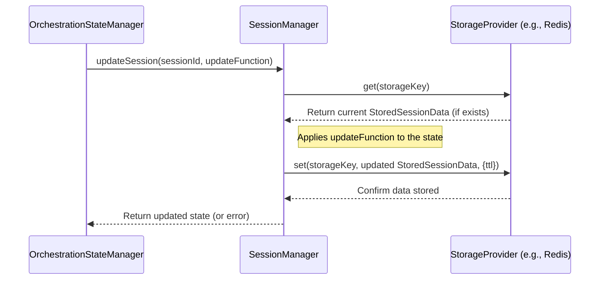

# Chapter 7: Session Management (`SessionManager`)

In [Chapter 6: API Route (`/api/chat/[agentId]/route.ts`)](06_api_chat__agentid__route_ts__.md), we saw how the API route acts as the front door, receiving your messages and sending back the agent's replies. We also saw how it gets the `sessionId` and potentially loads the `orchestrationState`. But how does the system *remember* that state between your different messages? How does it keep your conversation separate from someone else talking to the same agent?

## The Problem: Amnesia and Mixed-Up Conversations

Imagine talking to an assistant who forgets everything you just said the moment you pause. You ask, "What's the capital of France?" They answer, "Paris." Then you ask, "What's its population?" And they reply, "Whose population?" They've forgotten you were talking about Paris!

Also, imagine you're chatting with the "Finance Assistant", and someone else starts chatting with the same assistant at the same time. If the system isn't careful, your request for Apple's stock price might get mixed up with their request for Bitcoin's price, leading to confusing or wrong answers for both of you.

We need a way to:

1.  **Remember:** Keep track of important details *within* a single conversation (like the current topic, recent messages, or the current step in an [Orchestration (`OrchestrationManager`)](05_orchestration___orchestrationmanager___.md)).
2.  **Isolate:** Ensure that each user's conversation is completely separate and doesn't interfere with others.

## The Solution: The Hotel Front Desk (`SessionManager`)

This is exactly what the **`SessionManager`** does. Think of AgentDock as a hotel. Each time a new guest (a user starting a chat) arrives, the `SessionManager` (the friendly hotel front desk clerk) gives them a unique room key (`sessionId`).

*   **Unique Key (`sessionId`):** This key ensures the guest can only access their own room. In AgentDock, the `sessionId` uniquely identifies *your* specific conversation.
*   **Room (`SessionState`):** The hotel room holds the guest's belongings and maybe notes about their stay (like "requested extra towels"). In AgentDock, the `SessionState` is where we store information specific to *your* conversation, like the [Orchestration (`OrchestrationManager`)](05_orchestration___orchestrationmanager___.md) status (which step you're on), cumulative token counts, or even recent message summaries.
*   **Front Desk (`SessionManager`):** The front desk manages all the keys and knows which key belongs to which room. It can retrieve information about a specific guest's stay if you give them the key. In AgentDock, the `SessionManager` manages all active `sessionId`s and their corresponding `SessionState`. It provides functions to create, get, update, and delete the state associated with a specific `sessionId`.

By using the `SessionManager`, AgentDock ensures that when you send a message with your unique `sessionId` (your room key), the system retrieves *your* specific `SessionState` (checks *your* room), processes your message in that context, updates the state if needed (maybe puts a new note in your room), and sends the reply back to you, without ever affecting any other guest's (user's) conversation.

## Key Concepts

1.  **`SessionId`:** A unique string (like `session-finance-12345` or a long random ID) that identifies one specific conversation instance. This is your unique room key.
2.  **`SessionState`:** An object holding the data associated with a `SessionId`. This can include anything the system needs to remember for that specific chat, like the `activeStep` or `recentlyUsedTools` used by the [Orchestration (`OrchestrationManager`)](05_orchestration___orchestrationmanager___.md). This is the information stored *inside* your room.
3.  **`SessionManager`:** The class responsible for managing the lifecycle of sessions. It provides methods like `createSession`, `getSession`, `updateSession`, and `deleteSession`. This is the front desk clerk.
4.  **`StorageProvider`:** Where does the `SessionManager` actually store the `SessionState`? It uses a pluggable [Storage (`StorageProvider`, `StorageFactory`)](08_storage___storageprovider____storagefactory___.md) (like in-memory storage for quick tests, or Redis for a persistent, shared storage). This is the hotel's record-keeping system (a filing cabinet, a computer database).

## How it's Used: Remembering Orchestration State

Let's revisit the `OrchestrationStateManager` from [Chapter 5: Orchestration (`OrchestrationManager`)](05_orchestration___orchestrationmanager___.md). Its job is to remember things like the `activeStep` or `sequenceIndex` for a specific conversation. How does it do this across multiple messages? **It uses the `SessionManager`!**

The `OrchestrationStateManager` doesn't store the state itself directly. Instead, it asks the `SessionManager` to store and retrieve the orchestration-related data as part of the overall `SessionState` for that conversation.

Here's a simplified example showing how `OrchestrationStateManager` uses `SessionManager`:

```typescript
// Simplified concept from agentdock-core/src/orchestration/state.ts
import { SessionManager } from '../session'; // Uses SessionManager!
import { SessionId, SessionState } from '../types/session';

// Define what orchestration state looks like (extends basic SessionState)
interface OrchestrationState extends SessionState {
  activeStep?: string;
  recentlyUsedTools: string[];
  sequenceIndex?: number;
  // ... other fields like lastAccessed, cumulativeTokenUsage ...
}

// Factory function to create a NEW blank state for a session
function createDefaultOrchestrationState(sessionId: SessionId): OrchestrationState {
  return { sessionId, recentlyUsedTools: [], sequenceIndex: 0, /* ... */ };
}

export class OrchestrationStateManager {
  // It HOLDS a SessionManager instance, specifically for OrchestrationState
  private sessionManager: SessionManager<OrchestrationState>;

  constructor(/* ... options including storageProvider ... */) {
    // Creates a SessionManager, telling it HOW to create a default state
    // and WHICH storage provider to use.
    this.sessionManager = new SessionManager<OrchestrationState>(
        createDefaultOrchestrationState, // Function to create new state
        options.storageProvider,         // Where to store it
        'orchestration-state'            // Namespace in storage
    );
  }

  // Get state for a session (using SessionManager)
  async getState(sessionId: SessionId): Promise<OrchestrationState | null> {
    // Ask the SessionManager to get the data for this key
    const result = await this.sessionManager.getSession(sessionId);
    return result.success ? result.data : null;
  }

  // Update state for a session (using SessionManager)
  async updateState(sessionId: SessionId, updates: Partial<OrchestrationState>): Promise<OrchestrationState | null> {
    // Define HOW to merge the updates with the current state
    const updateFn = (currentState: OrchestrationState): OrchestrationState => {
        return { ...currentState, ...updates, lastAccessed: Date.now() };
    };
    // Ask SessionManager to apply this update function
    const result = await this.sessionManager.updateSession(sessionId, updateFn);
    return result.success ? result.data : null;
  }

  // Add a used tool (uses updateState above)
  async addUsedTool(sessionId: SessionId, toolName: string): Promise<OrchestrationState | null> {
    const state = await this.getState(sessionId);
    if (!state) return null;
    const updatedTools = [toolName, ...(state.recentlyUsedTools || [])].slice(0, 10);
    // Calls updateState, which uses sessionManager.updateSession
    return this.updateState(sessionId, { recentlyUsedTools: updatedTools });
  }
}
```

**Explanation:**

1.  `OrchestrationState` defines the specific pieces of information the orchestrator needs to remember (like `activeStep`). It includes `sessionId` because all session states need it.
2.  The `OrchestrationStateManager` *contains* a `SessionManager` instance. This `SessionManager` is specifically configured to handle `OrchestrationState`.
3.  When `OrchestrationStateManager` needs to get the state (`getState`), it simply calls `this.sessionManager.getSession(sessionId)`.
4.  When it needs to update the state (`updateState`, `addUsedTool`), it defines *how* the state should change and then calls `this.sessionManager.updateSession(sessionId, updateFn)`.

The `OrchestrationStateManager` focuses on the *logic* of orchestration, while the `SessionManager` handles the generic task of *storing and retrieving* that state reliably and separately for each session, using the configured [Storage (`StorageProvider`, `StorageFactory`)](08_storage___storageprovider____storagefactory___.md).

## Under the Hood: `SessionManager` Internals

How does the `SessionManager` itself work? It's essentially a bridge between your code and the storage layer.

**High-Level Flow (Updating State):**



**Code Structure (`SessionManager`):**

Let's look at a simplified version of the `SessionManager` class itself.

```typescript
// Simplified from agentdock-core/src/session/index.ts
import { SessionId, SessionState, SessionResult } from '../types/session';
import { StorageProvider } from '../storage/types';
import { logger } from '../logging';

// Wrapper for stored data, includes state, metadata, TTL
interface StoredSessionData<T extends SessionState> {
    state: T;
    metadata: { createdAt: Date; lastAccessedAt: Date; /*...*/ };
    ttlMs: number;
}

export class SessionManager<T extends SessionState> {
  private storage: StorageProvider; // The storage system (e.g., Memory, Redis)
  private defaultStateGenerator: (sessionId: SessionId) => T; // How to make a new state
  private storageNamespace: string; // Prefix for storage keys
  private defaultTtlMs: number; // Default time-to-live

  constructor(
    defaultStateGenerator: (sessionId: SessionId) => T,
    storageProvider: StorageProvider,
    storageNamespace: string = 'sessions',
    options: { defaultTtlMs?: number } = {}
  ) {
    this.storage = storageProvider; // Store the provided storage instance
    this.defaultStateGenerator = defaultStateGenerator;
    this.storageNamespace = storageNamespace;
    this.defaultTtlMs = options.defaultTtlMs || 30 * 60 * 1000; // Default 30 mins
    logger.debug('SessionManager initialized', { ns: storageNamespace });
  }

  // Helper to create the key used in storage
  private getStorageKey(sessionId: SessionId): string {
    return `${this.storageNamespace}:${sessionId}`;
  }

  // Get session data from storage
  async getSession(sessionId: SessionId): Promise<SessionResult<T>> {
    const storageKey = this.getStorageKey(sessionId);
    try {
      const storedData = await this.storage.get<StoredSessionData<T>>(storageKey);
      if (!storedData) {
        return { success: false, sessionId, error: 'Session not found' };
      }
      // TODO: Optionally update lastAccessed time here?
      return { success: true, sessionId, data: storedData.state };
    } catch (error: any) {
      logger.error('Error getting session', { error: error.message });
      return { success: false, sessionId, error: error.message };
    }
  }

  // Update session data in storage
  async updateSession(sessionId: SessionId, updateFn: (state: T) => T): Promise<SessionResult<T>> {
    const storageKey = this.getStorageKey(sessionId);
    try {
      const storedData = await this.storage.get<StoredSessionData<T>>(storageKey);
      if (!storedData) {
        return { success: false, sessionId, error: 'Session not found for update' };
      }
      
      // Apply the update function to the state
      const updatedState = updateFn(storedData.state);
      
      // Prepare the full data object to store
      const updatedSessionData: StoredSessionData<T> = {
          ...storedData,
          state: updatedState,
          metadata: { ...storedData.metadata, lastAccessedAt: new Date() }
      };
      
      // Calculate TTL in seconds for storage provider
      const ttlSeconds = this.defaultTtlMs > 0 ? Math.floor(this.defaultTtlMs / 1000) : undefined;

      // Save back to storage with TTL
      await this.storage.set(storageKey, updatedSessionData, { ttlSeconds });
      
      return { success: true, sessionId, data: updatedState };
    } catch (error: any) {
       logger.error('Error updating session', { error: error.message });
      return { success: false, sessionId, error: error.message };
    }
  }

  // Create a brand new session in storage
  async createSession(options: { sessionId?: SessionId } = {}): Promise<SessionResult<T>> {
    const sessionId = options.sessionId || `session_${Date.now()}`; // Generate ID if needed
    const storageKey = this.getStorageKey(sessionId);

    // Check if it already exists first
    const existing = await this.storage.get(storageKey);
    if (existing) {
      logger.warn('Session already exists, returning existing.', { sessionId });
      return this.getSession(sessionId); // Just return the existing one
    }

    // Create new state and metadata
    const state = this.defaultStateGenerator(sessionId);
    const now = new Date();
    const sessionData: StoredSessionData<T> = {
      state,
      metadata: { createdAt: now, lastAccessedAt: now },
      ttlMs: this.defaultTtlMs
    };
    const ttlSeconds = this.defaultTtlMs > 0 ? Math.floor(this.defaultTtlMs / 1000) : undefined;

    try {
      // Store the new session
      await this.storage.set(storageKey, sessionData, { ttlSeconds });
      return { success: true, sessionId, data: state };
    } catch (error: any) {
      logger.error('Error creating session', { error: error.message });
      return { success: false, sessionId, error: error.message };
    }
  }
  
  // Delete a session
  async deleteSession(sessionId: SessionId): Promise<SessionResult<boolean>> {
      const storageKey = this.getStorageKey(sessionId);
      try {
          const deleted = await this.storage.delete(storageKey);
          return { success: true, sessionId, data: deleted };
      } catch (error: any) {
          logger.error('Error deleting session', { error: error.message });
          return { success: false, sessionId, error: error.message };
      }
  }
}
```

**Explanation:**

1.  **Constructor:** Takes the `defaultStateGenerator` function (so it knows how to create a *new* empty state), the `storageProvider` instance (where to save/load), and a `storageNamespace` (to keep keys organized).
2.  **`getStorageKey`:** A simple helper to create a unique key for the storage system (e.g., `orchestration-state:session-12345`).
3.  **`getSession`:** Uses `storage.get(key)` to retrieve the data. It returns just the `state` part.
4.  **`updateSession`:** Retrieves the current data using `storage.get(key)`, applies the `updateFn` provided by the caller (e.g., `OrchestrationStateManager`) to modify the `state`, updates the `lastAccessedAt` timestamp, and then saves the *entire* `StoredSessionData` object back using `storage.set(key, data, {ttl})`. Using `ttl` tells the storage system to automatically delete the data after a period of inactivity.
5.  **`createSession`:** Creates a new state using `defaultStateGenerator`, wraps it in `StoredSessionData` with current timestamps, and saves it using `storage.set(key, data, {ttl})`.
6.  **`deleteSession`:** Uses `storage.delete(key)` to remove the session data.

The `SessionManager` provides a clean API (`getSession`, `updateSession`, etc.) while hiding the details of how and where the data is actually stored.

## Conclusion

You've now learned about the `SessionManager`, AgentDock's system for remembering things within a conversation and keeping different conversations separate.

*   It acts like a **hotel front desk**, managing unique **keys (`sessionId`)** for each conversation.
*   It stores conversation-specific data (**`SessionState`**) like orchestration status or token counts.
*   It ensures **isolation** between different user chats.
*   It relies on a **`StorageProvider`** to actually save and load the session data.
*   Core components like `OrchestrationStateManager` *use* the `SessionManager` to persist their state across messages.

Understanding `SessionManager` shows how AgentDock maintains context and separation in conversations. But how does the actual storage part work? Where do these session states get saved?

Next: [Chapter 8: Storage (`StorageProvider`, `StorageFactory`)](08_storage___storageprovider____storagefactory___.md)

---

Generated by [AI Codebase Knowledge Builder](https://github.com/The-Pocket/Tutorial-Codebase-Knowledge)