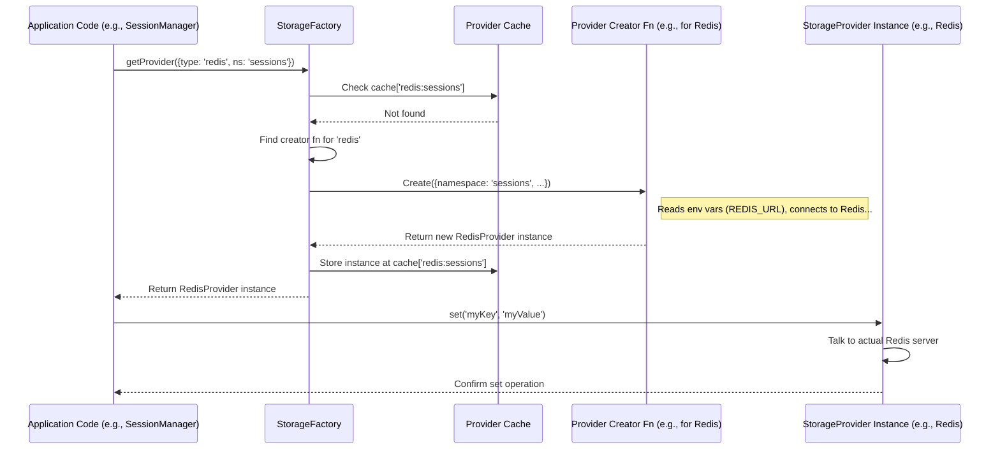

# Chapter 8: Storage (`StorageProvider`, `StorageFactory`)

In the [Chapter 7: Session Management (`SessionManager`)](07_session_management___sessionmanager___.md), we learned how the `SessionManager` keeps track of conversation details using a unique `sessionId` and `SessionState`. But we left one question unanswered: where does the `SessionManager` actually *save* all that `SessionState` data? Does it just keep it in the computer's temporary memory, or does it put it somewhere more permanent?

## The Problem: Where to Keep the Notes?

Imagine our `SessionManager` (the hotel front desk clerk) needs to keep notes about each guest's stay (the `SessionState`). Where should they put these notes?

*   **Sticky Notes:** They could use sticky notes on their desk. This is fast and easy for temporary notes, but if the power goes out or they go home, the notes are lost! This is like storing data only in the computer's active memory.
*   **Filing Cabinet:** They could put the notes in a sturdy filing cabinet. This takes a bit more effort to file and retrieve, but the notes are safe even if the power goes out. If multiple clerks need access, they can share the cabinet. This is like using a persistent database (like Redis or Vercel KV).

Which option is best? It depends! For quick tests or development, maybe sticky notes (memory) are fine. For a real application where you don't want to lose conversation state, you need the filing cabinet (persistent storage).

AgentDock needs a way to *choose* where to store data like session state, API keys, or other temporary information, without the rest of the application needing to worry about the details.

## The Solution: Flexible Filing Cabinets

AgentDock solves this with the **Storage** system, primarily using two concepts:

1.  **`StorageProvider` (The Filing Cabinet Blueprint):** This is like a standard blueprint that defines what *any* filing cabinet must be able to do. It says every cabinet must have standard operations like:
    *   `get(key)`: Find and retrieve a specific file (data) using its label (key).
    *   `set(key, value)`: Put a new file (data) into the cabinet with a specific label (key).
    *   `delete(key)`: Remove a file using its label.
    *   `exists(key)`: Check if a file with a specific label exists.
    *   (And a few others for handling multiple files or lists).
    This blueprint ensures that components like the [Session Management (`SessionManager`)](07_session_management___sessionmanager___.md) can use *any* storage system that follows the rules, without needing to know if it's a simple in-memory store or a powerful Redis database.

2.  **`StorageFactory` (The Filing Cabinet Store):** This is like a store where you can choose and get the specific type of filing cabinet you need based on your requirements (and configuration). You tell the factory:
    *   "I need an 'in-memory' cabinet for testing."
    *   "I need a 'Redis' cabinet connected to this address for production."
    *   "I need a 'Vercel KV' cabinet for my Vercel deployment."
    The factory knows how to build and give you the correct cabinet (a `StorageProvider` instance) ready to use.

## How `SessionManager` Uses Storage

Let's look back at the `SessionManager` from [Chapter 7: Session Management (`SessionManager`)](07_session_management___sessionmanager___.md). It needs to save and load `SessionState`. How does it use our storage concepts?

When a `SessionManager` is created, it's *given* a specific `StorageProvider` instance (like the Redis cabinet obtained from the `StorageFactory`).

```typescript
// Simplified concept from SessionManager constructor
import { StorageProvider } from '../storage/types';
import { getStorageFactory } from '../storage/factory';

export class SessionManager<T extends SessionState> {
  private storage: StorageProvider; // Holds the filing cabinet instance!

  constructor(
    defaultStateGenerator: (sessionId: SessionId) => T,
    storageProvider?: StorageProvider, // Can be passed in!
    storageNamespace: string = 'sessions'
    // ...
  ) {
    // Use the provided cabinet, or get a default one (memory) from the factory
    this.storage = storageProvider || getStorageFactory().getProvider({
      type: 'memory', // Default to simple memory storage
      namespace: storageNamespace
    });
    // ...
  }

  // --- Methods using the storage ---

  async getSession(sessionId: SessionId): Promise<SessionResult<T>> {
    const storageKey = this.getStorageKey(sessionId); // e.g., "sessions:session-123"
    // Use the cabinet's 'get' operation
    const storedData = await this.storage.get<StoredSessionData<T>>(storageKey);
    // ... handle result ...
  }

  async updateSession(sessionId: SessionId, updateFn: (state: T) => T): Promise<SessionResult<T>> {
    const storageKey = this.getStorageKey(sessionId);
    // ... get current data using this.storage.get() ...
    // ... apply updateFn ...
    // Use the cabinet's 'set' operation to save back
    await this.storage.set(storageKey, updatedSessionData, { /* ttl options */ });
    // ... handle result ...
  }

  async deleteSession(sessionId: SessionId): Promise<SessionResult<boolean>> {
     const storageKey = this.getStorageKey(sessionId);
     // Use the cabinet's 'delete' operation
     const deleted = await this.storage.delete(storageKey);
     // ... handle result ...
  }
}
```

**Explanation:**

1.  The `SessionManager` takes a `storageProvider` when it's created. If none is provided, it gets a default `memory` provider from the `StorageFactory`.
2.  Inside its methods (`getSession`, `updateSession`, `deleteSession`), it calls the corresponding standard methods (`get`, `set`, `delete`) on the `this.storage` object (which is the specific `StorageProvider` instance it was given).

The `SessionManager` doesn't care *which* type of storage provider it has, as long as it follows the standard blueprint (`StorageProvider` interface). This makes `SessionManager` flexible and decoupled from the storage details.

## Under the Hood: Building and Using Cabinets

Let's look closer at the blueprint and the factory.

### `StorageProvider`: The Blueprint

The core interface defining the standard operations is `StorageProvider` found in `agentdock-core/src/storage/types.ts`.

```typescript
// Simplified from agentdock-core/src/storage/types.ts

/**
 * Core storage provider interface (The Filing Cabinet Blueprint)
 */
export interface StorageProvider {
  /** Retrieve a file by its label (key) */
  get<T>(key: string, options?: StorageOptions): Promise<T | null>;

  /** Put a file (value) into the cabinet with a label (key) */
  set<T>(key: string, value: T, options?: StorageOptions): Promise<void>;

  /** Remove a file by its label (key) */
  delete(key: string, options?: StorageOptions): Promise<boolean>;

  /** Check if a file with this label (key) exists */
  exists(key: string, options?: StorageOptions): Promise<boolean>;

  /** Get multiple files at once */
  getMany<T>(keys: string[], options?: StorageOptions): Promise<Record<string, T | null>>;
  
  /** Save multiple files at once */
  setMany<T>(items: Record<string, T>, options?: StorageOptions): Promise<void>;
  
  /** Delete multiple files at once */
  deleteMany(keys: string[], options?: StorageOptions): Promise<number>;
  
  /** List files whose labels start with a prefix */
  list(prefix: string, options?: ListOptions): Promise<string[]>;
  
  /** Get a range of items from a list stored at a key */
  getList<T>(key: string, start?: number, end?: number, options?: StorageOptions): Promise<T[] | null>;

  /** Save an entire list to a key */
  saveList<T>(key: string, values: T[], options?: StorageOptions): Promise<void>;

  /** Remove an entire list */
  deleteList(key: string, options?: StorageOptions): Promise<boolean>;

  /** Clean up resources (like closing connections) */
  destroy?(): Promise<void>;
}
```

**Explanation:**

*   This interface simply lists the standard methods that any storage system (in-memory, Redis, Vercel KV, etc.) must implement.
*   Methods like `get`, `set`, `delete` are the fundamental operations.
*   Others like `getMany`, `setMany`, `list`, `getList` provide more advanced or optimized ways to interact with the storage.
*   Using `Promise` means these operations might take some time (like talking to a network database) and are handled asynchronously.

### `StorageFactory`: The Store

The `StorageFactory` (`agentdock-core/src/storage/factory.ts`) is responsible for creating instances of specific `StorageProvider` implementations. It acts as a central point for configuration and management.

**How it's used:**

You typically get the single, shared factory instance and ask it for a provider:

```typescript
import { getStorageFactory } from 'agentdock-core/storage';

// Get the factory instance (singleton)
const factory = getStorageFactory();

// Ask the factory for a Redis provider for the 'sessions' namespace
const redisProvider = factory.getProvider({
  type: 'redis', // Specify the type of cabinet
  namespace: 'sessions', // A prefix for keys for this usage
  // Config might be read from environment variables inside the factory
});

// Ask for a default provider (might be 'memory' or configured elsewhere)
const defaultProvider = factory.getDefaultProvider();

// Now you can use redisProvider.set(...) or defaultProvider.get(...)
```

**Inside the Factory (Simplified):**

```typescript
// Simplified from agentdock-core/src/storage/factory.ts
import { MemoryStorageProvider, RedisStorageProvider, VercelKVProvider } from './providers';
import { StorageProvider, StorageProviderFactory, StorageProviderOptions } from './types';

// Registry to hold functions that create providers
interface ProviderRegistry { [type: string]: StorageProviderFactory; }
// Cache to reuse provider instances (e.g., one connection per namespace)
interface ProviderCache { [cacheKey: string]: StorageProvider; }

export class StorageFactory {
  private static instance: StorageFactory; // Singleton instance
  private providers: ProviderRegistry = {}; // Holds creator functions
  private providerCache: ProviderCache = {}; // Holds created instances
  private defaultType: string = 'memory'; // Default cabinet type

  private constructor() {
    // Register built-in cabinet types and how to make them
    this.registerProvider('memory', (options = {}) => new MemoryStorageProvider(options));
    this.registerProvider('redis', (options = {}) => {
        // Reads process.env.REDIS_URL, process.env.REDIS_TOKEN internally
        return new RedisStorageProvider({ namespace: options.namespace, /* ... */ });
    });
    this.registerProvider('vercel-kv', (options = {}) => new VercelKVProvider({ namespace: options.namespace }));
    // ...
  }

  // Get the single shared factory instance
  public static getInstance(): StorageFactory { /* ... returns instance ... */ }

  // Add a new cabinet type
  public registerProvider(type: string, factory: StorageProviderFactory): void { /* ... adds to providers ... */ }

  // Get (or create and cache) a specific cabinet instance
  public getProvider(options: Partial<StorageProviderOptions> = {}): StorageProvider {
    const type = options.type || this.defaultType;
    const namespace = options.namespace || 'default';
    const cacheKey = `${type}:${namespace}`; // e.g., "redis:sessions"

    // Reuse if already created for this type and namespace
    if (this.providerCache[cacheKey]) {
      return this.providerCache[cacheKey];
    }

    // Find the creator function for this type
    const factory = this.providers[type];
    if (!factory) throw new Error(`Provider type '${type}' not registered`);

    // Create the new cabinet instance
    const provider = factory({ namespace, ...options.config }); // Pass config

    // Cache it for next time
    this.providerCache[cacheKey] = provider;
    return provider;
  }
  // ... other methods like setDefaultType, getDefaultProvider ...
}

// Helper function to get the singleton instance easily
export function getStorageFactory(): StorageFactory {
  return StorageFactory.getInstance();
}
```

**Explanation:**

1.  **Singleton:** There's usually only one `StorageFactory` instance in the application (`getInstance`).
2.  **Registration:** When the factory starts, it `registerProvider`s the known types ('memory', 'redis', 'vercel-kv') along with functions that know how to create them. These creation functions often read connection details (like `REDIS_URL`) from environment variables.
3.  **`getProvider`:** This is the main method. You ask for a `type` and `namespace`.
    *   It creates a `cacheKey` (e.g., "redis:sessions").
    *   It checks its `providerCache`. If an instance for that key already exists (meaning we already connected to Redis for the 'sessions' namespace), it returns the existing one to reuse the connection.
    *   If not cached, it finds the registered creation function (`factory`) for the requested `type`.
    *   It calls the function to create the new `StorageProvider` instance (e.g., actually connecting to Redis).
    *   It stores the new instance in the `providerCache` and returns it.

This factory pattern makes it easy to manage different storage backends and configure them centrally, often using environment variables. For example, the `getConfiguredStorageProvider` helper function used by the `OrchestrationManager` checks `process.env.KV_STORE_PROVIDER` or `process.env.REDIS_URL` to decide which type of provider to request from the factory.

**Flow Diagram: Getting and Using a Provider**



### Example Providers (`MemoryStorageProvider`, `RedisStorageProvider`)

AgentDock includes implementations of the `StorageProvider` interface:

*   **`MemoryStorageProvider` (`agentdock-core/src/storage/providers/memory-provider.ts`):**
    *   Stores data in a simple JavaScript `Map` in the computer's memory.
    *   Very fast, requires no external setup.
    *   **Data is lost** when the application restarts.
    *   Good for development, testing, or temporary data. Can optionally use a shared global map for persistence across serverless function calls if configured.

*   **`RedisStorageProvider` (`agentdock-core/src/storage/providers/redis-provider.ts`):**
    *   Uses the `@upstash/redis` library to connect to a Redis database (like Upstash or Vercel KV which uses the Redis API).
    *   Data is **persistent** across restarts.
    *   Requires a running Redis instance and connection details (URL, token) usually provided via environment variables (`REDIS_URL`, `SRH_TOKEN` or `KV_REST_API_TOKEN`).
    *   Suitable for production.

*   **`VercelKVProvider` (`agentdock-core/src/storage/providers/vercel-kv-provider.ts`):**
    *   Uses the `@vercel/kv` library, specifically designed for Vercel KV.
    *   Data is **persistent**.
    *   Typically configured automatically by Vercel environment variables when deployed.
    *   Ideal for applications hosted on Vercel.

Each of these classes implements all the methods defined in the `StorageProvider` interface (`get`, `set`, `delete`, etc.) using the specific commands for its backend (in-memory Map operations, Redis commands, or Vercel KV SDK calls).

## Conclusion

You've reached the end of our core concepts tutorial! In this final chapter, we explored AgentDock's flexible **Storage** system:

*   It solves the problem of needing different places to store data (like session state) depending on the environment (testing vs. production).
*   The **`StorageProvider`** interface acts as a **standard blueprint** defining common operations (`get`, `set`, `delete`) for any storage system.
*   The **`StorageFactory`** acts as a **store or builder**, creating specific `StorageProvider` instances (like `MemoryStorageProvider`, `RedisStorageProvider`, `VercelKVProvider`) based on configuration, often read from environment variables.
*   Components like the [Session Management (`SessionManager`)](07_session_management___sessionmanager___.md) are built to work with *any* `StorageProvider`, making them flexible and decoupled from storage details.

This flexible storage approach allows AgentDock to adapt to different deployment scenarios, from simple local testing to robust cloud deployments, ensuring data like conversation state can be managed appropriately.

Congratulations on completing the AgentDock core concepts tutorial! You now have a foundational understanding of:

*   How agents are defined ([Agent Configuration (`AgentConfig`)](01_agent_configuration___agentconfig___.md))
*   How they gain special abilities ([Tools](02_tools_.md))
*   The building blocks of capabilities ([Nodes (`BaseNode`, `AgentNode`)](03_nodes___basenode____agentnode___.md))
*   How agents interact with AI models ([CoreLLM (LLM Abstraction)](04_corellm__llm_abstraction__.md))
*   How complex workflows are managed ([Orchestration (`OrchestrationManager`)](05_orchestration___orchestrationmanager___.md))
*   How users interact via the web ([API Route (`/api/chat/[agentId]/route.ts`)](06_api_route____api_chat__agentid__route_ts__.md))
*   How conversation state is remembered ([Session Management (`SessionManager`)](07_session_management___sessionmanager___.md))
*   And how that state is saved ([Storage (`StorageProvider`, `StorageFactory`)](08_storage___storageprovider____storagefactory___.md))

You're now well-equipped to start building and customizing your own powerful AI agents with AgentDock!

---

Generated by [AI Codebase Knowledge Builder](https://github.com/The-Pocket/Tutorial-Codebase-Knowledge)