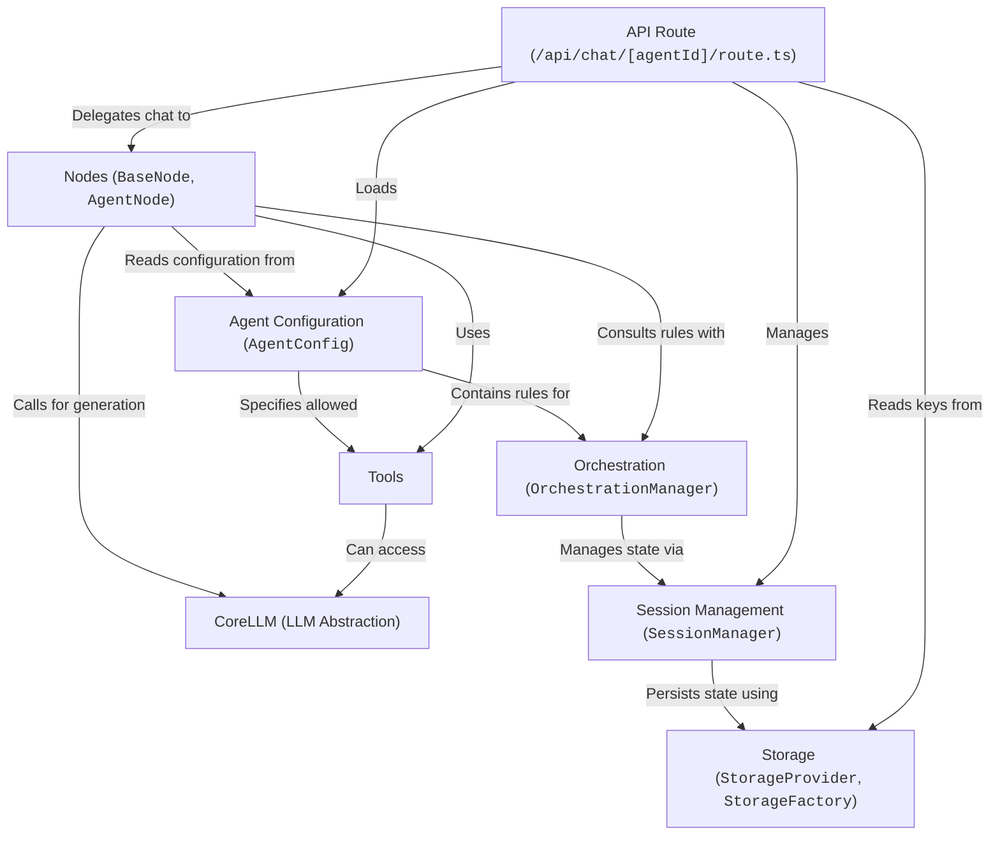

# Tutorial: AgentDock

AgentDock is a framework for building *AI agents*. Think of it like a toolkit to create specialized AI assistants.
You define an agent's **personality**, what **tools** (like search or calculators) it can use, and how it should handle conversations using a configuration file (`AgentConfig`).
The core logic is handled by **Nodes**, especially the `AgentNode`, which interacts with Language Models (`CoreLLM`) and follows rules (`Orchestration`) to decide when to talk and when to use tools.
It keeps track of conversations (`Session Management`) and saves data (`Storage`), all accessible through a web API (`API Route`).

**Source Repository:** [https://github.com/AgentDock/AgentDock](https://github.com/AgentDock/AgentDock)

## Chapters

1. [Agent Configuration (`AgentConfig`)
](01_agent_configuration___agentconfig___.md)
2. [Tools
](02_tools_.md)
3. [Nodes (`BaseNode`, `AgentNode`)
](03_nodes___basenode____agentnode___.md)
4. [CoreLLM (LLM Abstraction)
](04_corellm__llm_abstraction__.md)
5. [Orchestration (`OrchestrationManager`)
](05_orchestration___orchestrationmanager___.md)
6. [API Route (`/api/chat/[agentId]/route.ts`)
](06_api_route____api_chat__agentid__route_ts___.md)
7. [Session Management (`SessionManager`)
](07_session_management___sessionmanager___.md)
8. [Storage (`StorageProvider`, `StorageFactory`)
](08_storage___storageprovider____storagefactory___.md)

---

Generated by [AI Codebase Knowledge Builder](https://github.com/The-Pocket/Tutorial-Codebase-Knowledge)