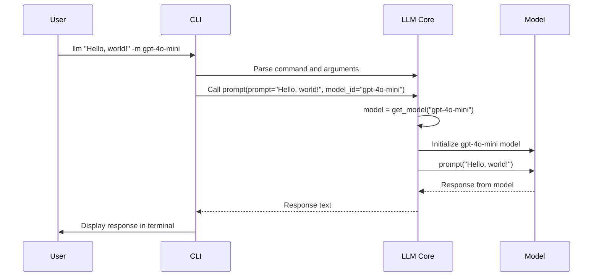

# Chapter 1: cli (Click CLI group)

Welcome to the first step in your journey with `llm`! This chapter will introduce you to the `cli`, which is essentially the control panel for the entire `llm` tool. Think of it like the dashboard of a car - it's how you tell the system what to do.

**Why is a CLI important?**

Imagine you want to ask a large language model (LLM) a question, like "What are the best types of cheese for a cheese board?". Without a command-line interface (CLI), you'd have to write a whole program to interact with the LLM. The `cli` simplifies this by providing a structured way to send commands and receive answers directly from your terminal.

**Core Concept: Click CLI Group**

The `cli` in `llm` is built using a Python library called Click. Click helps create command-line interfaces that are easy to use and understand. The `cli` is organized as a *group* of commands, meaning it can perform various actions, each with its own specific instructions (or "arguments").

**Key Concepts to Understand**

1.  **Commands:** These are the specific actions you can perform with `llm`. Examples include `prompt`, `keys`, `logs`, `models`, `templates`, `aliases`, `plugins`, `embed`, `embed_multi`, `similar`, `embed_models`, and `collections`. Each command has a specific purpose.

2.  **Arguments:** These are the pieces of information you provide to a command so it knows *how* to execute. They come in two forms:
    *   **Positional Arguments:** These are required and their meaning depends on their order.  For example, with `llm aliases set <alias> <model_id>`, you *must* provide the alias name first, then the model ID.
    *   **Options:** These are optional arguments that are specified using flags like `-m` or `--model`. Options usually have a default value if you don't specify them.

**Let's solve our use case: Asking a question**

The central use case for `llm` is asking a question to a language model. We'll use the `prompt` command to do this.

To ask "What are the best types of cheese for a cheese board?" you would type the following into your terminal:

```bash
llm "What are the best types of cheese for a cheese board?"
```

This tells the `llm` tool to use the `prompt` command, with the question itself as the main argument.  The `llm` tool will then send this question to the default language model and display the answer.

Example output:

```
Here are some of the best types of cheese for a cheese board:

*   Brie
*   Cheddar
*   Gouda
*   Blue Cheese
*   Goat Cheese
```

**Adding Options: Using a Specific Model**

Let's say you want to use a specific model, like `gpt-4o-mini`. You can do this using the `-m` or `--model` option:

```bash
llm -m gpt-4o-mini "What are the best types of cheese for a cheese board?"
```

Here, `-m gpt-4o-mini` tells the `prompt` command to use the `gpt-4o-mini` model instead of the default one.

**How `cli` works: A High-Level View**

When you run an `llm` command, here's what happens behind the scenes:

1.  **Parsing Arguments:** The `cli` uses Click to parse the command and its arguments (like the prompt and the model name).
2.  **Calling the Correct Function:** Based on the command and arguments, the `cli` calls the appropriate function within the `llm` code. In the above examples, the relevant `prompt` function in `llm/cli.py` will be called.
3.  **Displaying Results:** The function interacts with the language model, gets the response, and the `cli` displays that response in your terminal.

**Diving into the Code (Simplified)**

Let's look at a simplified version of the `prompt` command definition within `llm/cli.py`:

```python
@click.command(name="prompt")
@click.argument("prompt", required=False)
@click.option("model_id", "-m", "--model", help="Model to use")
def prompt(prompt, model_id):
    """
    Execute a prompt
    """
    # Simplified: Get the model
    model = get_model(model_id)

    # Simplified: Send the prompt to the model
    response = model.prompt(prompt)

    # Simplified: Print the response
    print(response.text())
```

Explanation:

*   `@click.command(name="prompt")`: This tells Click that this function is the code to run for the `llm prompt` command.
*   `@click.argument("prompt", required=False)`: This defines a *positional* argument called "prompt". The `required=False` means the user doesn't have to provide it (but usually will).
*   `@click.option("model_id", "-m", "--model", help="Model to use")`: This defines an *option* called "model". Users can specify the model using `-m` or `--model` flags. The actual name of the variable in code is `model_id`.
*   The function body then gets the model, sends the prompt to the model, and prints the response.

**Internal Implementation Walkthrough**

Let's visualize how this `prompt` command works internally:



This diagram shows:

1.  The user enters the command.
2.  The `cli` parses the command and calls the `prompt` function in the `llm` core.
3.  The `llm` core figures out the model based on the `-m` option and fetches it, initializing it if needed.
4.  The prompt is passed to the model, which generates a response.
5.  The response is sent back to the `cli` and displayed to the user.

**Other Useful Commands**

The `cli` provides many more commands!  Here's a quick overview:

*   `llm keys`: Manages API keys needed to access certain models (like OpenAI).
*   `llm models`: Lists the available models.
*   `llm templates`:  Allows you to create and use pre-defined prompts. See [Template](06_template.md) for details.
*   `llm aliases`: Lets you create shorter names for models.

**Conclusion**

The `cli` is the foundation for interacting with `llm`. It provides a structured and easy-to-use interface for running prompts, managing models, and much more. As you continue through the tutorial, you'll explore the individual commands and options in greater detail.

Now that you have a grasp of the `cli`, let's move on to understanding the concept of a [Prompt](02_prompt.md).


---

Generated by [AI Codebase Knowledge Builder](https://github.com/The-Pocket/Tutorial-Codebase-Knowledge)