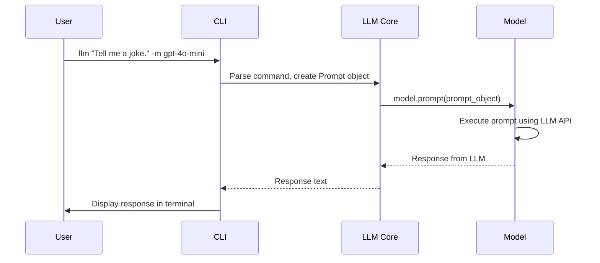

# Chapter 2: Prompt

In the previous chapter, [cli (Click CLI group)](01_cli__click_cli_group_.md), you learned how to use the command-line interface (`cli`) to interact with `llm`. Now, we'll dive into the heart of that interaction: the `Prompt`.

Imagine you're at a restaurant. The `cli` is like the waiter, and the `Prompt` is your order. You need to clearly specify what you want so the kitchen (the Large Language Model, or LLM) can prepare the right dish (the response).

**Why do we need a `Prompt` object?**

Think about asking an LLM a question. You don't just send the question directly. You might also need to specify which LLM to use, any additional instructions, or even files to reference. The `Prompt` object bundles all of this information together in a structured way. Without it, things could get messy and the LLM might not understand what you're asking!

**Core Concepts: What's inside a `Prompt`?**

The `Prompt` object has a few key ingredients:

1.  **`prompt` (The Main Text):** This is the core of your request – the actual question or instruction you want the LLM to process.  Like "Summarize this article" or "Translate this sentence into French."

2.  **`model` (The LLM to Use):**  This specifies which Large Language Model you want to use. Think of it as choosing a chef at the restaurant. Different LLMs (like `gpt-4o-mini` or `llama-3`) have different strengths.

3.  **`attachments` (Additional Files):**  Sometimes you want the LLM to consider extra information, like a document or an image. These are called attachments. Imagine showing the chef a picture of the dish you want!

4.  **`system` (System Instructions):** This provides high-level instructions to guide the LLM's behavior. Think of it as telling the chef your dietary restrictions or preferred cooking style. For example, "You are a helpful AI assistant."

5.  **`options` (Configuration Settings):** These are extra settings that control *how* the LLM generates its response, like the maximum length of the response or how "creative" it should be. These are covered in detail in the [Options](05_options.md) chapter.

**Solving the Use Case: Asking a Question with a Specific Model**

Let's revisit our cheese board question from the last chapter. This time, we'll look at how the `Prompt` object is constructed behind the scenes when you use the `cli`.

When you run the command:

```bash
llm -m gpt-4o-mini "What are the best types of cheese for a cheese board?"
```

The `cli` creates a `Prompt` object that looks something like this (in Python-like terms):

```python
prompt_object = Prompt(
    prompt="What are the best types of cheese for a cheese board?",
    model=gpt_4o_mini_model,  # Assume we have access to a gpt-4o-mini model object
    attachments=[],
    system=None,
    prompt_json=None,
    options={}
)
```

Explanation:

*   `prompt="What are the best types of cheese for a cheese board?"`: This sets the main question.
*   `model=gpt_4o_mini_model`: This specifies that we want to use the `gpt-4o-mini` model. The `cli` figures out which model you meant based on the `-m gpt-4o-mini` option.
*   `attachments=[], system=None, prompt_json=None, options={}`: We're not using any attachments, system instructions, or special options in this case.

The `cli` then passes this `prompt_object` to the `Model` object (we'll learn more about [Model](03_model.md) in the next chapter) to generate a response.

**Adding System Instructions**

Let's say we want to tell the LLM to respond in a funny way. We can use the `--system` option (via the `cli` or when constructing the `Prompt` object directly if writing Python code):

```bash
llm --system "Respond in the style of a pirate." "What are the best types of cheese for a cheese board?"
```

Now the `Prompt` object would look like this:

```python
prompt_object = Prompt(
    prompt="What are the best types of cheese for a cheese board?",
    model=default_model,  # Assuming the default model is being used
    attachments=[],
    system="Respond in the style of a pirate.",
    prompt_json=None,
    options={}
)
```

The LLM should now respond in a pirate-like tone!

Example output:

```
Ahoy, matey!  For a cheese board fit for a pirate, ye'll be wantin' these:

*   Cheddar, aged like buried treasure!
*   Brie, smooth as calm waters.
*   Gouda, round like a doubloon!
```

**Internal Implementation Walkthrough**

Let's see what happens under the hood when the `cli` uses the `Prompt` object:



Here's the breakdown:

1.  The user enters a command with a prompt and, optionally, a model choice.
2.  The `cli` parses the command and creates a `Prompt` object, packaging the prompt text, model ID, and any other options.
3.  The `cli` calls the `prompt` method on the selected [Model](03_model.md) (like `gpt-4o-mini`).
4.  The `Model` object then interacts with the actual LLM API to get a response based on the information provided in the `Prompt` object.
5.  Finally, the LLM's response is displayed to the user.

**Code Example (Simplified)**

Here's a simplified view of how the `Prompt` object is used within the `llm` code (referencing the `llm/models.py` file):

```python
@dataclass
class Prompt:
    prompt: str
    model: "Model" # type: ignore
    attachments: Optional[List[Attachment]]
    system: Optional[str]
    options: "Options" # type: ignore

# ... later in the code ...

class Model(ABC):
    # ...
    def prompt(
        self,
        prompt: str,
        *,
        attachments: Optional[List[Attachment]] = None,
        system: Optional[str] = None,
        stream: bool = True,
        **options
    ):
        return self.response(
            Prompt(
                prompt,
                attachments=attachments,
                system=system,
                model=self,
                options=self.Options(**options),
            ),
            stream=stream,
        )
```

Explanation:

*   The `Prompt` class (using `@dataclass`) clearly defines the structure of a prompt object, including the prompt text, model, attachments, system instructions, and options.  The `type: ignore` comments are for static type checking and can be ignored for understanding the core concepts.
*   The `Model.prompt` method creates a `Prompt` object using the provided arguments and then calls the `response` method (returning a [Response](04_response.md) object, which we'll explore in a future chapter). This illustrates how the `Prompt` object is constructed and then passed to the model for processing.

**Conclusion**

The `Prompt` object is a container that holds all the information needed to get a response from a Large Language Model. It ensures that your requests are structured and clear, allowing you to get the most out of `llm`.

In the next chapter, we'll explore the [Model](03_model.md) object, which is responsible for actually interacting with the LLM and generating the response based on the `Prompt`.


---

Generated by [AI Codebase Knowledge Builder](https://github.com/The-Pocket/Tutorial-Codebase-Knowledge)