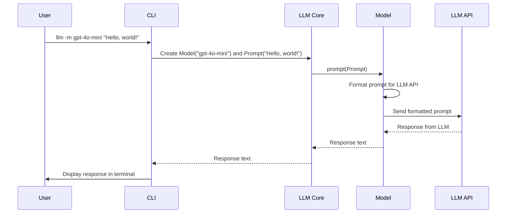

# Chapter 3: Model

In the previous chapter, [Prompt](02_prompt.md), you learned how to create `Prompt` objects to package up your requests to a Large Language Model. But how does that `Prompt` actually *get* to the LLM and get a response back? That's where the `Model` comes in.

Think of a `Model` as a chef in a restaurant. Each chef (model) has their own recipes (trained parameters) and can prepare different dishes (generate text, answer questions). A `Model` handles authentication (making sure you have permission to order food!), prompt formatting (preparing the ingredients), and the actual API call to the underlying LLM (sending the order to the kitchen and getting the dish back).

**Why do we need a `Model` object?**

Imagine you want to use different LLMs, like `gpt-4o-mini` or `llama-3`. Each LLM has its own unique API, its own way of formatting prompts, and its own way of handling authentication.  A `Model` object hides all of that complexity from you. You just tell the `Model` to execute a `Prompt`, and it takes care of the rest.

**Core Concepts: What's inside a `Model`?**

The `Model` object is responsible for a few key things:

1.  **`model_id`:**  This is a unique identifier for the model, like `"gpt-4o-mini"` or `"llama-3"`. Think of it as the chef's name.

2.  **Authentication:** Many LLMs require an API key to use them. The `Model` handles retrieving and using this key.  Think of this as paying for the meal!

3.  **Prompt Formatting:** LLMs often require prompts to be formatted in a specific way.  The `Model` knows how to do this formatting. This is like the chef knowing how to prepare the ingredients correctly.

4.  **API Call:** The `Model` makes the actual API call to the LLM, sends the formatted prompt, and receives the response. This is like the waiter bringing your order to the kitchen and bringing the finished dish back to your table.

5.  **Options:** The `Model` stores any specific configuration options available for the particular LLM it represents. These are specific settings that will be sent along the API call.

**Solving the Use Case: Asking a Question using a Specific Model**

Let's say you want to ask `gpt-4o-mini` a question. You would use the `cli` like this:

```bash
llm -m gpt-4o-mini "What are the best types of cheese for a cheese board?"
```

Behind the scenes, the `cli` does the following:

1.  It figures out that you want to use the `gpt-4o-mini` model (from the `-m gpt-4o-mini` option).

2.  It creates a `Model` object representing the `gpt-4o-mini` LLM. This `Model` object knows how to authenticate with the OpenAI API (if necessary), format the prompt for `gpt-4o-mini`, and make the API call.

3.  It creates a [Prompt](02_prompt.md) object containing your question.

4.  It tells the `Model` object to execute the `Prompt`.

5.  The `Model` object sends the formatted prompt to the OpenAI API.

6.  The OpenAI API responds with the answer.

7.  The `Model` object returns the answer to the `cli`, which then displays it to you.

**Example Code (Simplified)**

Here's a simplified example of how you might create and use a `Model` object in Python (this is a *simplified* example to illustrate the concept):

```python
# Assume we have a Model class defined (see llm/models.py for the actual class)
class Model:
    def __init__(self, model_id):
        self.model_id = model_id

    def prompt(self, prompt_text):
        # In a real implementation, this would:
        # 1. Authenticate with the LLM API
        # 2. Format the prompt correctly
        # 3. Make the API call
        # 4. Return the response
        print(f"Sending prompt '{prompt_text}' to model {self.model_id}...")
        response = f"The best cheeses are Brie, Cheddar, and Gouda. - Model: {self.model_id}" # dummy
        return response

# Create a Model object for gpt-4o-mini
model = Model("gpt-4o-mini")

# Ask the model a question
question = "What are the best types of cheese for a cheese board?"
answer = model.prompt(question)

# Print the answer
print(answer)
```

Explanation:

*   The `Model` class is a simplified representation of a real `Model` object.  It has a `model_id` and a `prompt` method.
*   We create a `Model` object for `gpt-4o-mini`.
*   We call the `prompt` method to ask the model a question.
*   The `prompt` method (in a real implementation) would handle all the details of interacting with the LLM API.

Example output:

```
Sending prompt 'What are the best types of cheese for a cheese board?' to model gpt-4o-mini...
The best cheeses are Brie, Cheddar, and Gouda. - Model: gpt-4o-mini
```

**Internal Implementation Walkthrough**

Let's visualize what happens internally when you call the `prompt` method on a `Model` object:



This diagram shows:

1.  The user enters a command with a prompt and a model choice.
2.  The `cli` creates a `Model` object and a [Prompt](02_prompt.md) object.
3.  The `cli` calls the `prompt` method on the `Model` object, passing in the `Prompt` object.
4.  The `Model` object formats the prompt to be compatible with the underlying LLM API.
5.  The `Model` object sends the formatted prompt to the LLM API.
6.  The LLM API processes the prompt and returns a response.
7.  The `Model` object receives the response and returns it to the `cli`.
8.  The `cli` displays the response to the user.

**Diving into the Code**

Here's a look at a simplified version of the `Model` class definition within `llm/models.py`:

```python
from abc import ABC, abstractmethod
from dataclasses import dataclass

@dataclass
class Prompt:  # Simplified for brevity
    prompt: str

class Model(ABC):
    model_id: str

    @abstractmethod
    def execute(self, prompt: Prompt) -> str:
        """Execute a prompt and return the response text."""
        pass

    def prompt(self, prompt_text: str) -> str:
        prompt = Prompt(prompt_text)
        return self.execute(prompt)
```

Explanation:

*   The `Model` class is an abstract base class (`ABC`), which means that concrete model implementations (like `gpt-4o-mini`) must inherit from it and implement the `execute` method.
*   The `execute` method is an abstract method (`@abstractmethod`), which means that it must be implemented by subclasses.  This method is responsible for actually interacting with the LLM API.
*   The `prompt` method is a convenience method that creates a [Prompt](02_prompt.md) object and then calls the `execute` method.

And here's an example of a concrete `Model` implementation (simplified):

```python
class MyModel(Model):
    def __init__(self, model_id: str):
        self.model_id = model_id

    def execute(self, prompt: Prompt) -> str:
        # Pretend we're calling an API here
        return f"Response from {self.model_id}: {prompt.prompt}"
```

Explanation:

*   The `MyModel` class inherits from the `Model` class and implements the `execute` method.
*   The `execute` method simply returns a string indicating that it received the prompt. In a real implementation, this method would make an API call to an LLM.

**Other Useful Methods**

The `Model` class may also have other useful methods, such as:

*   `get_key()`: Retrieves the API key for the LLM.
*   `format_prompt()`: Formats the prompt to be compatible with the LLM API.
*   `stream()`: Returns a generator that yields chunks of text as they are generated by the LLM (for streaming responses).

**Conclusion**

The `Model` object is a key abstraction in `llm` that handles the complexities of interacting with different Large Language Models. It encapsulates authentication, prompt formatting, and API calls, allowing you to easily switch between different LLMs without having to worry about the details.

In the next chapter, we'll explore the [Response](04_response.md) object, which represents the result of executing a prompt against a `Model`.


---

Generated by [AI Codebase Knowledge Builder](https://github.com/The-Pocket/Tutorial-Codebase-Knowledge)