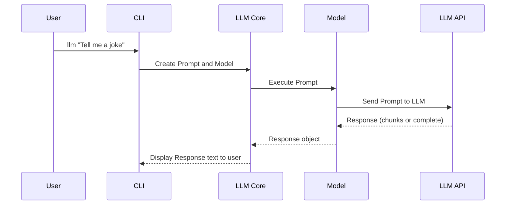

# Chapter 4: Response

In the previous chapter, [Model](03_model.md), you learned how `Model` objects are like chefs, taking your `Prompt` (order) and using an LLM to generate an answer. Now, let's talk about what you get back: the `Response`.

Think of the `Response` as the finished dish the chef prepares for you. It contains the generated text, any extra information about how it was created, and handles real-time delivery of results if you're watching the chef cook!

**Why do we need a `Response` object?**

Imagine just getting the raw text back from the LLM. It would be like the waiter just shouting the ingredients at you! The `Response` object packages everything up nicely. It provides the generated text, but also information like how long it took to generate, any errors that occurred, and more.

**Core Concepts: What's inside a `Response`?**

The `Response` object contains a few key things:

1.  **`text`:** This is the most important part - the actual text generated by the LLM! This is like the finished dish itself.

2.  **`model`:** This tells you which [Model](03_model.md) (chef) was used to generate the response.

3.  **`prompt`:** This is the original [Prompt](02_prompt.md) (order) that was used to generate the response.

4.  **`duration_ms`:** This tells you how long it took to generate the response, in milliseconds.

5.  **`datetime_utc`:** This is the date and time (in UTC) when the response was generated.

6.  **`stream`:** This indicates if the response was delivered in chunks (streaming) or all at once. Think of it as whether you watch the chef cook or they just bring you the finished dish.

7.  **`json`:** Some models return responses as structured JSON data. This field holds that data.

**Solving the Use Case: Getting an Answer and its Metadata**

Let's go back to our cheese board question. When you run:

```bash
llm "What are the best types of cheese for a cheese board?"
```

The `llm` tool doesn't just print the answer. It creates a `Response` object first. You can access different parts of this `Response` object (using Python code) like this:

```python
# Assume we have a response object called 'response'
# obtained from the Model.prompt() method as seen in the last chapter
print(response.text()) # Prints the generated text
print(response.model) # Prints the model that was used
print(response.prompt) # Prints the original prompt
print(response.duration_ms()) # Prints the duration in milliseconds
print(response.datetime_utc()) # Prints the timestamp

```

Example output (will vary depending on the model and execution time):

```
Here are some good cheeses for a cheeseboard: Brie, Cheddar, and Gouda.
<Model 'gpt-4o-mini'>
Prompt(prompt='What are the best types of cheese for a cheese board?', model=<llm.models.Model object at 0x...>, attachments=[], system=None, prompt_json=None, options={})
1234
2024-10-27T10:00:00
```

Explanation:

*   `response.text()`: This gets the actual answer from the LLM (the list of cheeses).
*   `response.model`: This tells you which model provided the answer (e.g., `gpt-4o-mini`).
*   `response.prompt`: This shows the exact question you asked.
*   `response.duration_ms()`: This tells you how long it took to get the answer.
*   `response.datetime_utc()`:  This tells you when the answer was generated.

**Handling Streaming Responses**

Some LLMs can send responses in chunks, like watching a chef gradually assemble the dish. The `Response` object handles this streaming behavior.  Here's how you can iterate through the chunks (using Python code):

```python
# Assume we have a streaming response object called 'response'
for chunk in response:
    print(chunk, end="")  # Print each chunk as it arrives

```

Explanation:

*   The `for chunk in response:` loop iterates through each chunk of text as it's generated by the LLM.
*   `print(chunk, end="")` prints each chunk to the console without adding a newline character, so the output appears as a continuous stream of text.

**Internal Implementation Walkthrough**

Here's what happens internally when you get a `Response` object:



This diagram shows:

1.  The user enters a command at the `cli`.
2.  The `cli` creates a [Prompt](02_prompt.md) object and a [Model](03_model.md) object.
3.  The `cli` tells the `Model` to execute the `Prompt`.
4.  The `Model` sends the `Prompt` to the LLM API.
5.  The LLM API sends back the response, either in chunks or all at once.
6. The `Model` encapsulates this into a `Response` object and returns it to the `cli`.
7.  The `cli` receives the `Response` object and displays the text to the user.

**Code Example (Simplified)**

Here's a simplified example of how the `Response` object is used within the `llm` code (referencing the `llm/models.py` file):

```python
from dataclasses import dataclass
import datetime
import time
from typing import List, Iterator, Optional

@dataclass
class Prompt: # Simplified for brevity
    prompt: str

class Model: # Simplified for brevity
    def __init__(self, model_id: str):
        self.model_id = model_id

    def execute(self, prompt: Prompt, stream: bool) -> Iterator[str]:
        #Simulate sending a prompt to an LLM and getting chunks back
        chunks = ["This ", "is ", "a ", "simulated ", "response."]
        if stream:
            yield from chunks # Yield chunks one by one
        else:
            yield "".join(chunks) # Yield the entire response at once

class Response:
    def __init__(self, prompt: Prompt, model: Model, stream: bool):
        self.prompt = prompt
        self.model = model
        self.stream = stream
        self._chunks: List[str] = [] #Accumulate chunks here
        self._done = False
        self._start_time = time.time() # Capture start time

    def __iter__(self) -> Iterator[str]:
        # Send prompt to model and collect the response
        for chunk in self.model.execute(self.prompt, self.stream):
            self._chunks.append(chunk)
            yield chunk # Yield the chunk

        self._done = True #Mark as complete

    def text(self) -> str:
        # Return assembled text from chunks
        return "".join(self._chunks)

# Create instances and demonstrate

prompt = Prompt("Tell me a short story.")
model = Model("TestModel")
response = Response(prompt, model, stream = True) # Get a streaming response

for chunk in response: # Process the streaming chunks
    print(chunk, end="")

print(f"\nResponse from {response.model.model_id} in {(time.time() - response._start_time):.4f} seconds.")
```

Explanation:

*   This simplified code demonstrates how a `Response` object accumulates chunks from a `Model` and provides access to the full text once the response is complete.
*   The `__iter__` method simulates receiving chunks from a model's execution and yields them, allowing for streaming.
*   The `text` method assembles the complete text from the accumulated chunks.

**Conclusion**

The `Response` object provides a structured way to access the output of an LLM, along with important metadata about how the response was generated. It handles streaming responses, allowing you to display results in real-time.

In the next chapter, we'll explore [Options](05_options.md), which let you customize how the LLM generates its response.


---

Generated by [AI Codebase Knowledge Builder](https://github.com/The-Pocket/Tutorial-Codebase-Knowledge)