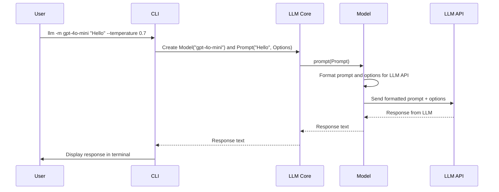

# Chapter 5: Options

In the previous chapter, [Response](04_response.md), you learned how to get the results from your interaction with an LLM. But what if you want to influence *how* the LLM generates its response? That's where `Options` come in!

Think of `Options` like adjusting the ingredients or cooking time in a recipe. You can tweak them to get a slightly different result. For example, you might want the LLM to be more creative, or you might want to limit the length of its response.

**Why do we need `Options`?**

Imagine you're asking an LLM to write a short story. You might want to specify that it should be a scary story (influencing the *content*) or that it should be no more than 100 words long (influencing the *length*). `Options` provide a structured way to specify these kinds of preferences. Without them, you're stuck with the LLM's default behavior!

**Core Concepts: What are `Options`?**

`Options` are settings that you can use to influence how an LLM responds to your prompt. They are defined as a Pydantic model, which is like a blueprint for creating structured data in Python. This means that `Options` have specific types (like numbers or strings) and can be validated to ensure that they are valid.

Here are some common types of `Options`:

1.  **`temperature`:** This controls the randomness of the LLM's output. A higher temperature (e.g., 1.0) makes the output more creative and unpredictable, while a lower temperature (e.g., 0.2) makes it more focused and deterministic.

2.  **`max_tokens`:** This limits the maximum number of tokens (words or sub-words) in the LLM's response. This is useful for controlling the length of the output.

3.  **`top_p`:** This is another way to control the randomness of the output. It's similar to temperature, but it works by selecting from the most probable tokens.

4.  **`frequency_penalty`:** This penalizes the LLM for repeating words or phrases, encouraging it to use more diverse language.

5.  **`presence_penalty`:** This penalizes the LLM for introducing new topics, encouraging it to stay focused on the current topic.

**Solving the Use Case: Asking a Question with a Specific Temperature**

Let's say you want to ask `gpt-4o-mini` a question and make the response more creative. You can use the `--temperature` option with the `cli`:

```bash
llm -m gpt-4o-mini --temperature 0.7 "Write a poem about a cat."
```

Here, `--temperature 0.7` tells the `llm` tool to use a temperature of 0.7, which will make the poem more creative and less predictable than the default temperature.

Behind the scenes, the `cli` does the following:

1.  It parses the command-line arguments, including the `--temperature 0.7` option.
2.  It creates a [Prompt](02_prompt.md) object containing the prompt text and the temperature option.
3.  It creates a [Model](03_model.md) object representing the `gpt-4o-mini` LLM.
4.  It tells the `Model` object to execute the `Prompt`, passing in the `Options` (including the temperature) to the LLM API.
5.  The LLM API generates a response based on the prompt and the options.
6.  The `Model` object returns the response to the `cli`, which then displays it to you.

**Example Code (Simplified)**

Here's a simplified example of how you might use `Options` in Python (this is a simplified example to illustrate the concept):

```python
from pydantic import BaseModel

# Define a custom Options class
class MyOptions(BaseModel):
    temperature: float = 0.5
    max_tokens: int = 100

# Assume we have a Model class defined (see llm/models.py for the actual class)
class Model:
    def __init__(self, model_id):
        self.model_id = model_id

    def prompt(self, prompt_text, options: MyOptions): # Added options!
        print(f"Sending prompt '{prompt_text}' to model {self.model_id} with options {options}...")
        response = f"The response based on the prompt. - Model: {self.model_id}, Temperature: {options.temperature}" # dummy
        return response

# Create a Model object for gpt-4o-mini
model = Model("gpt-4o-mini")

# Create an Options object
options = MyOptions(temperature=0.7, max_tokens=150)

# Ask the model a question with options
question = "Write a short story about a dog."
answer = model.prompt(question, options)

# Print the answer
print(answer)
```

Explanation:

*   We define a custom `Options` class called `MyOptions` using Pydantic's `BaseModel`. This class defines the available options and their default values.
*   The `Model` class now accepts an `options` argument in its `prompt` method.
*   We create an `Options` object with specific values for `temperature` and `max_tokens`.
*   We call the `prompt` method, passing in the `Options` object.

Example output:

```
Sending prompt 'Write a short story about a dog.' to model gpt-4o-mini with options temperature=0.7 max_tokens=150...
The response based on the prompt. - Model: gpt-4o-mini, Temperature: 0.7
```

**Internal Implementation Walkthrough**

Let's visualize what happens internally when you call the `prompt` method on a `Model` object with `Options`:



This diagram shows:

1.  The user enters a command with a prompt, a model choice, and some `Options`.
2.  The `cli` creates a [Model](03_model.md) object and a [Prompt](02_prompt.md) object, including the `Options`.
3.  The `cli` calls the `prompt` method on the `Model` object, passing in the `Prompt` object.
4.  The `Model` object formats the prompt and the `Options` to be compatible with the underlying LLM API.
5.  The `Model` object sends the formatted prompt and `Options` to the LLM API.
6.  The LLM API processes the prompt and `Options` and returns a response.
7.  The `Model` object receives the response and returns it to the `cli`.
8.  The `cli` displays the response to the user.

**Diving into the Code**

Here's a look at a simplified version of how `Options` are defined and used within the `llm/models.py` file:

```python
from pydantic import BaseModel
from dataclasses import dataclass

class Options(BaseModel):
    # Note: using pydantic v1 style Configs,
    # these are also compatible with pydantic v2
    class Config:
        extra = "forbid"

    temperature: float = 0.5
    max_tokens: int = 200

@dataclass
class Prompt:
    prompt: str
    model: "Model"
    options: Options

class Model:
    def execute(self, prompt: Prompt) -> str:
        # Simulate using the prompt and options
        return f"Executed with prompt: {prompt.prompt} and temperature: {prompt.options.temperature}"
```

Explanation:

*   The `Options` class is defined using Pydantic's `BaseModel`. This allows us to easily define the available options, their types, and their default values.
*   The `Prompt` class includes an `options` field, which is an instance of the `Options` class.
*   The `Model.execute` method receives the `Prompt` object, which includes the `Options`. The method can then use these options to influence the LLM's behavior (in this example, it just prints them).
*   The `Options.Config` with `extra = "forbid"` is a feature that prevents the model from having arbitrary attributes assigned to it, improving the structure and limiting potential errors.

**Conclusion**

`Options` provide a powerful way to customize the behavior of Large Language Models. By adjusting settings like `temperature` and `max_tokens`, you can influence the creativity, length, and focus of the LLM's responses.

In the next chapter, we'll explore [Template](06_template.md), which allows you to create reusable prompts and further customize your interactions with LLMs.


---

Generated by [AI Codebase Knowledge Builder](https://github.com/The-Pocket/Tutorial-Codebase-Knowledge)