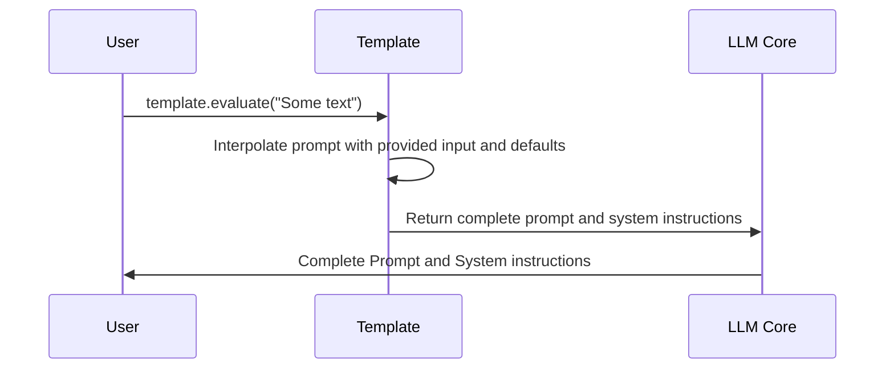

# Chapter 6: Template

In the previous chapter, [Options](05_options.md), you learned how to customize the behavior of LLMs by tweaking settings like temperature and max tokens. Now, let's see how we can *reuse* prompts and predefine common configurations with `Template`s!

Imagine you often ask the LLM to summarize articles in a concise way. Instead of typing the same instructions and options every time, you can create a `Template` – like saving your favorite recipe – and use it with a single command.

**Why do we need `Template`s?**

Think about asking a language model to translate text into different languages. You might have a specific format you prefer, like always including a disclaimer. A `Template` lets you define this format once and reuse it, saving you time and effort, and ensuring consistency!

**Core Concepts: What is a `Template`?**

A `Template` is essentially a recipe for creating prompts. It contains:

1.  **`name`:** A unique identifier for the template (e.g., "summarize_concise").

2.  **`prompt`:** The main prompt text, which can include placeholders (variables) for dynamic content.  For instance: `"Summarize this: $input"`.

3.  **`system`:** Optional system instructions, like `"You are a helpful summarization assistant."`.

4.  **`model`:** The default model to use with this template (e.g., `"gpt-4o-mini"`).

5.  **`defaults`:** Default values for the variables in the prompt. For example, if the prompt is `"Translate $input to $language"`, you might set a default `language` to `"French"`.

**Solving the Use Case: Creating and Using a Summarization Template**

Let's create a `Template` that summarizes text concisely.

First, we need to define the template (this can be done programmatically or via a command-line interface, which we'll cover later). For now, let's imagine we have a Python object representing our template:

```python
from llm import Template

summarize_template = Template(
    name="summarize_concise",
    prompt="Summarize this in a few sentences: $input",
    system="You are a helpful summarization assistant.",
    model="gpt-4o-mini",
    defaults={} # No default values are needed for this template
)
```

Explanation:

*   We create a `Template` object named `"summarize_concise"`.
*   The `prompt` includes a placeholder `$input`, which will be replaced with the text we want to summarize.
*   We provide system instructions to guide the LLM.
*   We specify the default model to use: `"gpt-4o-mini"`.

Now, let's use this template to summarize a piece of text:

```python
text_to_summarize = "The quick brown fox jumps over the lazy dog. This is a classic pangram."

# In the actual llm library, you would use the template with the cli or through code.
# This is a simplified demonstration.

prompt, system = summarize_template.evaluate(text_to_summarize)

print("Prompt:", prompt)
print("System:", system)
```

Example output:

```
Prompt: Summarize this in a few sentences: The quick brown fox jumps over the lazy dog. This is a classic pangram.
System: You are a helpful summarization assistant.
```

As you can see, the `$input` placeholder in the template was replaced with the text we provided. The `evaluate` method returns the combined prompt and system instructions, ready to be sent to a [Model](03_model.md).

**Adding Default Values**

Let's create another template for translation, this time with a default language:

```python
from llm import Template

translate_template = Template(
    name="translate_french",
    prompt="Translate this to $language: $input",
    system="You are a translation expert.",
    model="gpt-4o-mini",
    defaults={"language": "French"}
)

text_to_translate = "Hello, world!"
prompt, system = translate_template.evaluate(text_to_translate)

print("Prompt:", prompt)
print("System:", system)
```

Example output:

```
Prompt: Translate this to French: Hello, world!
System: You are a translation expert.
```

Here, the `$language` placeholder was automatically replaced with `"French"` because we defined it as a default value in the template.

**Internal Implementation Walkthrough**

Let's see what happens under the hood when we use a `Template`:



This diagram shows:

1.  The user calls the `evaluate` method on a `Template` object, providing some input text.
2.  The `Template` interpolates the prompt and system instructions with the provided input and any default values.
3.  The `Template` returns the complete prompt and system instructions to the `llm` core.

**Diving into the Code**

Here's a look at the `Template` class definition within `llm/templates.py`:

```python
from pydantic import BaseModel
import string
from typing import Optional, Any, Dict, List, Tuple


class Template(BaseModel):
    name: str
    prompt: Optional[str] = None
    system: Optional[str] = None
    model: Optional[str] = None
    defaults: Optional[Dict[str, Any]] = None

    def evaluate(
        self, input: str, params: Optional[Dict[str, Any]] = None
    ) -> Tuple[Optional[str], Optional[str]]:
        params = params or {}
        params["input"] = input
        if self.defaults:
            for k, v in self.defaults.items():
                if k not in params:
                    params[k] = v
        prompt: Optional[str] = None
        system: Optional[str] = None
        if not self.prompt:
            system = self.interpolate(self.system, params)
            prompt = input
        else:
            prompt = self.interpolate(self.prompt, params)
            system = self.interpolate(self.system, params)
        return prompt, system

    @classmethod
    def interpolate(cls, text: Optional[str], params: Dict[str, Any]) -> Optional[str]:
        if not text:
            return text
        string_template = string.Template(text)
        return string_template.substitute(**params)
```

Explanation:

*   The `Template` class uses Pydantic to define its structure, including the `name`, `prompt`, `system`, `model`, and `defaults` fields.
*   The `evaluate` method takes an `input` string and an optional dictionary of `params`.
*   It merges the provided `params` with the `defaults` defined in the template.
*   It uses the `interpolate` method (using Python's built-in `string.Template`) to replace the placeholders in the prompt and system instructions with the values from the `params` dictionary.

**Conclusion**

`Template`s provide a powerful way to reuse prompts and predefine common configurations. By using templates, you can save time, ensure consistency, and easily customize your interactions with Large Language Models.

In the next chapter, we'll explore the [PluginManager (pm)](07_pluginmanager__pm_.md), which allows you to extend the functionality of `llm` with custom models, templates, and other features.


---

Generated by [AI Codebase Knowledge Builder](https://github.com/The-Pocket/Tutorial-Codebase-Knowledge)