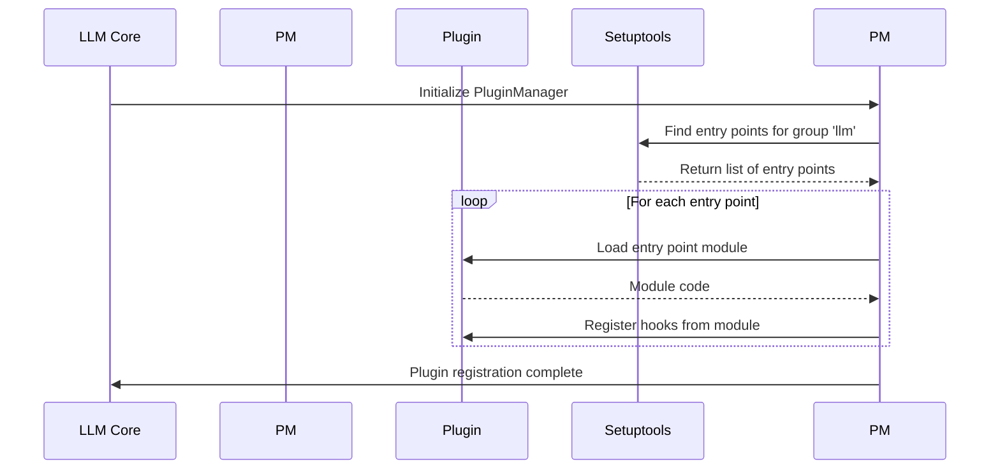

# Chapter 7: PluginManager (pm)

In the previous chapter, [Template](06_template.md), you learned how to create reusable prompts to streamline your interaction with LLMs. But what if you want to add *new* models or commands to `llm` without changing the core code? That's where the `PluginManager` (often called `pm`) comes in!

Think of the `PluginManager` as a modular kitchen system. You can add new appliances (like a fancy coffee maker or a powerful blender) to your kitchen without having to rebuild the entire thing. Similarly, the `PluginManager` allows external packages to register new functionalities to `llm`, making it incredibly extensible.

**Why do we need a `PluginManager`?**

Imagine you've found a fantastic new LLM, but `llm` doesn't support it natively. Without a `PluginManager`, you'd have to modify the core `llm` code to add support for this new model. This can be complicated, and your changes might be overwritten when you update `llm`.

With the `PluginManager`, you can create a separate *plugin* that adds support for the new model. This plugin can be installed and uninstalled without affecting the core `llm` code. This makes `llm` much more flexible and adaptable to new technologies.

**Core Concepts: How does the `PluginManager` work?**

The `PluginManager` has a few key concepts that you should understand:

1.  **Plugins:** These are external packages that add new functionalities to `llm`. A plugin might add a new model, a new command, or even a new way to format prompts.

2.  **Entry Points:** Plugins use entry points to tell `llm` about the functionalities they provide. Think of an entry point as a signpost that points to the code that should be executed when a particular action is performed.

3.  **Hooks:** These are specific points in the `llm` code where plugins can "hook in" and add their own functionalities. For example, there might be a hook for registering new models, or a hook for adding new commands.

4.  **Registration:** The `PluginManager` is responsible for discovering and registering plugins. It looks for plugins that have defined entry points and then registers them with the system.

**Solving the Use Case: Adding a New Model via a Plugin**

Let's imagine you want to add support for a hypothetical new model called "AwesomeModel". You would do this by creating a plugin. The following steps outlines the process:

1.  **Create a Plugin Package:** Create a new Python package (directory with an `__init__.py` file) for your plugin. Let's call it `llm_awesome_model`.

2.  **Define the Model:** In your plugin package, define a class that represents the "AwesomeModel" model. This class should inherit from the `llm.Model` class and implement the required methods (like `prompt`).

3.  **Register the Model using a Hook:**  Use the `llm.hookimpl` decorator (provided by `llm`) to register your model with the `PluginManager`.

4.  **Configure Entry Points:**  In your plugin's `setup.py` or `pyproject.toml` file, define an entry point that tells `llm` about your model.

Let's look at some simplified code snippets. First, inside the `llm_awesome_model` package (e.g. in a file called `__init__.py`):

```python
from llm import Model, hookimpl

class AwesomeModel(Model):
    model_id = "awesome-model"

    def __init__(self):
        super().__init__(self.model_id)

    def execute(self, prompt):
        # Implementation to call the AwesomeModel API would go here
        return f"AwesomeModel says: {prompt.prompt}"

@hookimpl
def register_models(register):
    register(AwesomeModel())
```

Explanation:

*   We create a class called `AwesomeModel` that inherits from `llm.Model`. We set `model_id` to `"awesome-model"`. The `execute` method is a placeholder, simulating a response.
*   The `@hookimpl` decorator tells `llm` that this function should be called when `llm` is looking for models to register. The `register` argument is a function that we can call to register our model.

Next, in your plugin's `setup.py` or `pyproject.toml` file, you'll add the entry point. Here's an example of a `setup.py`:

```python
from setuptools import setup

setup(
    name="llm_awesome_model",
    version="0.1.0",
    py_modules=["llm_awesome_model"], # Replace with actual module structure
    entry_points={
        "llm": ["llm_awesome_model = llm_awesome_model"]
    },
)
```

Explanation:

*   The `entry_points` section tells `llm` that this package provides a plugin for `llm`.
*   `"llm_awesome_model = llm_awesome_model"` maps the entry point name `"llm_awesome_model"` to the Python module `llm_awesome_model`. `llm` will import this module.

After installing this plugin, you should be able to use the `awesome-model` model with `llm`:

```bash
llm -m awesome-model "Tell me something awesome!"
```

Example output:

```
AwesomeModel says: Tell me something awesome!
```

**Internal Implementation Walkthrough**

Here's what happens internally when `llm` uses the `PluginManager` to load plugins:



This diagram shows:

1.  The `llm` core initializes the `PluginManager`.
2.  The `PluginManager` asks `setuptools` (a Python library for packaging) to find all entry points with the group name "llm".
3.  `setuptools` returns a list of entry points.
4.  For each entry point, the `PluginManager` loads the corresponding module.
5.  The `PluginManager` registers any hooks defined in the module.
6.  The `PluginManager` signals to the `llm` core that plugin registration is complete.

**Diving into the Code**

Here's a look at the `PluginManager` initialization within `llm/plugins.py`:

```python
import pluggy

pm = pluggy.PluginManager("llm")
```

Explanation:

*   This code creates an instance of the `pluggy.PluginManager` class. `pluggy` is the core library for managing plugins.
*   The `"llm"` argument is a name for the plugin manager.

Here's how `llm` loads entry points:

```python
pm.load_setuptools_entrypoints("llm")
```

Explanation:

*   This code tells the `PluginManager` to load all entry points with the group name `"llm"`. `setuptools` automatically registers packages with appropriate entry points. The `pm` instance loads them here.

Here's how plugins can define hooks:

```python
from llm import hookimpl

@hookimpl
def register_models(register):
    # Register your models here
    pass
```

Explanation:

*   The `@hookimpl` decorator tells `llm` that this function should be called when `llm` is looking for implementations of the `register_models` hook.
*   Plugins define their own implementations of these hooks, registering custom functionalities.

**Conclusion**

The `PluginManager` is a powerful tool for extending the functionality of `llm`. By using plugins, you can add new models, commands, and other features without modifying the core `llm` code. This makes `llm` incredibly flexible and adaptable to new technologies.

In the next chapter, we'll explore [Collection](08_collection.md), which is a way to store and retrieve embeddings.


---

Generated by [AI Codebase Knowledge Builder](https://github.com/The-Pocket/Tutorial-Codebase-Knowledge)