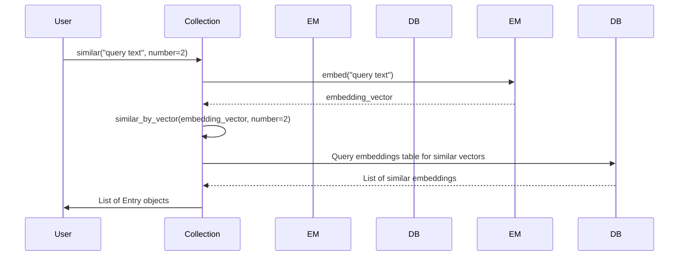

# Chapter 8: Collection

In the previous chapter, [PluginManager (pm)](07_pluginmanager__pm_.md), you learned how to extend `llm` using plugins. Now, let's explore how to store and retrieve embeddings using a `Collection`.

Imagine you have a massive library of books. To find a book similar to one you're reading, you could manually compare it to every other book – a very slow process! A `Collection` in `llm` is like a smart librarian: it organizes "embeddings" (numerical representations of text or data) so you can quickly find similar items.

**Why do we need a `Collection`?**

Let's say you want to build a question-answering system. You have a database of documents, and you want to find the document most relevant to a user's question. You can embed the documents and the question, then use a `Collection` to quickly find the document with the most similar embedding to the question. Without a `Collection`, you'd have to compare the question embedding to *every* document embedding, which would be very slow.

**Core Concepts: What is a `Collection`?**

A `Collection` is essentially a digital filing cabinet for embeddings. Here are the key things to understand:

1.  **Embeddings:** These are numerical representations of text or other data, created by an [EmbeddingModel](07_pluginmanager__pm_.md) (a special type of [Model](03_model.md)). Think of them as coordinates that indicate how similar two pieces of data are.

2.  **Storing Embeddings:** The `Collection` stores these embeddings, along with the original text (or data) and any associated metadata.

3.  **Similarity Search:** The main purpose of a `Collection` is to efficiently find embeddings that are similar to a given query embedding. "Similar" means the embeddings are "close" to each other in the multi-dimensional space, which can be calculated using cosine similarity.

4.  **Metadata:** You can store extra information (like author, date, or category) along with each embedding. This metadata can be used to filter search results.

**Solving the Use Case: Finding Similar Articles**

Let's say you want to create a `Collection` of news articles and then find articles similar to a given article. Here's how you can do it:

1.  **Create a `Collection`:** First, you need to create a `Collection` object. This tells `llm` where to store the embeddings.

2.  **Embed Articles:** Use an [EmbeddingModel](07_pluginmanager__pm_.md) to embed each article.

3.  **Store Embeddings in the `Collection`:** Add each article's embedding, along with its text and metadata, to the `Collection`.

4.  **Find Similar Articles:** To find articles similar to a given article, embed that article and then use the `Collection` to find the most similar embeddings.

Here's some simplified Python code (note that to run this code as-is, you'd need to make sure you have `sqlite-utils` installed, e.g. `pip install sqlite-utils`):

```python
import llm
from sqlite_utils import Database

# Create a database to store the collection
db = Database("articles.db")

# Create a collection called "news_articles"
collection = llm.Collection(name="news_articles", db=db, model_id="clip")

print(f"Collection '{collection.name}' created using model '{collection.model_id}'.")
```

Explanation:

*   First, we import the `llm` library and `Database` from `sqlite-utils`.
*   We create an SQLite database called `"articles.db"` to store our `Collection`.
*   We create a `Collection` object named `"news_articles"`, associating it with the database and the `"clip"` model (an embedding model that you'll need to have available in your `llm` setup). If the collection doesn't exist, it will be created.

Now, let's add some articles to the `Collection`:

```python
articles = [
    ("article1", "Climate change is a serious threat."),
    ("article2", "The economy is growing rapidly."),
    ("article3", "New technology is transforming society."),
    ("article4", "Global warming is impacting weather patterns."),
]

collection.embed_multi(articles)
print(f"Added {len(articles)} articles to the collection.")
```

Explanation:

*   We have a list of articles, where each article is a tuple containing an ID and the article text.
*   We use the `embed_multi` method to embed all of the articles and store them in the `Collection`.

Finally, let's find articles similar to a given article:

```python
query_text = "What are the effects of climate change?"
similar_articles = collection.similar(query_text, number=2)

print(f"Articles similar to '{query_text}':")
for article in similar_articles:
    print(f"- {article.id}: {article.content} (score: {article.score})")
```

Explanation:

*   We define the text we want to find similar articles for.
*   We use the `similar` method to find the 2 most similar articles in the `Collection`.
*   We print the ID, text, and similarity score for each similar article.

Example output (will vary slightly depending on the model and content):

```
Articles similar to 'What are the effects of climate change?':
- article4: Global warming is impacting weather patterns. (score: 0.85)
- article1: Climate change is a serious threat. (score: 0.80)
```

**Internal Implementation Walkthrough**

Let's see what happens under the hood when you use a `Collection` to find similar items:



This diagram shows:

1.  The user calls the `similar` method on a `Collection` object with the text to search for and the desired number of results.
2.  The `Collection` uses the [EmbeddingModel](07_pluginmanager__pm_.md) associated with the `Collection` to embed the query text.
3.  The `Collection` calls the `similar_by_vector` function using the generated vector.
4.  The `Collection` queries the database for embeddings similar to the query embedding.
5.  The database returns a list of similar embeddings.
6.  The `Collection` returns a list of `Entry` objects, each containing the ID, text, and similarity score for a similar item.

**Diving into the Code**

Let's look at some key parts of the `Collection` class definition in `llm/embeddings.py`:

```python
from dataclasses import dataclass
from typing import Optional, Dict, Any, Union
import time
import hashlib

@dataclass
class Entry: # Represents a single entry in the collection
    id: str
    score: Optional[float]
    content: Optional[str] = None
    metadata: Optional[Dict[str, Any]] = None

class Collection:
    def __init__(self, name: str, db, model_id: Optional[str] = None) -> None:
        self.name = name
        self.db = db
        self.model_id = model_id # ID of the embedding model to use

    def embed(self, id: str, value: Union[str, bytes], metadata: Optional[Dict[str, Any]] = None):
        # Embed the value and store in the database
        embedding = self.model().embed(value)
        self.db["embeddings"].insert({ # Insert or replace
            "collection_id": self.id,
            "id": id,
            "embedding": self.encode(embedding),
            "content": value if isinstance(value, str) else None, # only if store==True
            "metadata": self.encode_metadata(metadata),
            "updated": int(time.time()),
        }, replace=True) # Deduplicate based on content hash

    def similar(self, value: Union[str, bytes], number: int = 10) -> list[Entry]:
        # Find similar entries
        comparison_vector = self.model().embed(value)
        return self.similar_by_vector(comparison_vector, number)
    @staticmethod
    def content_hash(input: Union[str, bytes]) -> bytes:
        "Hash content for deduplication. Override to change hashing behavior."
        if isinstance(input, str):
            input = input.encode("utf8")
        return hashlib.md5(input).digest()
```

Explanation:

*   The `Entry` dataclass defines the structure for storing information about each item in the `Collection`.
*   The `Collection` class stores items along with the metadata and can find the similar items based on the embedding vectors.
*   The `embed` method embeds the given text, calculates hash and stores it in the "embeddings" table (replace if existing).
*   The `similar` method finds the similar items using the embeddings.

**Conclusion**

The `Collection` provides a way to efficiently store and retrieve embeddings, allowing you to quickly find similar items in a large dataset. This is useful for building question-answering systems, recommendation engines, and other applications that rely on semantic similarity.

Congratulations! You have completed the core tutorial for `llm`. You can now use `llm` to interact with Large Language Models, customize their behavior, and extend their functionality.


---

Generated by [AI Codebase Knowledge Builder](https://github.com/The-Pocket/Tutorial-Codebase-Knowledge)