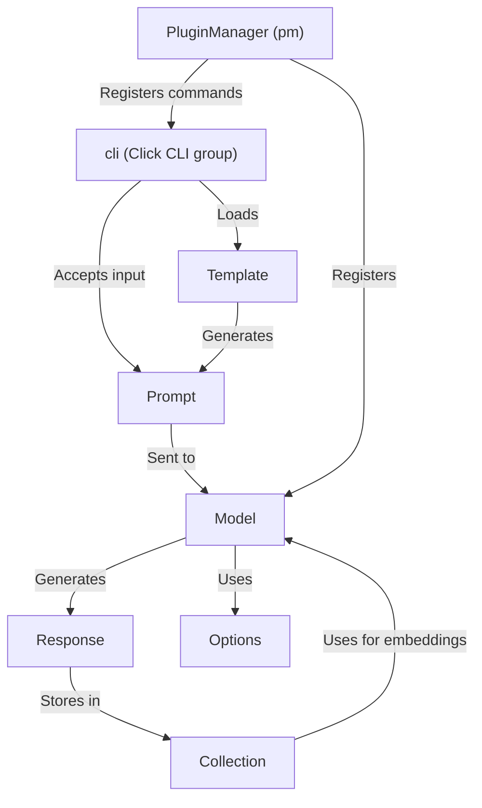

# Tutorial: LLM

`LLM` is a command-line tool that lets you interact with **Large Language Models (LLMs)**, like having a conversation with a *smart AI*. You provide a `Prompt`, the `LLM` sends it to a `Model`, and the `Model` returns a `Response`.  It can be extended via `PluginManager` to support various models and functionalities.

**Source Repository:** [None](None)

## Chapters

1. [cli (Click CLI group)](01_cli__click_cli_group_.md)
2. [Prompt](02_prompt.md)
3. [Model](03_model.md)
4. [Response](04_response.md)
5. [Options](05_options.md)
6. [Template](06_template.md)
7. [PluginManager (pm)](07_pluginmanager__pm_.md)
8. [Collection](08_collection.md)

---

Generated by [AI Codebase Knowledge Builder](https://github.com/The-Pocket/Tutorial-Codebase-Knowledge)