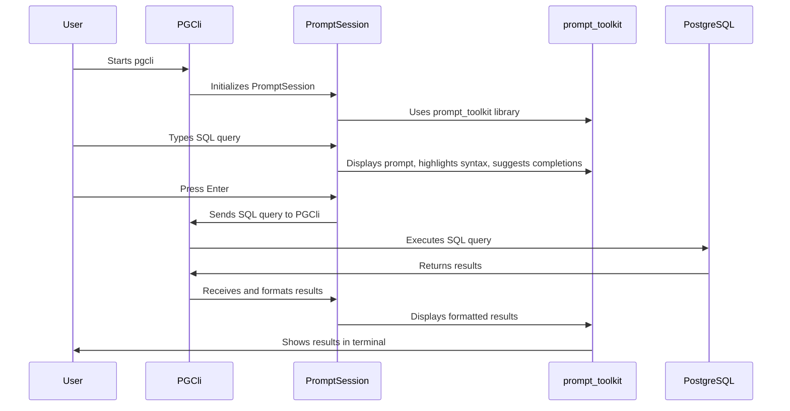

# Chapter 1: PromptSession

Imagine you're using a tool like `psql` to talk to your PostgreSQL database. You type in commands, see the results, and repeat.  The `pgcli` tool aims to give you a much better experience while doing that.  One of the core parts of making that happen is the `PromptSession`.

Think of `PromptSession` as the intelligent "command line" inside `pgcli`.  It's what makes typing commands interactive and enjoyable. It handles displaying the prompt (like `user@host:database>`), understanding what you type, giving you suggestions, and remembering your past commands.

In this chapter, we'll explore what `PromptSession` is and how it powers the interactive experience of `pgcli`. We will use a simple example: type a SQL query, then execute it.

## What Problem Does PromptSession Solve?

Without `PromptSession`, you'd have a very basic command line.  No fancy features!  Here's what you'd miss:

*   **Syntax Highlighting:**  SQL keywords would all be the same color, making it harder to spot errors.
*   **Auto-Suggestions:** No help guessing table or column names as you type.
*   **Key Bindings:** No convenient shortcuts for moving around the command line or editing your query.
*   **Command History:**  No easy way to re-run a previous command.

`PromptSession` takes care of all this, making your interaction with `pgcli` much more efficient and pleasant.

## Key Concepts of PromptSession

`PromptSession` relies on a few important ideas:

1.  **The Prompt:**  That little bit of text that tells you `pgcli` is ready for your input (e.g., `user@host:database>`).  It's more customizable than you might think!
2.  **Input Buffer:** The area where you actually type your SQL commands.
3.  **Key Bindings:**  Shortcuts that let you do things quickly with your keyboard (like pressing `Ctrl+Space` for autocompletion).
4.  **Lexer:** This analyzes what you're typing (e.g., identifying keywords, table names, etc.) so it can apply syntax highlighting.
5.  **Completer:** The engine that suggests possible completions for what you're typing.
6.  **History:** The record of commands you've entered in the past.

## Using PromptSession: A Simple Example

Let's see `PromptSession` in action.

**Step 1: Start `pgcli`**

When you run `pgcli`, the `PromptSession` is initialized. The first thing you see is the prompt. It presents the prompt and waits for input.

**Step 2: Type a SQL query**

Let's type a simple query:

```sql
SELECT * FROM users;
```

As you type, `PromptSession` provides syntax highlighting, making keywords like `SELECT` and `FROM` stand out. It might also suggest table names as you type `users` if you have a `users` table in your database.

**Step 3: Execute the query**

Press `Enter` to execute the query.  `PromptSession` sends the query to the database, and `pgcli` displays the results.

**Step 4: Access Command History**

Press the up arrow key. `PromptSession` recalls the `SELECT * FROM users;` query from your history, allowing you to easily run it again or edit it.

## Diving Deeper: How PromptSession Works Internally

Let's break down what happens behind the scenes when you use `PromptSession`.



Here's a simplified step-by-step explanation of what happens:

1.  **Initialization:** When `pgcli` starts, it creates a `PromptSession` object. This object sets up all the interactive features, like syntax highlighting and autocompletion, by leveraging the `prompt_toolkit` library.
2.  **User Input:** You type a SQL query in the input buffer of the `PromptSession`.
3.  **Real-time Interaction:** As you type, `PromptSession` uses a lexer (specifically, `PygmentsLexer` with `PostgresLexer`) to understand the SQL syntax and apply highlighting. It also uses a completer (like the [PGCompleter](04_pgcompleter.md) discussed in a later chapter) to suggest completions.
4.  **Execution:** When you press `Enter`, `PromptSession` captures the complete SQL query. The query will be sent to [PGExecute](02_pgexecute.md) for execution.
5.  **Displaying Results:** After the query is executed by [PGExecute](02_pgexecute.md), `PromptSession` receives and formats the result and displays the result.

## Code Snippets and Explanation

Here's a look at some of the code that creates and configures the `PromptSession` (from `pgcli/main.py`):

```python
from prompt_toolkit.shortcuts import PromptSession
from prompt_toolkit.lexers import PygmentsLexer
from pygments.lexers.sql import PostgresLexer
from prompt_toolkit.history import FileHistory
from prompt_toolkit.auto_suggest import AutoSuggestFromHistory
from .key_bindings import pgcli_bindings

#... skipping some lines
        prompt_app = PromptSession(
            lexer=PygmentsLexer(PostgresLexer),
            message=get_message,
            history=history,
            auto_suggest=AutoSuggestFromHistory(),
            key_bindings=key_bindings,
        )

        return prompt_app
```

Let's break this down:

*   `PromptSession(...)`: Creates a new `PromptSession` object. This is where we configure all the interactive features.
*   `lexer=PygmentsLexer(PostgresLexer)`: Sets the lexer to `PygmentsLexer` with `PostgresLexer`. This enables syntax highlighting for SQL.
*   `message=get_message`: Sets the function that generates the prompt message. This is how you can customize the prompt.
*   `history=history`: Sets the history object to the file history. This enables the command history feature.
*   `auto_suggest=AutoSuggestFromHistory()`: Enables auto-suggestions from the command history.
*   `key_bindings=key_bindings`: Sets the custom key bindings for `pgcli`.

Here's a quick glimpse at how key bindings are defined (from `pgcli/key_bindings.py`):

```python
from prompt_toolkit.key_binding import KeyBindings

def pgcli_bindings(pgcli):
    kb = KeyBindings()

    @kb.add("c-space")
    def _(event):
        """
        Initialize autocompletion at cursor.
        """
        b = event.app.current_buffer
        if b.complete_state:
            b.complete_next()
        else:
            b.start_completion(select_first=False)

    return kb
```

This code defines the `Ctrl+Space` key binding for autocompletion. When you press `Ctrl+Space`, the `start_completion` method of the current buffer is called.  The completer (again, often the [PGCompleter](04_pgcompleter.md)) then kicks in to suggest possible completions.

## Conclusion

The `PromptSession` is the heart of `pgcli`'s interactive command line. It uses syntax highlighting, autocompletion, key bindings, and command history to provide a user-friendly experience. The `prompt_toolkit` library provides powerful tools for creating interactive command-line applications, and `PromptSession` puts those tools to work for you.

In the next chapter, we'll look at how `pgcli` actually executes your SQL queries using the [PGExecute](02_pgexecute.md) abstraction.


---

Generated by [AI Codebase Knowledge Builder](https://github.com/The-Pocket/Tutorial-Codebase-Knowledge)