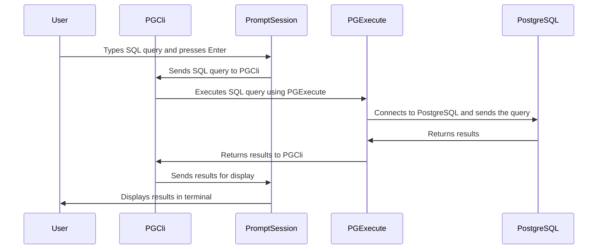

# Chapter 2: PGExecute

In the [PromptSession](01_promptsession.md) chapter, we learned how `pgcli` takes your commands. But how does `pgcli` actually *run* those commands and get the results back from your PostgreSQL database? That's where `PGExecute` comes in!

Think of `PGExecute` as the "database interaction manager" for `pgcli`. It's the piece of code responsible for connecting to your database, sending your SQL queries, and bringing back the results to display on your screen.  Without `PGExecute`, `pgcli` would just be a fancy text editor!

## What Problem Does PGExecute Solve?

Imagine you want to get a list of all the users in your database. You type the query `SELECT * FROM users;` into `pgcli`.  Here's what `PGExecute` does behind the scenes:

1.  **Connects to the Database:** Establishes a connection to your PostgreSQL database using the credentials you provided (username, password, host, database name, etc.).
2.  **Sends the Query:**  Transmits the `SELECT * FROM users;` query to the database server.
3.  **Receives the Results:**  Gets the results back from the database (the rows from the `users` table).
4.  **Manages Transactions:** Handles database transactions, if your query involves them (like `BEGIN`, `COMMIT`, `ROLLBACK`).
5.  **Returns the Data:**  Provides the results back to `pgcli` so it can display them to you in a readable format.

Without `PGExecute`, you'd have to manually handle all of these steps yourself using a low-level database library!  `PGExecute` simplifies this process by abstracting away the complexities of database interaction.

## Key Concepts of PGExecute

Let's break down the key concepts behind `PGExecute`:

1.  **Connection Management:**  `PGExecute` handles the connection to your PostgreSQL database. It stores the connection details (host, port, user, password, database name) and uses them to establish and maintain a connection. It uses the `psycopg` library under the hood.

2.  **Query Execution:** `PGExecute` provides methods for executing SQL queries against the database. It takes a SQL query as input and sends it to the database for execution.

3.  **Result Handling:** `PGExecute` receives the results from the database and makes them available to `pgcli`. It also handles errors that may occur during query execution.

4.  **Transactions:** `PGExecute` supports database transactions. Transactions allow you to group multiple SQL statements into a single unit of work. If any statement in the transaction fails, the entire transaction is rolled back, ensuring data consistency.

## Using PGExecute: A Simple Example

Let's see how `PGExecute` is used in `pgcli`.

**Step 1: Type a SQL query into `pgcli`**

Let's type our example query again:

```sql
SELECT * FROM users;
```

**Step 2: `PromptSession` hands off the query**

As we learned in [PromptSession](01_promptsession.md), the `PromptSession` captures the query.  When you press `Enter`, the `PromptSession` takes the query and passes it on to `PGExecute`.

**Step 3: `PGExecute` does its magic**

`PGExecute` receives the query, connects to the database, executes the query, retrieves the results, and passes the results back to `PromptSession`.

**Step 4: `PromptSession` displays the results**

The `PromptSession` then formats the results and displays them in your terminal. You see the data from the `users` table!

**Behind the Scenes:**

```python
# This is a simplified illustration. The real code is more complex.

# Get the query from PromptSession
query = "SELECT * FROM users;"

# Create a PGExecute object (usually done once when pgcli starts)
pg_execute = PGExecute(database="your_db", user="your_user", password="your_password", host="localhost")

# Execute the query
title, cur, headers, status = pg_execute.execute_normal_sql(query)

# 'cur' now contains the results (if any). 'headers' are the column names.
# This result is then passed to the PromptSession.
```

This is a simplified example, but it demonstrates the basic flow of how `PGExecute` is used to execute SQL queries in `pgcli`.

## Diving Deeper: How PGExecute Works Internally

Let's look at what happens inside `PGExecute` when you run a query.



Here's a simplified step-by-step explanation:

1.  **User Input:** You type a SQL query in `pgcli` and press `Enter`.
2.  **PromptSession:** The [PromptSession](01_promptsession.md) captures the SQL query.
3.  **PGExecute:** The `PromptSession` passes the captured SQL query to `PGExecute`.
4.  **Database Interaction:** `PGExecute` uses the `psycopg` library to connect to the PostgreSQL database, sends the SQL query, and retrieves the results.
5.  **Results Returned:** The results are sent back to `PGExecute`, then passed back through `pgcli` and `PromptSession` and displayed in your terminal.

Now, let's look at some of the code inside `pgcli/pgexecute.py`:

```python
import psycopg

class PGExecute:
    def __init__(
        self,
        database=None,
        user=None,
        password=None,
        host=None,
        port=None,
        dsn=None,
        notify_callback=None,
        **kwargs,
    ):
        self.conn = None
        self.connect(database, user, password, host, port, dsn, **kwargs)

    def connect(self, database=None, user=None, password=None, host=None, port=None, dsn=None, **kwargs):
        # This method establishes the connection to the database.
        conn_info = psycopg.conninfo.make_conninfo(dbname=database, user=user, password=password, host=host, port=port)
        self.conn = psycopg.connect(conn_info) # Connects to DB
        self.conn.autocommit = True # important!
```

This code shows how `PGExecute` initializes a connection to the database using the `psycopg` library. The `connect()` method takes the database connection parameters and uses them to establish a connection. Note the `conn.autocommit = True`, which makes each query run in its own transaction, unless you explicitly start a transaction with `BEGIN`.

```python
    def execute_normal_sql(self, split_sql):
        """Returns tuple (title, rows, headers, status)"""
        cur = self.conn.cursor()
        cur.execute(split_sql)

        # cur.description will be None for operations that do not return
        # rows.
        if cur.description:
            headers = [x[0] for x in cur.description]
            return "", cur, headers, cur.statusmessage
        else:
            return "", None, None, cur.statusmessage
```

This code shows how `PGExecute` executes a normal SQL query. It creates a cursor object, executes the SQL query using the cursor, and returns the results.  The `cur.description` attribute contains information about the columns in the result set (if any). The `cur.statusmessage` contains the status message returned by the database (e.g., "SELECT 1", "INSERT 0 1").

## Conclusion

The `PGExecute` class is the workhorse of `pgcli`, handling the database connection, query execution, and result retrieval. It uses the `psycopg` library to interact with the PostgreSQL database and provides methods for executing SQL queries and managing transactions. By abstracting away the complexities of database interaction, `PGExecute` makes it easier to build a powerful and user-friendly command-line interface for PostgreSQL.

In the next chapter, we'll explore [PGSpecial](03_pgspecial.md), which handles special commands in `pgcli` that are not standard SQL queries (like `\d` to describe a table).


---

Generated by [AI Codebase Knowledge Builder](https://github.com/The-Pocket/Tutorial-Codebase-Knowledge)