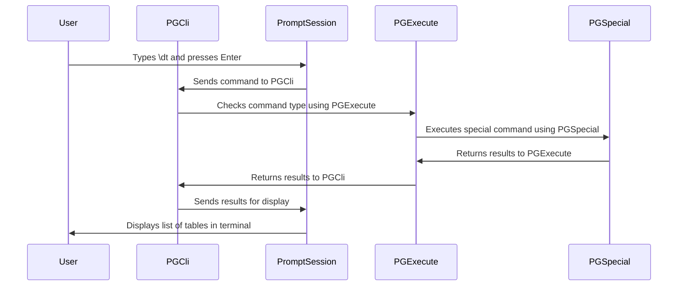

# Chapter 3: PGSpecial

In the previous chapter, [PGExecute](02_pgexecute.md), we learned how `pgcli` executes SQL queries. But what about those special commands that start with a backslash, like `\d` to describe a table? That's where PGSpecial comes in!

PGSpecial provides special commands, similar to those in `psql`. Think of them as shortcuts that allow you to do more than just regular SQL. They are distinguished from regular SQL by the leading backslash. Examples include listing databases, connecting to a new database, or executing a query from a file. PGSpecial parses these commands and performs the appropriate actions.

## What Problem Does PGSpecial Solve?

Imagine you're using `pgcli` and want to quickly see a list of all the tables in your current database. Instead of writing a complex SQL query, you just type `\dt` and press Enter. PGSpecial handles this for you!

Here's what PGSpecial does behind the scenes:

1.  **Recognizes the Special Command:**  It sees that your input starts with a backslash (`\`), so it knows it's a special command, not regular SQL.
2.  **Parses the Command:** It figures out which special command you typed (in this case, `\dt` for "list tables").
3.  **Executes the Command:** It runs the appropriate internal logic to fetch the table names from the database.
4.  **Formats the Output:**  It presents the list of tables in a readable way on your screen.

Without PGSpecial, you'd have to remember and type out complicated SQL queries for these common tasks. It simplifies your workflow and makes `pgcli` more user-friendly.

## Key Concepts of PGSpecial

Let's break down the key concepts behind PGSpecial:

1.  **Special Commands:** These are the backslash commands themselves, like `\dt`, `\c`, `\i`, etc. Each command has a specific function.
2.  **Parsing:** PGSpecial has a parser that understands the special commands and any arguments they might take (e.g., the filename after `\i`).
3.  **Execution Logic:**  For each special command, there's code that knows how to perform the requested action. This might involve querying the database, changing the connection settings, or reading from a file.

## Using PGSpecial: A Simple Example

Let's see how PGSpecial is used in `pgcli`.

**Step 1: Type a Special Command into `pgcli`**

Let's type our example command:

```
\dt
```

**Step 2: `PromptSession` hands off the command**

As we learned in [PromptSession](01_promptsession.md), the `PromptSession` captures the command.  When you press `Enter`, the `PromptSession` takes the command and passes it on to [PGExecute](02_pgexecute.md).

**Step 3: PGSpecial intercepts the command**

[PGExecute](02_pgexecute.md) checks if the command is a special command, if so, then it is passed on to PGSpecial.

**Step 4: PGSpecial does its magic**

PGSpecial receives the command, parses it, executes the internal logic to get the list of tables, and passes the results back to [PGExecute](02_pgexecute.md).

**Step 5: `PromptSession` displays the results**

The `PromptSession` then formats the results and displays them in your terminal. You see a list of tables in your database!

**Behind the Scenes:**

```python
# This is a simplified illustration. The real code is more complex.

# Get the command from PromptSession
command = "\dt"

# Create a PGSpecial object (usually done once when pgcli starts)
pg_special = PGSpecial()

# Execute the special command
results = pg_special.execute(None, command)  # None is passed as cursor here

# 'results' now contains the formatted table list.
# This result is then passed to the PromptSession for display.
```

This simplified example shows how PGSpecial intercepts and handles special commands in `pgcli`.

## Diving Deeper: How PGSpecial Works Internally

Let's peek at what happens inside PGSpecial when you run a special command.



Here's a simplified step-by-step explanation:

1.  **User Input:** You type a special command (e.g., `\dt`) in `pgcli` and press `Enter`.
2.  **PromptSession:** The [PromptSession](01_promptsession.md) captures the command.
3.  **PGExecute:** The [PromptSession](01_promptsession.md) passes the command to [PGExecute](02_pgexecute.md), which determines that it's a special command.
4.  **PGSpecial:** [PGExecute](02_pgexecute.md) passes the command to PGSpecial.
5.  **Command Execution:** PGSpecial finds the corresponding function for `\dt` and executes it. This involves connecting to the database (via a cursor object from [PGExecute](02_pgexecute.md)), running a query to fetch table names, and formatting the output.
6.  **Results Returned:** The formatted table list is returned and eventually displayed in your terminal.

Now, let's look at some of the relevant code inside `pgcli/main.py`:

```python
from pgspecial.main import PGSpecial
# ... skipping some lines

class PGCli:
    def __init__(self, ...):
        # ... skipping some lines
        self.pgspecial = PGSpecial() #Creates a PGSpecial object
        # ... skipping some lines

    def execute_command(self, text, handle_closed_connection=True):
        # ... skipping some lines
        try:
            if pgspecial:
                # First try to run each query as special
                _logger.debug("Trying a pgspecial command. sql: %r", sql)
                try:
                    cur = self.conn.cursor()
                except psycopg.InterfaceError:
                    # edge case when connection is already closed, but we
                    # don't need cursor for special_cmd.arg_type == NO_QUERY.
                    # See https://github.com/dbcli/pgcli/issues/1014.
                    cur = None
                try:
                    response = pgspecial.execute(cur, sql) #Calls the execute method on PGSpecial
                    # ... skipping some lines
```

This code shows how `pgcli` creates a `PGSpecial` object and uses its `execute` method to handle special commands. The code checks first if `pgspecial` exists, then tries to execute the command.

Here's the code for registering the special command within the `PGCli` class:

```python
    def register_special_commands(self):
        self.pgspecial.register(
            self.change_db,
            "\\c",
            "\\c[onnect] database_name",
            "Change to a new database.",
            aliases=("use", "\\connect", "USE"),
        )
# ... skipping some lines
```

This `register` method allows us to register Python functions to special commands. Here we register `self.change_db` to special command `\c`. If the user types `\c <dbname>`, then `self.change_db` will be called.

## Conclusion

PGSpecial is a valuable component of `pgcli`, providing a convenient way to execute common database management tasks using backslash commands. By parsing these commands and performing the appropriate actions, PGSpecial enhances the user experience and simplifies interaction with PostgreSQL.

In the next chapter, we'll explore [PGCompleter](04_pgcompleter.md), which provides intelligent autocompletion for SQL queries and special commands in `pgcli`.


---

Generated by [AI Codebase Knowledge Builder](https://github.com/The-Pocket/Tutorial-Codebase-Knowledge)