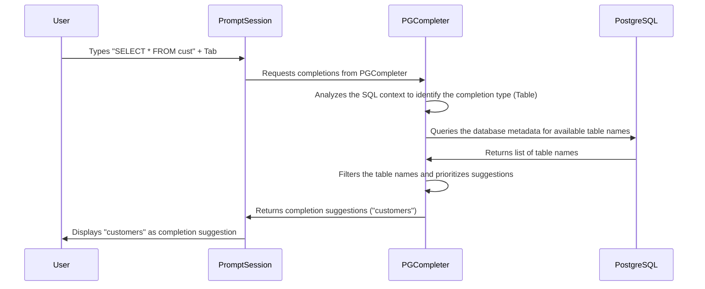

# Chapter 4: PGCompleter

In the previous chapter, [PGSpecial](03_pgspecial.md), we explored how `pgcli` handles special backslash commands. Now, let's dive into something that makes typing those commands (and SQL queries in general!) much easier: `PGCompleter`.

Imagine you're typing a SQL query like `SELECT * FROM cust`. Wouldn't it be nice if `pgcli` could automatically suggest `customers` as a possible table name after you type `cust`? That's exactly what `PGCompleter` does!

`PGCompleter` is like an intelligent auto-complete feature specifically for SQL. It suggests possible completions for what you're typing, including:

*   Table names
*   Column names
*   SQL keywords (like `SELECT`, `FROM`, `WHERE`)
*   Function names
*   Database names
*   Schema names
*   And more!

This saves you time, reduces typos, and helps you explore your database schema.

## What Problem Does PGCompleter Solve?

Without `PGCompleter`, you'd have to remember the exact names of all your tables, columns, and functions.  This can be a real pain, especially in large databases! `PGCompleter` solves this by:

1.  **Reducing Typing:** It suggests completions as you type, so you don't have to type out the full name of everything.
2.  **Preventing Errors:** By suggesting valid options, it helps you avoid typos and syntax errors.
3.  **Discovering Your Schema:** It shows you available tables, columns, and functions, which can help you explore your database.

## Key Concepts of PGCompleter

`PGCompleter` relies on a few key ideas:

1.  **Metadata:** `PGCompleter` needs information about your database to provide suggestions. This includes table names, column names, data types, and function signatures.  It gets this information by querying the database when `pgcli` starts up (and periodically refreshes it).
2.  **Context Awareness:** `PGCompleter` analyzes what you've already typed to understand the context of your query.  For example, if you type `SELECT * FROM`, it knows that you're likely going to type a table name next.
3.  **Prioritization:** Not all suggestions are created equal. `PGCompleter` tries to prioritize the most relevant suggestions based on your query history and the structure of your database.
4.  **Completion Types:** `PGCompleter` recognizes different types of things you might be trying to complete (tables, columns, keywords, etc.) and uses different strategies for each.

## Using PGCompleter: A Simple Example

Let's see `PGCompleter` in action.

**Step 1: Start `pgcli` and connect to your database.**

**Step 2: Type `SELECT * FROM cust` and press `Tab`.**

As you type, `PGCompleter` looks at your database metadata and sees if there are any tables that start with `cust`.  If you have a table named `customers`, it will suggest that as a completion.

**Step 3: Press `Tab` repeatedly to cycle through the suggestions (if there are multiple).**

**Step 4: Press `Enter` to accept the suggestion.**

`PGCompleter` automatically completes the table name to `customers`, and you can continue typing your query.

**Behind the Scenes:**

```python
# This is a simplified illustration. The real code is more complex.

# The user types "SELECT * FROM cust"

# PGCompleter analyzes the input and determines that the user is likely trying to complete a table name after FROM.

# PGCompleter queries the database metadata to find all table names.

# PGCompleter finds "customers" as a table name that starts with "cust".

# PGCompleter suggests "customers" as a completion.

# The user presses Tab and PGCompleter completes the table name.
```

## Diving Deeper: How PGCompleter Works Internally

Let's take a look at the steps that happen inside `PGCompleter` to make autocompletion happen.



Here's a breakdown of what happens:

1.  **User Input:** You type part of a SQL query and press `Tab`.
2.  **PromptSession:** The [PromptSession](01_promptsession.md) detects the `Tab` keypress and asks the `PGCompleter` for possible completions.
3.  **Analysis:** `PGCompleter` analyzes the SQL code you've typed to figure out what kind of thing you're trying to complete (e.g., a table name, a column name, a keyword). The `suggest_type` function is crucial here!
4.  **Metadata Retrieval:** `PGCompleter` uses the `PGExecute` (as seen in [PGExecute](02_pgexecute.md)) to query the PostgreSQL database for relevant metadata. For instance, if you're completing a table name, it fetches a list of all table names from the database.
5.  **Filtering and Prioritization:**  `PGCompleter` filters the results based on what you've already typed (e.g., if you typed `cust`, it only shows tables that start with `cust`). It also prioritizes the suggestions using the `PrevalenceCounter` class, giving frequently used names higher priority.
6.  **Suggestion Display:** `PGCompleter` returns a list of `Completion` objects to the [PromptSession](01_promptsession.md), which then displays them as suggestions in the `pgcli` interface.

Now, let's look at some simplified code snippets from `pgcli/pgcompleter.py`:

```python
from prompt_toolkit.completion import Completion

class PGCompleter:
    def get_completions(self, document, complete_event):
        word_before_cursor = document.get_word_before_cursor(WORD=True)
        suggestions = suggest_type(document.text, document.text_before_cursor) # Determine the completion type
        # ... skipping some lines
        for suggestion in suggestions:
            suggestion_type = type(suggestion)
            if suggestion_type == Table:
                #Logic to fetch and return table names from DB
                # ... skipping some lines
                yield Completion(table_name, -len(word_before_cursor)) #Create Completion Object and return

```

This code shows the main `get_completions` function that is called when you press `Tab`.
* First, it determines the context using `suggest_type`.
* Based on the context, it fetches the relevant objects (table names here).
* Lastly, creates a `Completion` object to return.

Here's another snippet showing how table names are fetched from the database:

```python
    def extend_relations(self, data, kind):
        """extend metadata for tables or views.
        """
        metadata = self.dbmetadata[kind]
        for schema, relname in data:
            try:
                metadata[schema][relname] = OrderedDict()
            except KeyError:
                pass
            self.all_completions.add(relname)
```

The `extend_relations` function is used to store table names into an internal metadata variable inside `PGCompleter`. This metadata is pre-fetched from the database to be used for suggestions.

## Conclusion

`PGCompleter` is a powerful tool that makes typing SQL queries in `pgcli` faster, easier, and more accurate. By analyzing your code, retrieving metadata from the database, and prioritizing suggestions, it provides intelligent autocompletion that significantly improves your workflow.

In the next chapter, we'll look at [Config Management](05_config_management.md), which handles the configuration settings of `pgcli`.


---

Generated by [AI Codebase Knowledge Builder](https://github.com/The-Pocket/Tutorial-Codebase-Knowledge)