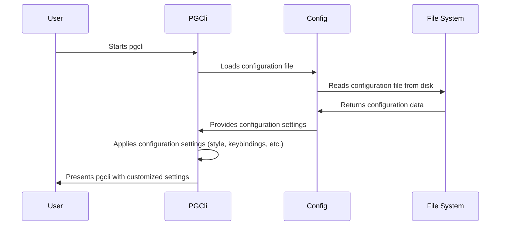

# Chapter 5: Config Management

In the previous chapter, [PGCompleter](04_pgcompleter.md), we saw how `pgcli` provides smart autocompletion suggestions. Now, let's talk about how `pgcli` remembers *your* preferences.  Think of it like setting up the options in your favorite game – how do you tell `pgcli` to use your favorite colors, keybindings, or connection settings every time you start it?  That's where Config Management comes in!

Config Management is all about handling `pgcli`'s configuration settings. It's like a settings panel for the application. It determines things like the style, keybindings, connection options, etc. It reads these settings from a configuration file and allows you to customize `pgcli`'s behavior to fit your needs. This ensures that each user can tailor the application to their own preferences and environment.

## What Problem Does Config Management Solve?

Imagine you want `pgcli` to always use a specific color scheme (like "solarized") and a particular table format (like "psql"). Without Config Management, you'd have to manually set these options every time you launch `pgcli`. That would get annoying fast!

Config Management solves this by:

1.  **Persisting Settings:**  It saves your preferences in a configuration file so they're automatically applied each time you run `pgcli`.
2.  **Customization:** It lets you tweak almost every aspect of `pgcli`, from the way it looks to how it behaves.
3.  **Centralized Control:** All your settings are stored in one place, making it easy to manage and update them.

## Key Concepts of Config Management

Here's what you need to know about how `pgcli` manages its configuration:

1.  **Configuration File:**  `pgcli` reads its settings from a file named `config`. This file is usually located in a directory like `~/.config/pgcli/` (on Linux/macOS) or in your user profile's `AppData` folder (on Windows).  You can find the exact location by running `pgcli --pgclirc` in your terminal.
2.  **Config Sections:**  The `config` file is organized into sections, like `[main]`, `[colors]`, and `[data_formats]`. Each section contains related settings.
3.  **Settings (Key-Value Pairs):** Within each section, settings are defined as key-value pairs.  For example, `table_format = psql` sets the default table output format to "psql".

## Using Config Management: A Simple Example

Let's say you want to change `pgcli`'s color scheme to "solarized".  Here's how you'd do it:

**Step 1: Find the Configuration File**

Open your terminal and type:

```bash
pgcli --pgclirc
```

This will print the location of your `pgcli` config file.  For example, it might say:

```
/home/your_user/.config/pgcli/config
```

**Step 2: Edit the Configuration File**

Open the `config` file in your favorite text editor (like VS Code, Notepad++, or even `nano` in the terminal).

**Step 3: Modify the `syntax_style` Setting**

Find the `[main]` section in the `config` file.  Look for a line that says `syntax_style = ...`.  Change it to:

```
syntax_style = solarized
```

**Step 4: Save the Configuration File**

Save the changes you made to the `config` file.

**Step 5: Restart `pgcli`**

Close `pgcli` and start it again.  Now, `pgcli` should use the "solarized" color scheme!

**Behind the Scenes:**

When `pgcli` starts, it reads the `config` file, finds the `syntax_style` setting, and uses that value to set the color scheme. All this is done automatically, so you don't have to worry about setting it manually each time.

## Diving Deeper: How Config Management Works Internally

Let's take a look at how `pgcli` handles configuration behind the scenes.



Here's the step-by-step process:

1.  **`pgcli` Startup:** When you start `pgcli`, the `PGCli` class is initialized (as seen in [main.py](02_pgexecute.md)).
2.  **Loading the Configuration:** The `PGCli` class uses the `get_config()` function (defined in `pgcli/config.py`) to load the configuration settings from the `config` file.
3.  **Reading the File:** The `get_config()` function reads the contents of the `config` file using the `ConfigObj` library, which is designed for parsing configuration files.
4.  **Applying the Settings:** The `PGCli` class then applies these settings to configure various aspects of `pgcli`, such as the color scheme, keybindings, table output format, and more.

Now, let's look at the relevant code snippets from `pgcli/config.py`:

```python
from configobj import ConfigObj
import os
from os.path import expanduser

def config_location():
    if "XDG_CONFIG_HOME" in os.environ:
        return "%s/pgcli/" % expanduser(os.environ["XDG_CONFIG_HOME"])
    else:
        return expanduser("~/.config/pgcli/")

def get_config_filename(pgclirc_file=None):
    return pgclirc_file or "%sconfig" % config_location()

def load_config(usr_cfg, def_cfg=None):
    if def_cfg:
        cfg = ConfigObj()
        cfg.merge(ConfigObj(def_cfg, interpolation=False))
        cfg.merge(ConfigObj(expanduser(usr_cfg), interpolation=False, encoding="utf-8"))
    else:
        cfg = ConfigObj(expanduser(usr_cfg), interpolation=False, encoding="utf-8")
    cfg.filename = expanduser(usr_cfg)
    return cfg

def get_config(pgclirc_file=None):
    from pgcli import __file__ as package_root

    package_root = os.path.dirname(package_root)

    pgclirc_file = get_config_filename(pgclirc_file)

    default_config = os.path.join(package_root, "pgclirc")
    write_default_config(default_config, pgclirc_file)

    return load_config(pgclirc_file, default_config)
```

Explanation:

*   `config_location()`: This function determines the default location of the `pgcli` configuration directory based on the operating system and environment variables.
*   `get_config_filename()`: Returns the file path of the config file.
*   `load_config()`: Loads the settings from a config file using the `ConfigObj` library. It will also merge the default config values into the user config.

Here's how the settings are applied inside `pgcli/main.py`:

```python
from .config import get_config
from .pgstyle import style_factory, style_factory_output
class PGCli:
    def __init__(self, ...):
        # Load config.
        c = self.config = get_config(pgclirc_file)
        self.syntax_style = c["main"]["syntax_style"]
        self.cli_style = c["colors"]
        self.style_output = style_factory_output(self.syntax_style, c["colors"])
```

Explanation:

*   `get_config()` is called in `PGCli`'s constructor to load the configuration.
*   Settings like `syntax_style` and colors are read from the configuration and used to initialize the `pgcli` interface.
*   `style_factory_output()` creates an object that controls the color and styling of the output.

## Conclusion

Config Management allows you to customize `pgcli` to fit your preferences, from color schemes to keybindings and table formats. By editing the `config` file, you can tailor `pgcli` to your specific needs and create a more efficient and enjoyable command-line experience.

In the next chapter, we'll explore [CompletionRefresher](06_completionrefresher.md), which updates the autocompletion suggestions in `pgcli` to reflect changes in your database schema.


---

Generated by [AI Codebase Knowledge Builder](https://github.com/The-Pocket/Tutorial-Codebase-Knowledge)