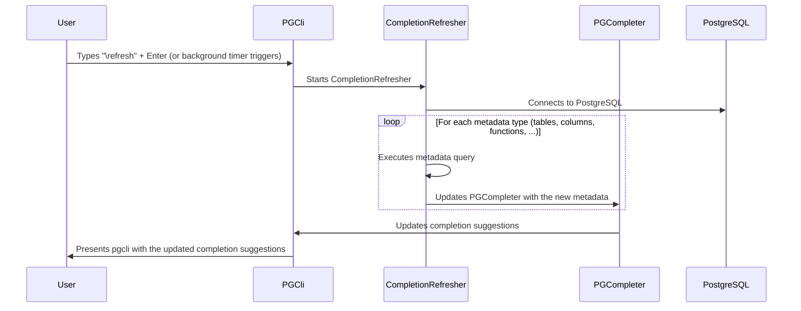

# Chapter 6: CompletionRefresher

In the previous chapter, [Config Management](05_config_management.md), we learned how `pgcli` remembers your favorite settings. Now, let's talk about keeping `pgcli`'s autocompletion suggestions up-to-date, even when your database changes!

Imagine you add a new table called `products` to your PostgreSQL database. Wouldn't it be great if `pgcli` automatically started suggesting `products` when you type `SELECT * FROM pro`? That's where `CompletionRefresher` comes in!

`CompletionRefresher` is like a librarian who constantly updates the catalog. It's the background process that keeps the [PGCompleter](04_pgcompleter.md) up-to-date with the latest database schema. It ensures that the auto-complete suggestions in `pgcli` are always accurate, even after you've made changes to your database structure.

## What Problem Does CompletionRefresher Solve?

Without `CompletionRefresher`, the [PGCompleter](04_pgcompleter.md) would only know about the database schema when `pgcli` first started. If you added a new table, function, or column, you wouldn't see it in the autocompletion suggestions until you restarted `pgcli`. This is annoying and inefficient!

`CompletionRefresher` solves this by:

1.  **Staying Up-to-Date:** It automatically detects changes in your database schema and updates the [PGCompleter](04_pgcompleter.md) accordingly.
2.  **Background Operation:** It works silently in the background, so you don't have to manually trigger the update.
3.  **Accuracy:** Ensures that the auto-complete suggestions are always accurate, reflecting the current state of your database.

## Key Concepts of CompletionRefresher

`CompletionRefresher` relies on a few important concepts:

1.  **Background Thread:**  `CompletionRefresher` runs in a separate thread, so it doesn't block the main `pgcli` interface.  This means you can keep typing queries while the schema is being updated.
2.  **Asynchronous Operation:** It retrieves database metadata asynchronously, meaning it doesn't wait for the entire operation to complete before returning control to the user.
3.  **Metadata Refreshers:**  Specific functions (decorated with `@refresher`) that know how to fetch different kinds of metadata from the database (tables, columns, functions, etc.).
4.  **PGCompleter Update:** It updates the [PGCompleter](04_pgcompleter.md) with the new metadata, so the autocompletion suggestions are current.

## Using CompletionRefresher: A Simple Example

Let's say you've just created a new table called `products` in your PostgreSQL database. Here's how `CompletionRefresher` ensures that `pgcli` knows about it:

**Step 1: Create the `products` table**

Using `psql` or another tool, create a new table in your database:

```sql
CREATE TABLE products (
    id SERIAL PRIMARY KEY,
    name VARCHAR(255),
    price DECIMAL
);
```

**Step 2: Wait for `CompletionRefresher` to do its thing (or manually trigger it)**

`CompletionRefresher` runs automatically in the background (every few minutes - this is not configurable). Alternatively, you can manually trigger a refresh by typing `\refresh` in `pgcli` and pressing Enter.

**Step 3: Autocomplete the new table name**

Now, in `pgcli`, type:

```sql
SELECT * FROM prod
```

If you hit `<Tab>` after typing `prod`, you should see `products` as one of the autocompletion suggestions. This means that `CompletionRefresher` has successfully updated the [PGCompleter](04_pgcompleter.md) with the new table information.

**Behind the Scenes:**

When you create the `products` table (or when the `CompletionRefresher`'s timer expires), the `CompletionRefresher` connects to the database in the background, queries the database to fetch the list of tables, adds `products` to the [PGCompleter](04_pgcompleter.md)'s list of known tables, and allows the table to show up in autocompletions.

## Diving Deeper: How CompletionRefresher Works Internally

Let's explore what happens inside `CompletionRefresher` to make autocompletion updates happen.



Here's a breakdown of the process:

1.  **User Trigger (or Background Timer):** You manually type `\refresh` in `pgcli` and press Enter, or the background timer triggers the `CompletionRefresher`.
2.  **CompletionRefresher starts:** The [PGCli](02_pgexecute.md) class calls the `refresh` method of `CompletionRefresher`.
3.  **Background Thread:** `CompletionRefresher` starts a new thread to perform the refresh operation without blocking the main `pgcli` interface.
4.  **Metadata Refreshers:** The `_bg_refresh` function iterates through a dictionary of metadata refreshers. These refreshers are functions decorated with `@refresher` that know how to fetch specific types of metadata (tables, columns, functions, schemas, etc.) from the database.
5.  **Updating PGCompleter:** Each refresher uses the [PGExecute](02_pgexecute.md) class to query the database and then updates the [PGCompleter](04_pgcompleter.md) with the new metadata.
6.  **Autocompletion Updates:** [PGCompleter](04_pgcompleter.md) can use the new metadata to update the completion suggestions.

Let's examine some simplified code snippets from `pgcli/completion_refresher.py`:

```python
import threading

class CompletionRefresher:
    def __init__(self):
        self._completer_thread = None

    def refresh(self, executor, special, callbacks, history=None, settings=None):
        if self.is_refreshing():
            # Prevent overlapping refreshes
            return
        else:
            self._completer_thread = threading.Thread(
                target=self._bg_refresh, #Defines the target function
                args=(executor, special, callbacks, history, settings),
                name="completion_refresh",
            )
            self._completer_thread.daemon = True
            self._completer_thread.start() #Starts the thread

```

This code snippet shows how `CompletionRefresher` starts a new thread to perform the refresh operation in the background. The `_bg_refresh` function (explained next) is the target function that will be executed in the new thread.

```python
    def _bg_refresh(self, pgexecute, special, callbacks, history=None, settings=None):
        completer = PGCompleter(
            smart_completion=True, pgspecial=special, settings=settings
        )

        executor = pgexecute.copy() #Create a copy of executor
        for refresher in self.refreshers.values():
            refresher(completer, executor) #Call registered refreshers

        # Load history into pgcompleter so it can learn user preferences
        n_recent = 100
        if history:
            for recent in history.get_strings()[-n_recent:]:
                completer.extend_query_history(recent, is_init=True)

        for callback in callbacks:
            callback(completer)
        executor.conn.close()

```

Explanation:
* This is the function that is executed on the background thread
*   `_bg_refresh` iterates through all the functions registered with `@refresher` decorator and executes each of them. These registered functions use the [PGExecute](02_pgexecute.md) to query the database and then update the [PGCompleter](04_pgcompleter.md) object with the new metadata.
*   Lastly, we want the new completer to learn user preference from history.

Here's an example of one of the refresher functions:

```python
from .pgcompleter import PGCompleter

@refresher("tables")
def refresh_tables(completer: PGCompleter, executor):
    completer.extend_relations(executor.tables(), kind="tables")
    completer.extend_columns(executor.table_columns(), kind="tables")
    completer.extend_foreignkeys(executor.foreignkeys())

```

Explanation:

*   The `@refresher` decorator registers this function as a metadata refresher.
*   `refresh_tables` uses the [PGExecute](02_pgexecute.md) object (`executor`) to fetch table metadata (table names and column names) from the database.
*   It then updates the [PGCompleter](04_pgcompleter.md) object (`completer`) with the new table metadata using the `extend_relations` and `extend_columns` methods.

## Conclusion

`CompletionRefresher` ensures that `pgcli`'s autocompletion suggestions are always up-to-date, even when your database schema changes. By running in the background and using metadata refreshers, it provides a seamless and accurate autocompletion experience, making it easier and faster to write SQL queries.

In the next chapter, we'll explore [MetaQuery](07_metaquery.md), which contains metadata information about the queries that have been executed.


---

Generated by [AI Codebase Knowledge Builder](https://github.com/The-Pocket/Tutorial-Codebase-Knowledge)