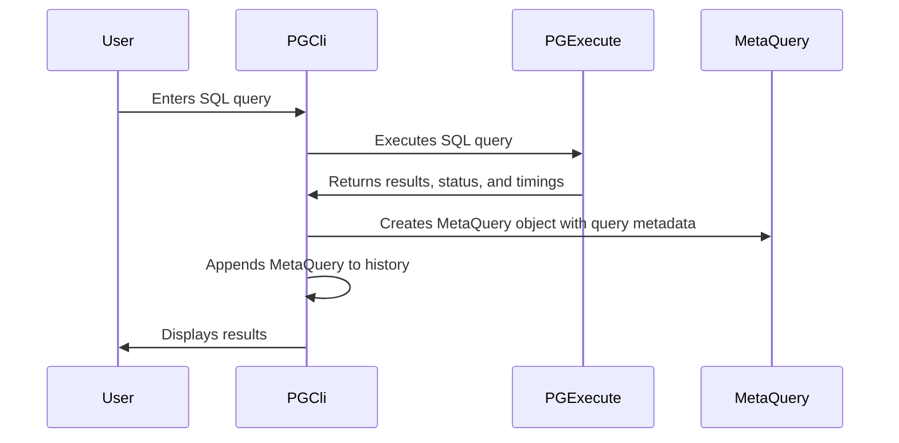

# Chapter 7: MetaQuery

In the previous chapter, [CompletionRefresher](06_completionrefresher.md), we learned how `pgcli` keeps its autocompletion suggestions up-to-date. Now, let's talk about how `pgcli` remembers what happened *after* you run a query.

Imagine you just executed a complex SQL query. Wouldn't it be useful to know how long it took to run, whether it changed the database, or if it was a special command? That's where `MetaQuery` comes in!

`MetaQuery` is like a "query receipt" that `pgcli` stores after each query is executed. It contains important information about the query, such as its execution time, success status, and whether it modified the database. This information is then used for things like logging, error handling, and improving autocompletion.

## What Problem Does MetaQuery Solve?

Without `MetaQuery`, `pgcli` would "forget" about your query as soon as it finished running. This would make it difficult to:

1.  **Track Query Performance:** You wouldn't know how long your queries are taking to execute.
2.  **Identify Database Changes:** You wouldn't be able to easily see which queries modified the database.
3.  **Improve Autocompletion:** `pgcli` wouldn't be able to use past query information to suggest better autocompletions.

`MetaQuery` solves these problems by providing a way to store and access information about executed queries.

## Key Concepts of MetaQuery

`MetaQuery` is a simple, but powerful concept. Here are the key things to know:

1.  **Query Information:** `MetaQuery` stores various details about a query, including:
    *   The full text of the query.
    *   Whether the query was successful or not.
    *   The total time it took to run (including formatting the results).
    *   The time spent actually executing the query.
    *   Flags indicating if the query modified the database, changed the search path, or was a special command.

2.  **Named Tuple:** `MetaQuery` is implemented as a "named tuple" in Python. Think of it as a lightweight class that's used to store data. You can access the data using named attributes (e.g., `meta_query.query`, `meta_query.successful`).

3.  **History:** `MetaQuery` objects are stored in a history list, allowing `pgcli` to access information about past queries.

## Using MetaQuery: A Simple Example

Let's say you run the following SQL query in `pgcli`:

```sql
SELECT * FROM users LIMIT 10;
```

After the query executes, `pgcli` creates a `MetaQuery` object to store information about it. Here's a simplified example of what that `MetaQuery` object might look like:

```python
MetaQuery(
    query="SELECT * FROM users LIMIT 10;",
    successful=True,
    total_time=0.123,
    execution_time=0.087,
    meta_changed=False,
    db_changed=False,
    path_changed=False,
    mutated=False,
    is_special=False,
)
```

*   `query`: The original SQL query.
*   `successful`: `True` because the query executed without errors.
*   `total_time`: The query took 0.123 seconds to run and format results.
*   `execution_time`: The query itself took 0.087 seconds to execute.
*   `meta_changed`: `False` because the query didn't change any database objects (like tables or functions).
*   `db_changed`: `False` because the query didn't switch databases.
*   `path_changed`: `False` because the query didn't change the search path.
*   `mutated`: `False` because the query didn't insert, update, or delete any data.
*   `is_special`: `False` because it wasn't a special backslash command (like `\dt`).

This `MetaQuery` object is then added to the query history.

**How this information is used:**

1.  **Timing:** As we saw in the previous chapters, `pgcli` can display how long each query took to run. This information comes directly from the `total_time` and `execution_time` attributes of the `MetaQuery` object.
2.  **Autocompletion:** `pgcli` can use the `MetaQuery` history to learn which tables and columns you frequently query. This information helps `PGCompleter` suggest more relevant autocompletions.
3. **Destructive Statement Requires Transaction:** Destructive warnings are generated only if destructive statements are outside a valid transaction.

## Diving Deeper: How MetaQuery Works Internally

Let's take a peek inside `pgcli` to see how `MetaQuery` is created and used.



Here's what happens step-by-step:

1.  **User Enters Query:** You type a SQL query in `pgcli` and press Enter.
2.  **PGExecute Executes Query:** The [PGExecute](02_pgexecute.md) class executes the query against the database.
3.  **Metadata Returned:** [PGExecute](02_pgexecute.md) returns the results of the query, the status message, and the execution time.
4.  **MetaQuery Created:** The `PGCli` class creates a `MetaQuery` object, populating it with the query text, success status, timings, and other metadata.
5.  **History Appended:** The `MetaQuery` object is appended to the `query_history` list in the `PGCli` class.
6.  **Results Displayed:** The query results are displayed in your terminal.

Now, let's look at the code in `pgcli/main.py` where `MetaQuery` is used:

```python
from collections import namedtuple

# Query tuples are used for maintaining history
MetaQuery = namedtuple(
    "Query",
    [
        "query",  # The entire text of the command
        "successful",  # True If all subqueries were successful
        "total_time",  # Time elapsed executing the query and formatting results
        "execution_time",  # Time elapsed executing the query
        "meta_changed",  # True if any subquery executed create/alter/drop
        "db_changed",  # True if any subquery changed the database
        "path_changed",  # True if any subquery changed the search path
        "mutated",  # True if any subquery executed insert/update/delete
        "is_special",  # True if the query is a special command
    ],
)
MetaQuery.__new__.__defaults__ = ("", False, 0, 0, False, False, False, False)
```

This code defines the `MetaQuery` named tuple and sets default values for its attributes.

Here's where the `MetaQuery` object is created in the `_evaluate_command` function:

```python
        meta_query = MetaQuery(
            text,
            all_success,
            total,
            execution,
            meta_changed,
            db_changed,
            path_changed,
            mutated,
            is_special,
        )

        return output, meta_query
```

This code shows how the `MetaQuery` object is created with the query text, success status, timings, and other metadata.

Finally, here's the `handle_watch_command` method that adds the `MetaQuery` object to the history:

```python
        self.query_history.append(query)
```

## Conclusion

`MetaQuery` provides a simple and effective way to store information about executed queries in `pgcli`. This information is used for various purposes, including displaying query timings, improving autocompletion, and handling errors. By capturing these details, `MetaQuery` enhances the overall `pgcli` experience.

You've now explored all the core abstractions that power `pgcli`! There are no further chapters. You're well on your way to understanding how `pgcli` works under the hood!


---

Generated by [AI Codebase Knowledge Builder](https://github.com/The-Pocket/Tutorial-Codebase-Knowledge)