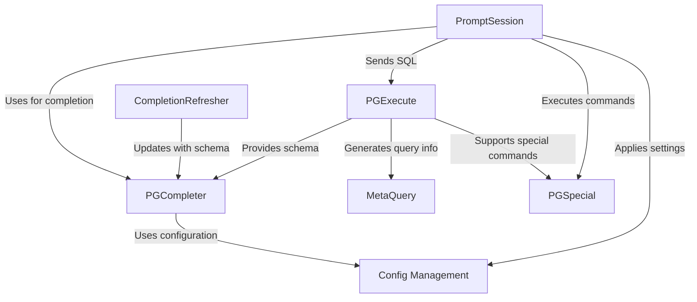

# Tutorial: pgcli

`pgcli` is an interactive command-line interface for PostgreSQL. It offers **auto-completion** of SQL queries and syntax highlighting, making database interaction *easier and more efficient*. It also provides special commands like `psql`.

**Source Repository:** [None](None)

## Chapters

1. [PromptSession](01_promptsession.md)
2. [PGExecute](02_pgexecute.md)
3. [PGSpecial](03_pgspecial.md)
4. [PGCompleter](04_pgcompleter.md)
5. [Config Management](05_config_management.md)
6. [CompletionRefresher](06_completionrefresher.md)
7. [MetaQuery](07_metaquery.md)

---

Generated by [AI Codebase Knowledge Builder](https://github.com/The-Pocket/Tutorial-Codebase-Knowledge)